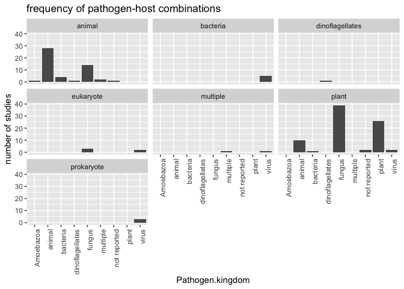
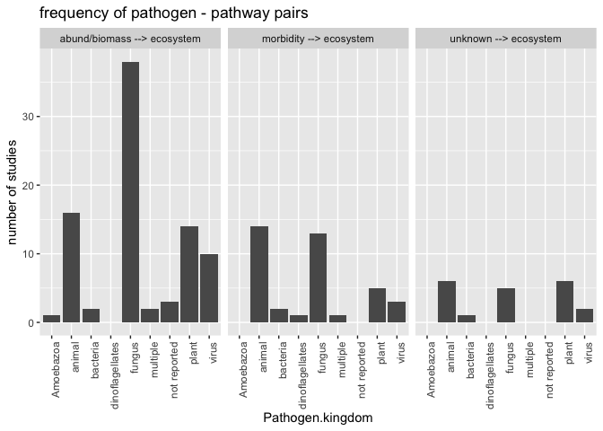
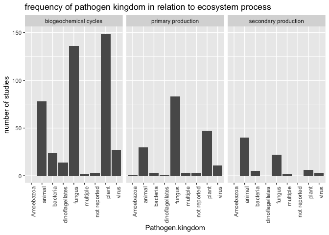

PATE\_20180817
================
Ilya
8/17/2018

##### install packages

    ## 
    ## Attaching package: 'dplyr'

    ## The following objects are masked from 'package:stats':
    ## 
    ##     filter, lag

    ## The following objects are masked from 'package:base':
    ## 
    ##     intersect, setdiff, setequal, union

read in studies spreadsheet and make graph of pathogen frequency for each kingdom of hosts
------------------------------------------------------------------------------------------

``` r
S <- read.csv("meta_data_20180724 - studies.csv")
save(S, file = "S.Rdata")

plot<- ggplot(data = S, mapping = aes(x = Pathogen.kingdom))+
  geom_bar()+
  theme(axis.text.x = element_text(angle = 90, hjust = 1))+
  facet_wrap(.~Host.kingdom)+
  ylab("number of studies")+
    ggtitle("frequency of pathogen-host combinations")

plot
```



### make plot of frequency of pathogen kingdom for each pathway from host/community to ecosystem process

``` r
load("S.Rdata")
names(S)[names(S)=="var1_abund.biomass.to.ecosystem.fxn"]="var_1"
names(S)[names(S)=="var2_morbidity.to.ecosystem.fxn"]="var_2"

names(S)[names(S)=="var3_unknown.to.ecosystem.fxn"]="var_3"

tolong = names(S)[c(18:20)]
dim(S)[1]
```

    ## [1] 147

``` r
S = subset(S, exclude != "1")
dim(S)[1]
```

    ## [1] 139

``` r
#reshape wide to long to make figure in ggplot2
S.long<-reshape(S, 
                varying=tolong, 
                direction="long", 
                idvar="ID", 
                sep="_")

#make field that indicates pathway
i1 = which(S.long$time == 1)
pathway = rep("unassigned", dim(S.long)[1])
pathway[i1]="abund/biomass --> ecosystem"
i2 = which(S.long$time == 2)
pathway[i2]="morbidity --> ecosystem"
i3 = which(S.long$time == 3)
pathway[i3]="unknown --> ecosystem"
S.long$pathway = pathway
S.long = subset(S.long, var == 1)
plot<- ggplot(data = S.long, mapping = aes(x = Pathogen.kingdom))+
  geom_bar()+
  theme(axis.text.x = element_text(angle = 90, hjust = 1))+
  facet_wrap(.~pathway)+
  ylab("number of studies")+
    ggtitle("frequency of pathogen - pathway pairs")
# 
plot
```



### read in measures data (which indicates which ecosystem process involved, among other info), merge with studies, make plot of pathogen kingdom vs. ecosystem process

``` r
load("S.Rdata")
names(S)[names(S)=="ID"]="paper.ID"
names(S)[names(S)=="note"]="study.note"
M = read.csv("meta_data_20180724 - measures.csv")
#get just the rows for the ecosystem processes (excluding PP --> abund or morbidity)
Mep = subset(M, measure.general == "biogeochemical cycles" | 
               measure.general == "primary production" |
               measure.general == "secondary production")
intersect(names(Mep), names(S))
```

    ## [1] "paper.ID"

``` r
setdiff(Mep$paper.ID, S$paper.ID)
```

    ## integer(0)

``` r
setdiff(S$paper.ID, Mep$paper.ID)
```

    ## [1]  313 1568 1589 1943  781 1000 1927

``` r
Mep = merge(Mep, S)

plot<- ggplot(data = Mep, mapping = aes(x = Pathogen.kingdom))+
  geom_bar()+
  theme(axis.text.x = element_text(angle = 90, hjust = 1))+
  facet_wrap(.~measure.general)+
  ylab("number of studies")+
    ggtitle("frequency of pathogen kingdom in relation to ecosystem process")
plot
```



##### SCRATCH work below here.

#### read in data and summarize

``` r
P = read.csv("meta_data_20180724 - measures.csv")
P = subset(P, exclude.as.ecosystem.measure !=1)
names(P)
```

    ##  [1] "paper.ID"                                                               
    ##  [2] "measureID"                                                              
    ##  [3] "pathway"                                                                
    ##  [4] "measure.general"                                                        
    ##  [5] "measure.specific....outcome.variable"                                   
    ##  [6] "outcome.unit...concat.w.measure.specific"                               
    ##  [7] "morbid_or_abund_biomass_measure"                                        
    ##  [8] "effects.on.host"                                                        
    ##  [9] "effects.on.community"                                                   
    ## [10] "predictor.variable"                                                     
    ## [11] "ecosystem_process_mediate"                                              
    ## [12] "have.not.added.double.counting"                                         
    ## [13] "double.counted.effect.on.plants...photosynthesizers.as.ecosystem.effect"
    ## [14] "double.counted.effect.on.non.plant.hosts.as.ecosystem.effect"           
    ## [15] "ecosystem.function.not.linked.to.morbidity.or.abund"                    
    ## [16] "location.in.paper"                                                      
    ## [17] "note"                                                                   
    ## [18] "exclude.as.ecosystem.measure"                                           
    ## [19] "include.as.ecosystem.measure"                                           
    ## [20] "reason.for.inclusion.or.exclusion.as.ecosystem.measure"                 
    ## [21] "notes"                                                                  
    ## [22] "confirm"

``` r
#check ones that are empty
tmp = subset(P,measure.general == "")
tmp
```

    ##  [1] paper.ID                                                               
    ##  [2] measureID                                                              
    ##  [3] pathway                                                                
    ##  [4] measure.general                                                        
    ##  [5] measure.specific....outcome.variable                                   
    ##  [6] outcome.unit...concat.w.measure.specific                               
    ##  [7] morbid_or_abund_biomass_measure                                        
    ##  [8] effects.on.host                                                        
    ##  [9] effects.on.community                                                   
    ## [10] predictor.variable                                                     
    ## [11] ecosystem_process_mediate                                              
    ## [12] have.not.added.double.counting                                         
    ## [13] double.counted.effect.on.plants...photosynthesizers.as.ecosystem.effect
    ## [14] double.counted.effect.on.non.plant.hosts.as.ecosystem.effect           
    ## [15] ecosystem.function.not.linked.to.morbidity.or.abund                    
    ## [16] location.in.paper                                                      
    ## [17] note                                                                   
    ## [18] exclude.as.ecosystem.measure                                           
    ## [19] include.as.ecosystem.measure                                           
    ## [20] reason.for.inclusion.or.exclusion.as.ecosystem.measure                 
    ## [21] notes                                                                  
    ## [22] confirm                                                                
    ## <0 rows> (or 0-length row.names)

``` r
pathway.number = rep(3, dim(P)[1])
pathway.number[(P$pathway=="abund biomass to ecosystem fxn" | P$pathway == "morbidity to ecosystem fxn")]=2
pathway.number[(P$pathway=="PP to ecosystem fxn" | P$pathway == "PP to abund biomass" 
                | P$pathway == "PP to morbidity")]=1

P$pathway.number = pathway.number
P = subset(P, measure.general!="")
P$measure.general = trimws(P$measure.general)
P$measure.specific....outcome.variable = trimws(P$measure.specific....outcome.variable)

#check out "community"
Pcom = subset(P, measure.general == "community")
sort(unique(P$measure.general))
```

    ##  [1] "abiotic"                                               
    ##  [2] "abundance"                                             
    ##  [3] "biogeochemical cycles"                                 
    ##  [4] "biomass"                                               
    ##  [5] "biomass density"                                       
    ##  [6] "biotic"                                                
    ##  [7] "both"                                                  
    ##  [8] "community"                                             
    ##  [9] "community abundance"                                   
    ## [10] "community behavior"                                    
    ## [11] "community biomass"                                     
    ## [12] "community composition"                                 
    ## [13] "community composition or diversity"                    
    ## [14] "community consumption"                                 
    ## [15] "community phenotype"                                   
    ## [16] "community reproduction"                                
    ## [17] "community respiration"                                 
    ## [18] "community taxa"                                        
    ## [19] "community vigor"                                       
    ## [20] "condition of host"                                     
    ## [21] "consumption of PP"                                     
    ## [22] "decomposition"                                         
    ## [23] "demography"                                            
    ## [24] "disease score"                                         
    ## [25] "diversity"                                             
    ## [26] "host abundance"                                        
    ## [27] "host abundance or behavior"                            
    ## [28] "host abundance, community composition, or phenotype"   
    ## [29] "host and community"                                    
    ## [30] "host and community abund/biomass"                      
    ## [31] "host and community abundance"                          
    ## [32] "host and community and PP biomass"                     
    ## [33] "host and community behavior"                           
    ## [34] "host and community biomass"                            
    ## [35] "host and community composition"                        
    ## [36] "host and community demography"                         
    ## [37] "host and community mortality"                          
    ## [38] "host and community phenotype"                          
    ## [39] "host and community survival"                           
    ## [40] "host and PP production"                                
    ## [41] "host behavior"                                         
    ## [42] "host behavior or abundance"                            
    ## [43] "host biomass"                                          
    ## [44] "host community"                                        
    ## [45] "host community composition"                            
    ## [46] "host demography"                                       
    ## [47] "host fitness"                                          
    ## [48] "host infection intensity"                              
    ## [49] "host infection prevalence"                             
    ## [50] "host morbidity"                                        
    ## [51] "host mortality"                                        
    ## [52] "host or community phenotype or biomass/abund"          
    ## [53] "host phenotype"                                        
    ## [54] "host phenotype or biomass"                             
    ## [55] "host physiology"                                       
    ## [56] "host production"                                       
    ## [57] "host productivity"                                     
    ## [58] "host reproduction"                                     
    ## [59] "host resistance"                                       
    ## [60] "host survival"                                         
    ## [61] "host vigor"                                            
    ## [62] "host, community, and PP biomass"                       
    ## [63] "host, PP, and community demography"                    
    ## [64] "host, PP, and community production"                    
    ## [65] "host+PP biomass"                                       
    ## [66] "infection duration"                                    
    ## [67] "infection intensity"                                   
    ## [68] "infection prevalence"                                  
    ## [69] "infection prevalence / intensity"                      
    ## [70] "infection prevalence and intensity"                    
    ## [71] "mortality"                                             
    ## [72] "neither"                                               
    ## [73] "non-host community"                                    
    ## [74] "non-host community biomass"                            
    ## [75] "percent parasite"                                      
    ## [76] "population growth"                                     
    ## [77] "PP and host abundance"                                 
    ## [78] "PP demography"                                         
    ## [79] "PP or host or community abundance/biomass or phenotype"
    ## [80] "PP phenotype"                                          
    ## [81] "PP transmission vector"                                
    ## [82] "primary production"                                    
    ## [83] "production"                                            
    ## [84] "productivity"                                          
    ## [85] "reproduction"                                          
    ## [86] "secondary production"                                  
    ## [87] "time to infection"                                     
    ## [88] "vigor"

``` r
#community.list = c("community")

P1 <- P %>%
  group_by(paper.ID, pathway.number, pathway, measure.general) %>%
  summarize(measure.general.count = n())

P1$measure.general.presence = 1#if there is at least one measure like this

P2 <- P1 %>%
  group_by(pathway.number, pathway, measure.general) %>%
  summarize(measure.general.count.across.papers = sum(measure.general.presence))

P2 = data.frame(P2)
P2 = P2[
  with(P2, order(pathway.number, pathway, measure.general.count.across.papers)),
]
P2
```

    ##     pathway.number                                     pathway
    ## 1                1                         PP to abund biomass
    ## 2                1                         PP to abund biomass
    ## 8                1                         PP to abund biomass
    ## 9                1                         PP to abund biomass
    ## 10               1                         PP to abund biomass
    ## 11               1                         PP to abund biomass
    ## 12               1                         PP to abund biomass
    ## 13               1                         PP to abund biomass
    ## 15               1                         PP to abund biomass
    ## 16               1                         PP to abund biomass
    ## 18               1                         PP to abund biomass
    ## 21               1                         PP to abund biomass
    ## 23               1                         PP to abund biomass
    ## 24               1                         PP to abund biomass
    ## 26               1                         PP to abund biomass
    ## 27               1                         PP to abund biomass
    ## 28               1                         PP to abund biomass
    ## 29               1                         PP to abund biomass
    ## 33               1                         PP to abund biomass
    ## 35               1                         PP to abund biomass
    ## 36               1                         PP to abund biomass
    ## 37               1                         PP to abund biomass
    ## 38               1                         PP to abund biomass
    ## 39               1                         PP to abund biomass
    ## 41               1                         PP to abund biomass
    ## 42               1                         PP to abund biomass
    ## 44               1                         PP to abund biomass
    ## 46               1                         PP to abund biomass
    ## 47               1                         PP to abund biomass
    ## 20               1                         PP to abund biomass
    ## 22               1                         PP to abund biomass
    ## 31               1                         PP to abund biomass
    ## 43               1                         PP to abund biomass
    ## 17               1                         PP to abund biomass
    ## 32               1                         PP to abund biomass
    ## 34               1                         PP to abund biomass
    ## 40               1                         PP to abund biomass
    ## 45               1                         PP to abund biomass
    ## 3                1                         PP to abund biomass
    ## 19               1                         PP to abund biomass
    ## 4                1                         PP to abund biomass
    ## 5                1                         PP to abund biomass
    ## 7                1                         PP to abund biomass
    ## 6                1                         PP to abund biomass
    ## 30               1                         PP to abund biomass
    ## 14               1                         PP to abund biomass
    ## 25               1                         PP to abund biomass
    ## 50               1                         PP to ecosystem fxn
    ## 49               1                         PP to ecosystem fxn
    ## 51               1                         PP to ecosystem fxn
    ## 52               1                         PP to ecosystem fxn
    ## 48               1                         PP to ecosystem fxn
    ## 53               1                             PP to morbidity
    ## 54               1                             PP to morbidity
    ## 55               1                             PP to morbidity
    ## 56               1                             PP to morbidity
    ## 57               1                             PP to morbidity
    ## 58               1                             PP to morbidity
    ## 59               1                             PP to morbidity
    ## 60               1                             PP to morbidity
    ## 62               1                             PP to morbidity
    ## 63               1                             PP to morbidity
    ## 66               1                             PP to morbidity
    ## 69               1                             PP to morbidity
    ## 67               1                             PP to morbidity
    ## 68               1                             PP to morbidity
    ## 61               1                             PP to morbidity
    ## 64               1                             PP to morbidity
    ## 65               1                             PP to morbidity
    ## 72               2              abund biomass to ecosystem fxn
    ## 73               2              abund biomass to ecosystem fxn
    ## 71               2              abund biomass to ecosystem fxn
    ## 75               2              abund biomass to ecosystem fxn
    ## 70               2              abund biomass to ecosystem fxn
    ## 74               2              abund biomass to ecosystem fxn
    ## 77               2                  morbidity to ecosystem fxn
    ## 78               2                  morbidity to ecosystem fxn
    ## 76               2                  morbidity to ecosystem fxn
    ## 82               3                           abiotic or biotic
    ## 83               3                           abiotic or biotic
    ## 84               3                           abiotic or biotic
    ## 81               3                           abiotic or biotic
    ## 79               3                           abiotic or biotic
    ## 80               3                           abiotic or biotic
    ## 85               3                         ecosystem fxn to PP
    ## 88               3                                PP abundance
    ## 89               3                                PP abundance
    ## 90               3                                PP abundance
    ## 87               3                                PP abundance
    ## 86               3                                PP abundance
    ## 91               3                                PP morbidity
    ## 92               3                                PP morbidity
    ## 94               3 PP to host infection prevalence / intensity
    ## 95               3 PP to host infection prevalence / intensity
    ## 97               3 PP to host infection prevalence / intensity
    ## 98               3 PP to host infection prevalence / intensity
    ## 99               3 PP to host infection prevalence / intensity
    ## 100              3 PP to host infection prevalence / intensity
    ## 103              3 PP to host infection prevalence / intensity
    ## 104              3 PP to host infection prevalence / intensity
    ## 105              3 PP to host infection prevalence / intensity
    ## 106              3 PP to host infection prevalence / intensity
    ## 107              3 PP to host infection prevalence / intensity
    ## 93               3 PP to host infection prevalence / intensity
    ## 96               3 PP to host infection prevalence / intensity
    ## 101              3 PP to host infection prevalence / intensity
    ## 102              3 PP to host infection prevalence / intensity
    ## 108              3                               PP to unknown
    ## 109              3                               PP to unknown
    ## 110              3                               PP to unknown
    ## 111              3                               PP to unknown
    ## 112              3                               PP to unknown
    ## 114              3                               PP to unknown
    ## 115              3                               PP to unknown
    ## 113              3                               PP to unknown
    ## 116              3                              PP to unknown 
    ## 119              3                    unknown to ecosystem fxn
    ## 118              3                    unknown to ecosystem fxn
    ## 117              3                    unknown to ecosystem fxn
    ##                                            measure.general
    ## 1                                                abundance
    ## 2                                    biogeochemical cycles
    ## 8                       community composition or diversity
    ## 9                                    community consumption
    ## 10                                  community reproduction
    ## 11                                   community respiration
    ## 12                                          community taxa
    ## 13                                               diversity
    ## 15                                      host and community
    ## 16                        host and community abund/biomass
    ## 18                       host and community and PP biomass
    ## 21                           host and community demography
    ## 23                             host and community survival
    ## 24                                  host and PP production
    ## 26                                          host community
    ## 27                              host community composition
    ## 28                                         host demography
    ## 29                                          host morbidity
    ## 33                                       host productivity
    ## 35                                           host survival
    ## 36                         host, community, and PP biomass
    ## 37                      host, PP, and community demography
    ## 38                      host, PP, and community production
    ## 39                                         host+PP biomass
    ## 41                                      non-host community
    ## 42                              non-host community biomass
    ## 44                                   PP and host abundance
    ## 46                                            productivity
    ## 47                                            reproduction
    ## 20                          host and community composition
    ## 22                            host and community mortality
    ## 31                                          host phenotype
    ## 43                                       population growth
    ## 17                            host and community abundance
    ## 32                                         host production
    ## 34                                       host reproduction
    ## 40                                               mortality
    ## 45                                      primary production
    ## 3                                                  biomass
    ## 19                              host and community biomass
    ## 4                                                community
    ## 5                                      community abundance
    ## 7                                    community composition
    ## 6                                        community biomass
    ## 30                                          host mortality
    ## 14                                          host abundance
    ## 25                                            host biomass
    ## 50                                               community
    ## 49                                                 biomass
    ## 51                                      primary production
    ## 52                                    secondary production
    ## 48                                   biogeochemical cycles
    ## 53                                      community behavior
    ## 54                                     community phenotype
    ## 55                                  community reproduction
    ## 56                                         community vigor
    ## 57                                       condition of host
    ## 58                                           decomposition
    ## 59                             host and community behavior
    ## 60                            host and community phenotype
    ## 62                                            host biomass
    ## 63                                            host fitness
    ## 66                                         host physiology
    ## 69                                      primary production
    ## 67                                       host reproduction
    ## 68                                              host vigor
    ## 61                                           host behavior
    ## 64                                          host morbidity
    ## 65                                          host phenotype
    ## 72                                   community respiration
    ## 73                              host and community biomass
    ## 71                                       community biomass
    ## 75                                    secondary production
    ## 70                                   biogeochemical cycles
    ## 74                                      primary production
    ## 77                                      primary production
    ## 78                                    secondary production
    ## 76                                   biogeochemical cycles
    ## 82                                   community consumption
    ## 83                                          community taxa
    ## 84                                                 neither
    ## 81                                                    both
    ## 79                                                 abiotic
    ## 80                                                  biotic
    ## 85                                       consumption of PP
    ## 88                                               mortality
    ## 89                                           PP demography
    ## 90                                              production
    ## 87                                              demography
    ## 86                                               abundance
    ## 91                                            PP phenotype
    ## 92                                                   vigor
    ## 94                                         biomass density
    ## 95                                           disease score
    ## 97                               host infection prevalence
    ## 98                                          host mortality
    ## 99                                         host resistance
    ## 100                                     infection duration
    ## 103                       infection prevalence / intensity
    ## 104                     infection prevalence and intensity
    ## 105                                       percent parasite
    ## 106                                 PP transmission vector
    ## 107                                      time to infection
    ## 93                                               abundance
    ## 96                                host infection intensity
    ## 101                                    infection intensity
    ## 102                                   infection prevalence
    ## 108                                  biogeochemical cycles
    ## 109                             host abundance or behavior
    ## 110                             host and community biomass
    ## 111                             host behavior or abundance
    ## 112           host or community phenotype or biomass/abund
    ## 114                              host phenotype or biomass
    ## 115 PP or host or community abundance/biomass or phenotype
    ## 113                                         host phenotype
    ## 116    host abundance, community composition, or phenotype
    ## 119                                   secondary production
    ## 118                                     primary production
    ## 117                                  biogeochemical cycles
    ##     measure.general.count.across.papers
    ## 1                                     1
    ## 2                                     1
    ## 8                                     1
    ## 9                                     1
    ## 10                                    1
    ## 11                                    1
    ## 12                                    1
    ## 13                                    1
    ## 15                                    1
    ## 16                                    1
    ## 18                                    1
    ## 21                                    1
    ## 23                                    1
    ## 24                                    1
    ## 26                                    1
    ## 27                                    1
    ## 28                                    1
    ## 29                                    1
    ## 33                                    1
    ## 35                                    1
    ## 36                                    1
    ## 37                                    1
    ## 38                                    1
    ## 39                                    1
    ## 41                                    1
    ## 42                                    1
    ## 44                                    1
    ## 46                                    1
    ## 47                                    1
    ## 20                                    2
    ## 22                                    2
    ## 31                                    2
    ## 43                                    2
    ## 17                                    3
    ## 32                                    3
    ## 34                                    3
    ## 40                                    3
    ## 45                                    5
    ## 3                                     7
    ## 19                                    7
    ## 4                                    12
    ## 5                                    12
    ## 7                                    14
    ## 6                                    16
    ## 30                                   16
    ## 14                                   18
    ## 25                                   36
    ## 50                                    1
    ## 49                                    3
    ## 51                                   13
    ## 52                                   13
    ## 48                                   18
    ## 53                                    1
    ## 54                                    1
    ## 55                                    1
    ## 56                                    1
    ## 57                                    1
    ## 58                                    1
    ## 59                                    1
    ## 60                                    1
    ## 62                                    1
    ## 63                                    1
    ## 66                                    1
    ## 69                                    1
    ## 67                                    2
    ## 68                                    2
    ## 61                                    5
    ## 64                                    7
    ## 65                                   32
    ## 72                                    1
    ## 73                                    1
    ## 71                                    2
    ## 75                                   20
    ## 70                                   26
    ## 74                                   67
    ## 77                                    3
    ## 78                                    8
    ## 76                                   26
    ## 82                                    1
    ## 83                                    1
    ## 84                                    1
    ## 81                                   30
    ## 79                                   50
    ## 80                                   98
    ## 85                                    1
    ## 88                                    1
    ## 89                                    1
    ## 90                                    1
    ## 87                                    2
    ## 86                                   22
    ## 91                                    1
    ## 92                                    1
    ## 94                                    1
    ## 95                                    1
    ## 97                                    1
    ## 98                                    1
    ## 99                                    1
    ## 100                                   1
    ## 103                                   1
    ## 104                                   1
    ## 105                                   1
    ## 106                                   1
    ## 107                                   1
    ## 93                                    2
    ## 96                                    3
    ## 101                                  16
    ## 102                                  42
    ## 108                                   1
    ## 109                                   1
    ## 110                                   1
    ## 111                                   1
    ## 112                                   1
    ## 114                                   1
    ## 115                                   1
    ## 113                                   2
    ## 116                                   1
    ## 119                                   1
    ## 118                                   2
    ## 117                                  15

``` r
write.csv(P2, file = "summary.20180815.csv")
```

### manually summarize data as relating to host or community, then read back in and use to reclassify

``` r
P$measure.general.previous = P$measure.general
P$community = NA
P$host = NA
Pr = read.csv("summary.20180815_reclassified.csv")

names(Pr)
```

    ## [1] "X"                                  
    ## [2] "pathway.number"                     
    ## [3] "pathway"                            
    ## [4] "measure.general"                    
    ## [5] "measure.general.count.across.papers"
    ## [6] "host"                               
    ## [7] "community"                          
    ## [8] "misclassified"                      
    ## [9] "reclassify"

``` r
Pr = subset(Pr, reclassify !="")
upathway = unique(Pr$pathway)
a = 2
for (a in 1:length(upathway)){
  Pr.tmp = subset(Pr, pathway == upathway[a])
  umeasure.general = unique(Pr.tmp$measure.general)#for each unique measure.general
  for (b in 1:length(umeasure.general)){
    Pr.tmp.measure.general = subset(Pr.tmp, measure.general == umeasure.general[b])
    inds = which(as.character(P$pathway) == as.character(upathway[a]) & as.character(P$measure.general) == as.character(umeasure.general[b]))
    P$measure.general[inds]=as.character(Pr.tmp.measure.general$reclassify)
    P$community[inds]= Pr.tmp.measure.general$community
    P$host[inds]=Pr.tmp.measure.general$host
  }
}
save(P, file = "P.Rdata")
```

### summarize again P having reclassified

``` r
load("P.Rdata")
#order, select fields, and output
Psum_simple <- P %>%
  group_by(pathway.number, pathway, measure.general, measure.specific....outcome.variable, community, host) %>%
  summarize(count = n())

Psum_simple = Psum_simple[
  with(Psum_simple, order(pathway, measure.general)),
]
write.csv(Psum_simple, file = "P_raw_summarized.csv")

#now summarize more
Pa <- P %>%
  group_by(paper.ID, pathway.number, pathway, measure.general, community, host) %>%
  summarize(measure.general.count = n())

Pa$measure.general.presence = 1#if there is at least one measure like this

Pb <- Pa %>%
  group_by(pathway.number, pathway, measure.general, community, host) %>%
  summarize(measure.general.count.across.papers = sum(measure.general.presence))

Pb = data.frame(Pb)
Pb = Pb[
  with(Pb, order(pathway.number, pathway, measure.general.count.across.papers)),
]

write.csv(Pb, file = "P.summary.reclass.20180815.csv")

#finally, summarize across papers by pathway and measure
```
