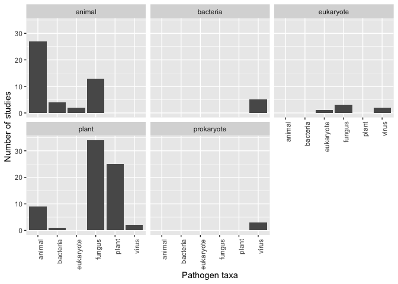
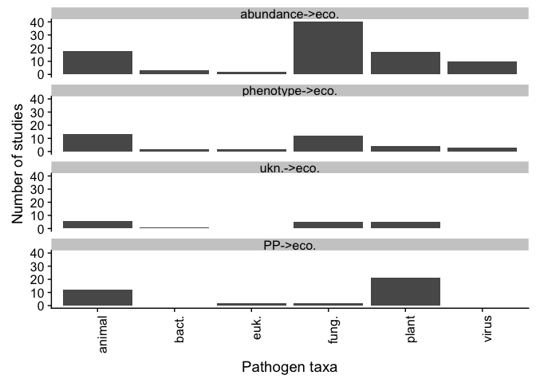
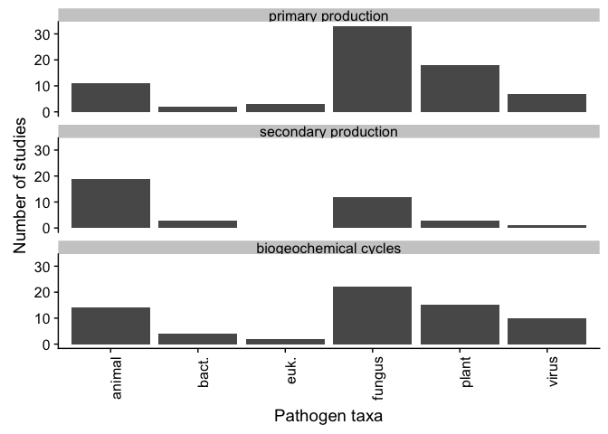
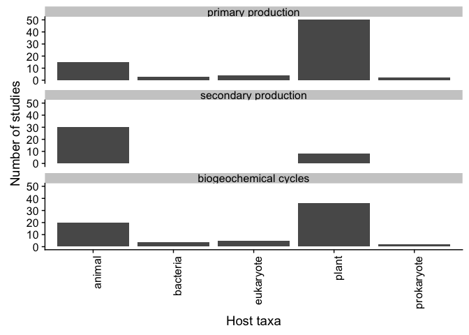

PATE\_20180817
================
Ilya
8/17/2018

use
===

##### install packages

    ## 
    ## Attaching package: 'dplyr'

    ## The following objects are masked from 'package:stats':
    ## 
    ##     filter, lag

    ## The following objects are masked from 'package:base':
    ## 
    ##     intersect, setdiff, setequal, union

    ## 
    ## Attaching package: 'MASS'

    ## The following object is masked from 'package:dplyr':
    ## 
    ##     select

    ## 
    ## Attaching package: 'gplots'

    ## The following object is masked from 'package:stats':
    ## 
    ##     lowess

    ## Loading required package: grid

    ## Loading required package: Matrix

    ## Loading 'metafor' package (version 2.0-0). For an overview 
    ## and introduction to the package please type: help(metafor).

### summarize results of screening, based on each screener's results

``` r
path = "screened_20180918"
files = list.files(path)
out = NULL
a =1
tmp = read.csv(paste0(path, "/", files[a]))
names(tmp)= tolower(names(tmp))
names.tmp = names(tmp)
out = rbind(out, tmp)
for (a in 2:length(files)){
  tmp = read.csv(paste0(path, "/", files[a]))
  names(tmp)= tolower(names(tmp))
  fields = intersect(names(tmp), names(out))
  out = out[,fields]
  #add 
  tmp = tmp[,fields]
  out = rbind(out, tmp)
}
print("number of articles")
```

    ## [1] "number of articles"

``` r
dim(out)[1]
```

    ## [1] 2169

``` r
#check there is only one row for each paper id number, should be TRUE
dim(out)[1] == length(unique(out$id))
```

    ## [1] TRUE

``` r
out$include = tolower(out$include)
out$include[out$include == "n"] = "no"
out$include[out$include == "y"] = "yes"
out$include[out$include == "m"] = "maybe"
print("excluded after title and abstract screen")
```

    ## [1] "excluded after title and abstract screen"

``` r
tab = data.frame(table(out$include))
tab
```

    ##    Var1 Freq
    ## 1 maybe  195
    ## 2    no 1840
    ## 3   yes  134

``` r
print("full-text articles           assessed for eligibility")
```

    ## [1] "full-text articles \t\t\tassessed for eligibility"

``` r
tab$Freq[tab$Var1=="yes"]+tab$Freq[tab$Var1=="maybe"]
```

    ## [1] 329

``` r
#compute whether study was included or not 
# include_abstract = rep(NA, dim(out)[1])
# inds.no.abstract = which(out$include == "no")
# include_abstract[inds.no.abstract]
#check those that are blank
blank = subset(out, include == "")
table(blank$screened_by)#these should all be 0
```

    ## 
    ##                                                  BH 
    ##                                                   0 
    ##                                                  CS 
    ##                                                   0 
    ##                                                  ER 
    ##                                                   0 
    ##                                                  IF 
    ##                                                   0 
    ## occupancy of competitors of host -- but not biomass 
    ##                                                   0 
    ##                                                  RO 
    ##                                                   0 
    ##                                                  SH 
    ##                                                   0 
    ##                                                  SL 
    ##                                                   0 
    ##                                                  TH 
    ##                                                   0

``` r
#articles excluded on full text review
df = data.frame(table(out$exclude_reason))
df = subset(df, Var1 != "")
print("articles excluded after full-text screen")
```

    ## [1] "articles excluded after full-text screen"

``` r
sum(df$Freq)
```

    ## [1] 187

``` r
#reasons for exclusion
table(out$exclude_reason)
```

    ## 
    ##                                                          
    ##                                                     1982 
    ## data on PP but not on ecosystem processes affected by PP 
    ##                                                      129 
    ##                   effects of PP and non-PP not separable 
    ##                                                       21 
    ##                                            no data on PP 
    ##                                                       22 
    ##                                                   review 
    ##                                                        9 
    ##                         meta-analysis with relevant data 
    ##                                                        2 
    ##                                           modeling study 
    ##                                                        4

``` r
#check ones that are no for include and non-blank for include_article_review
#this should be empty
check = subset(out, include == "no" & exclude_reason !="")
check
```

    ##  [1] include                authors                year                  
    ##  [4] title                  journal                lpages                
    ##  [7] upages                 doi                    abstract              
    ## [10] id                     screened_by            include_article_review
    ## [13] exclude_reason        
    ## <0 rows> (or 0-length row.names)

``` r
# subset(out, exclude_reason == "no information on ecosystem effects (host abundance, mortality, not basal area); small stem density")
out$include_article_review = tolower(out$include_article_review)

#records that are no at include should be blank at include_article_review
inds.include1_no = which(out$include=="no")
out$include_article_review[inds.include1_no]=""
table(out$include, out$include_article_review)
```

    ##        
    ##              maybe maybe -- requested ill   no  yes yes -- requested ill
    ##   maybe    0    15                      0  114   65                    1
    ##   no    1840     0                      0    0    0                    0
    ##   yes      0     4                      1   54   75                    0

``` r
#this should be empty -- should have always indicated whether to include an article on full screen of article, for abstracts that were not marked as no at abstract/title stage
df_blank_odd = subset(out, include_article_review == "" & include != "no")
dim(df_blank_odd)
```

    ## [1]  0 13

``` r
df.include = data.frame(table(out$include_article_review))
df.include = subset(df.include, Var1 !="")
df.include
```

    ##                     Var1 Freq
    ## 2                  maybe   19
    ## 3 maybe -- requested ill    1
    ## 4                     no  168
    ## 5                    yes  140
    ## 6   yes -- requested ill    1

``` r
#check that maybe ("effects...not separable") and no add up to exclude 
print("exclude check")
```

    ## [1] "exclude check"

``` r
df.include$Freq[df.include$Var1=="maybe"]+df.include$Freq[df.include$Var1=="no"]
```

    ## [1] 187

``` r
print("include check")#this plus nos (at include_article_review) should add up to number checked full article 
```

    ## [1] "include check"

``` r
df.include$Freq[df.include$Var1=="yes"]+
  df.include$Freq[df.include$Var1=="maybe -- requested ill"]+
  df.include$Freq[df.include$Var1=="yes -- requested ill"]
```

    ## [1] 142

``` r
#check ones that are yes at include_article_review and something other than yes or maybe at include. this should be empty
inds.include_review_yes = which(out$include_article_review!="maybe" & out$include_article_review !="no" & out$include_article_review !="" )
inds.include_no = which(out$include=="no")
intersect(inds.include_review_yes, inds.include_no)
```

    ## integer(0)

``` r
#check that all the ones that have exclude reason are also no for include_article_review
table(out$include_article_review, out$exclude_reason)
```

    ##                         
    ##                              
    ##                          1840
    ##   maybe                     0
    ##   maybe -- requested ill    1
    ##   no                        0
    ##   yes                     140
    ##   yes -- requested ill      1
    ##                         
    ##                          data on PP but not on ecosystem processes affected by PP
    ##                                                                                 0
    ##   maybe                                                                         0
    ##   maybe -- requested ill                                                        0
    ##   no                                                                          129
    ##   yes                                                                           0
    ##   yes -- requested ill                                                          0
    ##                         
    ##                          effects of PP and non-PP not separable
    ##                                                               0
    ##   maybe                                                      19
    ##   maybe -- requested ill                                      0
    ##   no                                                          2
    ##   yes                                                         0
    ##   yes -- requested ill                                        0
    ##                         
    ##                          no data on PP review
    ##                                      0      0
    ##   maybe                              0      0
    ##   maybe -- requested ill             0      0
    ##   no                                22      9
    ##   yes                                0      0
    ##   yes -- requested ill               0      0
    ##                         
    ##                          meta-analysis with relevant data modeling study
    ##                                                         0              0
    ##   maybe                                                 0              0
    ##   maybe -- requested ill                                0              0
    ##   no                                                    2              4
    ##   yes                                                   0              0
    ##   yes -- requested ill                                  0              0

``` r
#check rows that are yes on include_article_review and have entry for exclude_reason -- these need to be corrected for consistency in original data so that this is empty  
test = subset(out, include_article_review=="yes" & exclude_reason !="")
test
```

    ##  [1] include                authors                year                  
    ##  [4] title                  journal                lpages                
    ##  [7] upages                 doi                    abstract              
    ## [10] id                     screened_by            include_article_review
    ## [13] exclude_reason        
    ## <0 rows> (or 0-length row.names)

``` r
table(out$include_article_review)
```

    ## 
    ##                                         maybe maybe -- requested ill 
    ##                   1840                     19                      1 
    ##                     no                    yes   yes -- requested ill 
    ##                    168                    140                      1

read in studies spreadsheet and remove ones that were later excluded
====================================================================

``` r
S <- read.csv("meta_data_20180724 - studies.csv")
#unique(S$exclude)
S <- subset(S, is.na(exclude))#record is okay if it is empty, exclude those that are 1
save(S, file = "S.Rdata")
```

### read in measures data and generate a PP --&gt; abund/morbidity row for each abund/morbidity --&gt; ecosystem process record that does not have an accompanying PP --&gt; abund/morbidity

``` r
P = read.csv("meta_data_20180724 - quant_data.csv")
dim(P)
```

    ## [1] 1944   56

``` r
P = subset(P, is.na(exclude.as.ecosystem.measure))
dim(P)[1]
```

    ## [1] 1840

``` r
P = subset(P, !is.na(pathway))
dim(P)[1]
```

    ## [1] 1840

``` r
subset(P, is.na(paper.ID))#should be empty
```

    ##     paper.ID measureID                        pathway      measure.general
    ## 79        NA                                                              
    ## 90        NA                                                              
    ## 311       NA                                                              
    ## 514       NA                                                              
    ## 555       NA                                                              
    ## 607       NA           abund biomass to ecosystem fxn secondary production
    ## 678       NA                                                              
    ## 736       NA                                                              
    ## 821       NA                                                              
    ##     measure.specific....outcome.variable              data.to.use percent
    ## 79                                                                     NA
    ## 90                                                                     NA
    ## 311                                                                    NA
    ## 514                                                                    NA
    ## 555                                                                    NA
    ## 607                          host weight percent difference and P      NA
    ## 678                                                                    NA
    ## 736                                                                    NA
    ## 821                                                                    NA
    ##     value digitizable.or.raw.data.available
    ## 79     NA                                NA
    ## 90     NA                                NA
    ## 311    NA                                NA
    ## 514    NA                                NA
    ## 555    NA                                NA
    ## 607    NA                                NA
    ## 678    NA                                NA
    ## 736    NA                                NA
    ## 821    NA                                NA
    ##     variable.greater.without.pathogen.parasite direction
    ## 79                                          NA          
    ## 90                                          NA          
    ## 311                                         NA          
    ## 514                                         NA          
    ## 555                                         NA          
    ## 607                                          1          
    ## 678                                         NA          
    ## 736                                         NA          
    ## 821                                         NA          
    ##     note.directionality.of.effect test.statistic.bounded.below
    ## 79                                                          NA
    ## 90                                                          NA
    ## 311                                                         NA
    ## 514                                                         NA
    ## 555                                                         NA
    ## 607                                                         NA
    ## 678                                                         NA
    ## 736                                                         NA
    ## 821                                                         NA
    ##     percent.difference P  F df  t sample.size.total sample.size.control
    ## 79                  NA   NA NA NA                NA                  NA
    ## 90                  NA   NA NA NA                NA                  NA
    ## 311                 NA   NA NA NA                NA                  NA
    ## 514                 NA   NA NA NA                NA                  NA
    ## 555                 NA   NA NA NA                NA                  NA
    ## 607                  4   NA NA NA                NA                  NA
    ## 678                 NA   NA NA NA                NA                  NA
    ## 736                 NA   NA NA NA                NA                  NA
    ## 821                 NA   NA NA NA                NA                  NA
    ##     sample.size.infected secondary_factor secondary_factor_level
    ## 79                    NA                                        
    ## 90                    NA                                        
    ## 311                   NA                                        
    ## 514                   NA                                        
    ## 555                   NA                                        
    ## 607                   NA                                        
    ## 678                   NA                                        
    ## 736                   NA                                        
    ## 821                   NA                                        
    ##     tertiary_factor tertiary_factor_level quaternary.factor
    ## 79                                                         
    ## 90                                                         
    ## 311                                                        
    ## 514                                                        
    ## 555                                                        
    ## 607                                                        
    ## 678                                                        
    ## 736                                                        
    ## 821                                                        
    ##     quaternary.factor.level variance.measure control.mean control.variance
    ## 79                       NA                                             NA
    ## 90                       NA                                             NA
    ## 311                      NA                                             NA
    ## 514                      NA                                             NA
    ## 555                      NA                                             NA
    ## 607                      NA                                             NA
    ## 678                      NA                                             NA
    ## 736                      NA                                             NA
    ## 821                      NA                                             NA
    ##     control.CI.lower control.CI.upper infected.mean infected.variance
    ## 79                NA               NA                              NA
    ## 90                NA               NA                              NA
    ## 311               NA               NA                              NA
    ## 514               NA               NA                              NA
    ## 555               NA               NA                              NA
    ## 607               NA               NA                              NA
    ## 678               NA               NA                              NA
    ## 736               NA               NA                              NA
    ## 821               NA               NA                              NA
    ##     R.squared correlation.coefficient digitized_data predictor.variable
    ## 79                                 NA             NA                   
    ## 90                                 NA             NA                   
    ## 311                                NA             NA                   
    ## 514                                NA             NA                   
    ## 555                                NA             NA                   
    ## 607                                NA             NA                   
    ## 678                                NA             NA                   
    ## 736                                NA             NA                   
    ## 821                                NA             NA                   
    ##     predictor.value predictor.unit
    ## 79                                
    ## 90                                
    ## 311                               
    ## 514                               
    ## 555                               
    ## 607                               
    ## 678                               
    ## 736                               
    ## 821                               
    ##     outcome.unit...concat.w.measure.specific
    ## 79                                          
    ## 90                                          
    ## 311                                         
    ## 514                                         
    ## 555                                         
    ## 607                                         
    ## 678                                         
    ## 736                                         
    ## 821                                         
    ##     morbid_or_abund_biomass_measure effects.on.host effects.on.community
    ## 79                                                                      
    ## 90                                                                      
    ## 311                                                                     
    ## 514                                                                     
    ## 555                                                                     
    ## 607                                                                     
    ## 678                                                                     
    ## 736                                                                     
    ## 821                                                                     
    ##     ecosystem_process_mediate have.not.added.double.counting
    ## 79                         NA                             NA
    ## 90                         NA                             NA
    ## 311                        NA                             NA
    ## 514                        NA                             NA
    ## 555                        NA                             NA
    ## 607                        NA                             NA
    ## 678                        NA                             NA
    ## 736                        NA                             NA
    ## 821                        NA                             NA
    ##     double.counted.effect.on.plants...photosynthesizers.as.ecosystem.effect
    ## 79                                                                       NA
    ## 90                                                                       NA
    ## 311                                                                      NA
    ## 514                                                                      NA
    ## 555                                                                      NA
    ## 607                                                                      NA
    ## 678                                                                      NA
    ## 736                                                                      NA
    ## 821                                                                      NA
    ##     double.counted.effect.on.non.plant.hosts.as.ecosystem.effect
    ## 79                                                            NA
    ## 90                                                            NA
    ## 311                                                           NA
    ## 514                                                           NA
    ## 555                                                           NA
    ## 607                                                           NA
    ## 678                                                           NA
    ## 736                                                           NA
    ## 821                                                           NA
    ##     ecosystem.function.not.linked.to.morbidity.or.abund location.in.paper
    ## 79                                                   NA                  
    ## 90                                                   NA                  
    ## 311                                                  NA                  
    ## 514                                                  NA                  
    ## 555                                                  NA                  
    ## 607                                                  NA                  
    ## 678                                                  NA                  
    ## 736                                                  NA                  
    ## 821                                                  NA                  
    ##     note exclude.as.ecosystem.measure include.as.ecosystem.measure
    ## 79                                 NA                             
    ## 90                                 NA                             
    ## 311                                NA                             
    ## 514                                NA                             
    ## 555                                NA                             
    ## 607                                NA                             
    ## 678                                NA                             
    ## 736                                NA                             
    ## 821                                NA                             
    ##     reason.for.inclusion.or.exclusion.as.ecosystem.measure notes confirm
    ## 79                                                                    NA
    ## 90                                                                    NA
    ## 311                                                                   NA
    ## 514                                                                   NA
    ## 555                                                                   NA
    ## 607                                                                   NA
    ## 678                                                                   NA
    ## 736                                                                   NA
    ## 821                                                                   NA

``` r
P$have.not.added.double.counting=trimws(P$have.not.added.double.counting)
##find rows for which "have.not.added.double.counting" is non-empty
# D = subset(P, have.not.added.double.counting !="" &
#              (P$pathway == "morbidity to ecosystem fxn" | P$pathway == "abund biomass to ecosystem fxn"))

D = subset(P, have.not.added.double.counting !="")
list1 = sort(unique(D$pathway))
list0 = c("PP to abund biomass",
          "PP to morbidity", 
          "PP to unknown")
# D.not = subset(P, have.not.added.double.counting =="" |
#                               (P$have.not.added.double.counting !="" & P$pathway != "morbidity to ecosystem fxn" & P$pathway != "abund biomass to ecosystem fxn"))

D.not = subset(P, is.na(have.not.added.double.counting))

dim(D)[1]+dim(D.not)[1]                 
```

    ## [1] 1840

``` r
out = NULL
a = 1
for (a in 1:dim(D)[1]){
  tmp = D[a,]
  tmp$have.not.added.double.counting = ""
  tmp.1 = tmp
  index = which(list1 == tmp$pathway)
  tmp.1$measure.general = tmp.1$morbid_or_abund_biomass_measure
  tmp.1$pathway = list0[index]
  tmp.both = rbind(tmp, tmp.1)#both rows
  out = rbind(out, tmp.both)
}
P = rbind(D.not, out)
save(P, file = "P.Rdata")
```

combine study and measures data
-------------------------------

### includes error check that identifies couple of papers inadvertantly reviewed twice.

fields in PATE\_data.csv:
-------------------------

paper.ID: unique identifier for each paper (matches numbers in each screener's file)
------------------------------------------------------------------------------------

author: study lead author
-------------------------

Pathogen.kingdom; Host.kingdom: note that there are some entries here for entities that are higher or lower than kingdom or (e.g. dinoflagellates) paraphyletic. We may want to limit analysis to categories that appear relatively frequently.
-----------------------------------------------------------------------------------------------------------------------------------------------------------------------------------------------------------------------------------------------

System: aquatic, terrestrial
----------------------------

System.2: if we decide to use this we may want to bin these into fewer categories of biomes
-------------------------------------------------------------------------------------------

PP.to.ecosystem.fxn: 1 (pathway present), 0 (absent); this describes direct effect of PP on ecosystem function, e.g. biomass of trematodes, primary production of hemiparasitic plants
--------------------------------------------------------------------------------------------------------------------------------------------------------------------------------------

"PP.abundance": this seems lower priority for analysis, refers to whether study included info on abundance of PP in the environment
-----------------------------------------------------------------------------------------------------------------------------------

"PP.morbidity": did the study contain info on the phenotype of pathogens (e.g. vigor of hemiparasitic plants). this seems lower priority for inclusion in analysis.
-------------------------------------------------------------------------------------------------------------------------------------------------------------------

"PP.to.host.infection.prevalence...intensity": does the paper report on PP infection prevalence or intensity? lower priority for analysis
-----------------------------------------------------------------------------------------------------------------------------------------

"PP.to.abund.biomass", "PP.to.morbidity", "PP.to.unknown": does paper report on each of these pathways from PP to host/community. Unknown includes cases where it is not possible to determine whether effects are on abund/biomass or on morbidity
---------------------------------------------------------------------------------------------------------------------------------------------------------------------------------------------------------------------------------------------------

"abund.biomass.to.ecosystem.fxn", "morbidity.to.ecosystem.fxn", "unknown.to.ecosystem.fxn": does paper report on each of these pathways
---------------------------------------------------------------------------------------------------------------------------------------

abiotic.or.biotic: does paper report on abiotic or biotic factors that mediate influence of PP on other components in model?
----------------------------------------------------------------------------------------------------------------------------

"experimental..PP.manipulation.or.mimic...1..observational..2..both..3.": is paper experimental, observational, or both; note entries in this field currently include some notes and would need to be cleaned up to be used in analysis.
----------------------------------------------------------------------------------------------------------------------------------------------------------------------------------------------------------------------------------------

"process.vs..standing.stock.vs..both": does paper report on ecosystem effects as process (e.g. rate), standing stock, or report on both?
----------------------------------------------------------------------------------------------------------------------------------------

"highest.observational.scale..species.vs..community.ecosystem..of.ecosystem.impact": what is the highest observational scale at which ecosystem function effects have been measured: species, assemblage (multiple species), or ecosystem (includes papers in which effects at level of a functional group have been measured e.g. biomass of all trees)
--------------------------------------------------------------------------------------------------------------------------------------------------------------------------------------------------------------------------------------------------------------------------------------------------------------------------------------------------------

spatial scale: area or volume of sampling unit; description would require some recoding to be used in analysis
--------------------------------------------------------------------------------------------------------------

"coordinates.in.paper": are lat/long reported in paper (note: have not extracted this info)
-------------------------------------------------------------------------------------------

measureID: if a study reported on an ecosystem process measure (e.g. morbidity --&gt; ecosystem fxn), we assumed that there was also a measure at an earlier stage in the conceptual diagram (PP --&gt; morbidity). We created an additional record for this earlier stage, and linked the two stages with a measureID unique to that study. The two measures are also linked by having the same value for "measure.specific....outcome.variable", which is also unique within the study.
-----------------------------------------------------------------------------------------------------------------------------------------------------------------------------------------------------------------------------------------------------------------------------------------------------------------------------------------------------------------------------------------------------------------------------------------------------------------------------------------

pathway: what pathway has been measued
--------------------------------------

measure.general: in the case of (X --&gt; ecosystem fxn), this is either biogeochemical cycles, primary production, or secondary production. For (PP --&gt; X), there is more variation in how measures have been described, and some recoding would be needed to make these data comparable.
---------------------------------------------------------------------------------------------------------------------------------------------------------------------------------------------------------------------------------------------------------------------------------------------

"measure.specific....outcome.variable": the measure as described in the paper
-----------------------------------------------------------------------------

effects.on.hoste; effects.on.community: was the PP --&gt; X effect on the host or not, on the community or not; note this has not been filled in for all rows but could be based (have checked this for part) on the measure.general and measure.specific
---------------------------------------------------------------------------------------------------------------------------------------------------------------------------------------------------------------------------------------------------------

ecosystem\_process\_mediate: did an ecosystem process mediate the relationship between PP and other components of the conceptual diagram. Note this has not been filled in throughout, but could be based on other data (have checked this for part)
----------------------------------------------------------------------------------------------------------------------------------------------------------------------------------------------------------------------------------------------------

``` r
load("S.Rdata")
load("P.Rdata")

names(S)[names(S)=="ID"]="paper.ID"
setdiff(S$paper.ID, P$paper.ID)
```

    ## integer(0)

``` r
ids = setdiff(P$paper.ID, S$paper.ID)#this has two that determined later needed to be excluded
ids.common = intersect(P$paper.ID, S$paper.ID)#
dim(P)
```

    ## [1] 2139   56

``` r
P = subset(P, paper.ID %in% ids.common)
dim(P)
```

    ## [1] 2112   56

``` r
out = NULL 
uid = unique(P$paper.ID)
a = 37
out = NULL 
for (a in 1:length(uid)){
  tmpS = subset(S, paper.ID == uid[a])
  tmpP = subset(P, paper.ID == uid[a])
  #compute PP.to.abund.biomass
  tmpS$PP.to.abund.biomass=0
  PP_abund = subset(tmpP, pathway == "PP to abund biomass")
  if (dim(PP_abund)[1]>0){
    tmpS$PP.to.abund.biomass=1
  }
  #compute PP.to.morbidity
  tmpS$PP.to.morbidity=0
  PP_morb = subset(tmpP, pathway == "PP to morbidity")
  if (dim(PP_morb)[1]>0){
    tmpS$PP.to.morbidity=1
  }
  
  #compute PP.to.unknown
  tmpS$PP.to.unknown=0
  PP_unk = subset(tmpP, pathway == "PP to unknown")
  if (dim(PP_unk)[1]>0){
    tmpS$PP.to.unknown=1
  }

  #compute abund biomass to ecosystem fxn
  tmpS$abund.biomass.to.ecosystem.fxn=0
  PP_ab_ef = subset(tmpP, pathway == "abund biomass to ecosystem fxn")
  if (dim(PP_ab_ef)[1]>0){
    tmpS$abund.biomass.to.ecosystem.fxn=1
  }

  #compute morbidity to ecosystem fxn
  tmpS$morbidity.to.ecosystem.fxn=0
  PP_m_ef = subset(tmpP, pathway == "morbidity to ecosystem fxn")
  if (dim(PP_m_ef)[1]>0){
    tmpS$morbidity.to.ecosystem.fxn=1
  }

  #compute unknown to ecosystem fxn
  tmpS$unknown.to.ecosystem.fxn=0
  PP_u_ef = subset(tmpP, pathway == "unknown to ecosystem fxn")
  if (dim(PP_u_ef)[1]>0){
    tmpS$unknown.to.ecosystem.fxn=1
  }
  tmpM = merge(tmpS, tmpP, by = "paper.ID")
  out = rbind(out, tmpM)
  
  if (dim(tmpM)[1] > dim(tmpP)[1]){
    #this will print if there are papers that have been entered twice in spreadsheet "studies"
    print("a")
    print(uid[a])
    print(a)
  }
}
M = merge(S, P, by = "paper.ID")
dim(M)[1]==dim(out)[1]
```

    ## [1] TRUE

``` r
dim(M)
```

    ## [1] 2112   92

``` r
M <- out
save(M, file = "M.Rdata")
write.csv(M, file ="PATE_data.csv")
```

### meta-analysis

mean\_variance
==============

exclude data points with standard deviation equal to zero
=========================================================

``` r
load("M.Rdata")
# sd_adjust = 0.0001
M = subset(M, pathway %in% c("morbidity to ecosystem fxn",
                             "unknown to ecosystem fxn",
                             "abund biomass to ecosystem fxn",
                             "PP to ecosystem fxn"))
#M = subset(M, exclude.as.ecosystem.measure !=1)
M$d = NA
M$control_sd=NA
M$infected_sd = NA
M$d = NA
M$d.sampling.variance = NA
M$control.mean=as.numeric(as.character(M$control.mean))
```

    ## Warning: NAs introduced by coercion

``` r
M$infected.mean=as.numeric(as.character(M$infected.mean))
```

    ## Warning: NAs introduced by coercion

``` r
M.y = subset(M, data.to.use == "mean_variance" & !is.na(control.mean))
M.n  = subset(M, data.to.use != "mean_variance" | (data.to.use == "mean_variance" & is.na(control.mean)))
dim(M.y)[1]+dim(M.n)[1]==dim(M)[1]
```

    ## [1] TRUE

``` r
#for each record, get effect size and SE
a = 31
for (a in 1:dim(M.y)[1]){
  #find out what type of variance measure is there
  var_measure = M.y$variance.measure[a]
  if (var_measure == "SE"){
    M.y$control_sd[a]=M.y$control.variance[a]*sqrt(M.y$sample.size.control[a])
    M.y$infected_sd[a]=M.y$infected.variance[a]*sqrt(M.y$sample.size.infected[a])
  }
  if (var_measure == "CV"){
    #comment out these lines relevant for SE
    # C.tmp$log.ci.ub = C.tmp$log.odds.ratio+1.96*C.tmp$log.se
    # SE = (CI.upper - mean)/1.96
    M.y$control_sd[a] = M.y$control.variance[a]*M.y$control.mean[a]/100
    M.y$infected_sd[a] = M.y$infected.variance[a]*M.y$infected.mean[a]/100
  }
  m1i = M.y$control.mean[a]
  m2i = M.y$infected.mean[a]
  sd1i = M.y$control_sd[a]
  sd2i = M.y$infected_sd[a]
  # if (sd1i == 0 | sd2i == 0){
  #   sd1i = sd1i+sd_adjust
  #   sd2i = sd2i+sd_adjust
  # }
  n1i = M.y$sample.size.control[a]
  n2i = M.y$sample.size.infected[a]
  m = escalc(measure = "SMD",
         m1i = m1i,
         m2i = m2i,
         sd1i = sd1i,
         sd2i = sd2i,
         n1i = n1i,
         n2i = n2i)
  M.y$d[a] =m$yi[1]
  print("a")
  print(a)
  print(M.y$d[a])
  M.y$d.sampling.variance[a] = m$vi[1]
}
```

    ## [1] "a"
    ## [1] 1
    ## [1] 0.8475836
    ## [1] "a"
    ## [1] 2
    ## [1] 0.8877142
    ## [1] "a"
    ## [1] 3
    ## [1] -1.588274
    ## [1] "a"
    ## [1] 4
    ## [1] -1.15229
    ## [1] "a"
    ## [1] 5
    ## [1] -2.085546
    ## [1] "a"
    ## [1] 6
    ## [1] -2.290532
    ## [1] "a"
    ## [1] 7
    ## [1] -1.837976
    ## [1] "a"
    ## [1] 8
    ## [1] -1.011372
    ## [1] "a"
    ## [1] 9
    ## [1] -0.3179377
    ## [1] "a"
    ## [1] 10
    ## [1] -0.5073987
    ## [1] "a"
    ## [1] 11
    ## [1] 0.2555637
    ## [1] "a"
    ## [1] 12
    ## [1] -0.2972895
    ## [1] "a"
    ## [1] 13
    ## [1] -0.2828196
    ## [1] "a"
    ## [1] 14
    ## [1] -0.2667701
    ## [1] "a"
    ## [1] 15
    ## [1] -0.3779471
    ## [1] "a"
    ## [1] 16
    ## [1] -0.5268314
    ## [1] "a"
    ## [1] 17
    ## [1] -0.2337016
    ## [1] "a"
    ## [1] 18
    ## [1] -0.7524972
    ## [1] "a"
    ## [1] 19
    ## [1] -0.5422304
    ## [1] "a"
    ## [1] 20
    ## [1] -0.3378157
    ## [1] "a"
    ## [1] 21
    ## [1] -0.4595802
    ## [1] "a"
    ## [1] 22
    ## [1] -0.4069509
    ## [1] "a"
    ## [1] 23
    ## [1] -0.35293
    ## [1] "a"
    ## [1] 24
    ## [1] -0.2527022
    ## [1] "a"
    ## [1] 25
    ## [1] -0.164921
    ## [1] "a"
    ## [1] 26
    ## [1] 0.1962844
    ## [1] "a"
    ## [1] 27
    ## [1] -5.374003
    ## [1] "a"
    ## [1] 28
    ## [1] 0.3074788
    ## [1] "a"
    ## [1] 29
    ## [1] -0.1080644
    ## [1] "a"
    ## [1] 30
    ## [1] 0.2140274
    ## [1] "a"
    ## [1] 31
    ## [1] NA
    ## [1] "a"
    ## [1] 32
    ## [1] -0.28528
    ## [1] "a"
    ## [1] 33
    ## [1] 0.01959757
    ## [1] "a"
    ## [1] 34
    ## [1] 0.2810299
    ## [1] "a"
    ## [1] 35
    ## [1] -0.05564985
    ## [1] "a"
    ## [1] 36
    ## [1] -0.4059833
    ## [1] "a"
    ## [1] 37
    ## [1] -0.2620261
    ## [1] "a"
    ## [1] 38
    ## [1] -0.284654
    ## [1] "a"
    ## [1] 39
    ## [1] 0.2372401
    ## [1] "a"
    ## [1] 40
    ## [1] -0.2841067
    ## [1] "a"
    ## [1] 41
    ## [1] -0.3818054
    ## [1] "a"
    ## [1] 42
    ## [1] -0.1817749
    ## [1] "a"
    ## [1] 43
    ## [1] -0.253322
    ## [1] "a"
    ## [1] 44
    ## [1] -0.4565935
    ## [1] "a"
    ## [1] 45
    ## [1] -0.2742121
    ## [1] "a"
    ## [1] 46
    ## [1] -6.244527
    ## [1] "a"
    ## [1] 47
    ## [1] NA
    ## [1] "a"
    ## [1] 48
    ## [1] NA
    ## [1] "a"
    ## [1] 49
    ## [1] -2.25913
    ## [1] "a"
    ## [1] 50
    ## [1] -2.722881
    ## [1] "a"
    ## [1] 51
    ## [1] -2.201161
    ## [1] "a"
    ## [1] 52
    ## [1] -3.493121
    ## [1] "a"
    ## [1] 53
    ## [1] -1.375274
    ## [1] "a"
    ## [1] 54
    ## [1] -0.4334238
    ## [1] "a"
    ## [1] 55
    ## [1] -1.07986
    ## [1] "a"
    ## [1] 56
    ## [1] -1.423906
    ## [1] "a"
    ## [1] 57
    ## [1] -0.1276036
    ## [1] "a"
    ## [1] 58
    ## [1] -2.018175
    ## [1] "a"
    ## [1] 59
    ## [1] -4.203049
    ## [1] "a"
    ## [1] 60
    ## [1] -1.480773
    ## [1] "a"
    ## [1] 61
    ## [1] -1.924691
    ## [1] "a"
    ## [1] 62
    ## [1] -2.998027
    ## [1] "a"
    ## [1] 63
    ## [1] 1.009494
    ## [1] "a"
    ## [1] 64
    ## [1] 0
    ## [1] "a"
    ## [1] 65
    ## [1] -0.3685038
    ## [1] "a"
    ## [1] 66
    ## [1] -0.6990683
    ## [1] "a"
    ## [1] 67
    ## [1] 0.628025
    ## [1] "a"
    ## [1] 68
    ## [1] -0.4766374
    ## [1] "a"
    ## [1] 69
    ## [1] 0
    ## [1] "a"
    ## [1] 70
    ## [1] 0
    ## [1] "a"
    ## [1] 71
    ## [1] 0
    ## [1] "a"
    ## [1] 72
    ## [1] -0.6467786
    ## [1] "a"
    ## [1] 73
    ## [1] 1.218547
    ## [1] "a"
    ## [1] 74
    ## [1] -2.601099
    ## [1] "a"
    ## [1] 75
    ## [1] -11.12846
    ## [1] "a"
    ## [1] 76
    ## [1] 1.78564
    ## [1] "a"
    ## [1] 77
    ## [1] -8.466522
    ## [1] "a"
    ## [1] 78
    ## [1] -7.28856
    ## [1] "a"
    ## [1] 79
    ## [1] -5.785149
    ## [1] "a"
    ## [1] 80
    ## [1] -8.056122
    ## [1] "a"
    ## [1] 81
    ## [1] -6.423757
    ## [1] "a"
    ## [1] 82
    ## [1] -3.84053
    ## [1] "a"
    ## [1] 83
    ## [1] -4.154529
    ## [1] "a"
    ## [1] 84
    ## [1] 0.7724622
    ## [1] "a"
    ## [1] 85
    ## [1] 0.3453791
    ## [1] "a"
    ## [1] 86
    ## [1] 1.922698
    ## [1] "a"
    ## [1] 87
    ## [1] 1.228575
    ## [1] "a"
    ## [1] 88
    ## [1] 1.87215
    ## [1] "a"
    ## [1] 89
    ## [1] 1.180907
    ## [1] "a"
    ## [1] 90
    ## [1] -0.8388898
    ## [1] "a"
    ## [1] 91
    ## [1] -2.497289
    ## [1] "a"
    ## [1] 92
    ## [1] -2.380869
    ## [1] "a"
    ## [1] 93
    ## [1] -3.65432
    ## [1] "a"
    ## [1] 94
    ## [1] 0.8341991
    ## [1] "a"
    ## [1] 95
    ## [1] 1.280823
    ## [1] "a"
    ## [1] 96
    ## [1] -1.702444
    ## [1] "a"
    ## [1] 97
    ## [1] -0.1960252
    ## [1] "a"
    ## [1] 98
    ## [1] -1.613666
    ## [1] "a"
    ## [1] 99
    ## [1] -0.4162858
    ## [1] "a"
    ## [1] 100
    ## [1] -1.504487
    ## [1] "a"
    ## [1] 101
    ## [1] -0.6002489
    ## [1] "a"
    ## [1] 102
    ## [1] 3.349469
    ## [1] "a"
    ## [1] 103
    ## [1] -2.852232
    ## [1] "a"
    ## [1] 104
    ## [1] -1.322158
    ## [1] "a"
    ## [1] 105
    ## [1] 0.8106906
    ## [1] "a"
    ## [1] 106
    ## [1] 2.86179
    ## [1] "a"
    ## [1] 107
    ## [1] 1.442277
    ## [1] "a"
    ## [1] 108
    ## [1] 19.06656
    ## [1] "a"
    ## [1] 109
    ## [1] 11.45961
    ## [1] "a"
    ## [1] 110
    ## [1] 15.7975
    ## [1] "a"
    ## [1] 111
    ## [1] -5.783132
    ## [1] "a"
    ## [1] 112
    ## [1] -1.943616
    ## [1] "a"
    ## [1] 113
    ## [1] 11.31853
    ## [1] "a"
    ## [1] 114
    ## [1] -5.155392
    ## [1] "a"
    ## [1] 115
    ## [1] -10.84574
    ## [1] "a"
    ## [1] 116
    ## [1] 5.615105
    ## [1] "a"
    ## [1] 117
    ## [1] 2.08568
    ## [1] "a"
    ## [1] 118
    ## [1] 4.096287
    ## [1] "a"
    ## [1] 119
    ## [1] -0.1167094
    ## [1] "a"
    ## [1] 120
    ## [1] 0.08435282
    ## [1] "a"
    ## [1] 121
    ## [1] -9.167313
    ## [1] "a"
    ## [1] 122
    ## [1] 6.91685
    ## [1] "a"
    ## [1] 123
    ## [1] 1.164927
    ## [1] "a"
    ## [1] 124
    ## [1] 4.422117
    ## [1] "a"
    ## [1] 125
    ## [1] 0.6205459
    ## [1] "a"
    ## [1] 126
    ## [1] 7.28509
    ## [1] "a"
    ## [1] 127
    ## [1] -6.897287
    ## [1] "a"
    ## [1] 128
    ## [1] 0.7864117
    ## [1] "a"
    ## [1] 129
    ## [1] -0.8870533
    ## [1] "a"
    ## [1] 130
    ## [1] 1.429912
    ## [1] "a"
    ## [1] 131
    ## [1] 2.5121

``` r
ustudy = unique(M.y$paper.ID)
#for each study
out = NULL
b = 2
c = 1
d = 1
e = 1

for (b in 1:length(ustudy)){
  s.tmp = subset(M.y, paper.ID == ustudy[b])
  upath = unique(s.tmp$pathway)
#for each pathway in study
    for (c in 1:length(upath)){
      p.tmp = subset(s.tmp, pathway == upath[c])
      umeasure = unique(p.tmp$measure.general)
      #for each general measure, find all variables within that measure
      for (d in 1:length(umeasure)){
        inds = which(p.tmp$measure.general == umeasure[d])
        m.tmp = p.tmp[inds,]
        #unique variable
        uvar = unique(m.tmp$measure.specific....outcome.variable)
        for (e in 1:length(uvar)){
          v.tmp = subset(m.tmp, measure.specific....outcome.variable == uvar[e])
          if (dim(v.tmp)[1]>1){
            #if more than one record for a variable, find pooled estimate across all records
            m = escalc(yi = v.tmp$d,
                       vi = v.tmp$d.sampling.variance,
                       measure = "MN")  
            v.tmp$d = m$yi[1]
            v.tmp$d.sampling.variance = m$vi[1]
            v.tmp = v.tmp[1,]
            out = rbind(out, v.tmp)
          }#end if statement
          else {#else use value already gotten
            out = rbind(out, v.tmp)
          }#end else
          print("b")
          print(b)
          print("c")
          print(c)
          print("d")
          print(d)
          print("e")
          print(e)
          print(v.tmp$d)
          
        }#end variable
        
      }#end general measure
  }#end pathway
}#end study
```

    ## [1] "b"
    ## [1] 1
    ## [1] "c"
    ## [1] 1
    ## [1] "d"
    ## [1] 1
    ## [1] "e"
    ## [1] 1
    ## [1] 0.8475836
    ## [1] "b"
    ## [1] 2
    ## [1] "c"
    ## [1] 1
    ## [1] "d"
    ## [1] 1
    ## [1] "e"
    ## [1] 1
    ## [1] -1.588274
    ## [1] "b"
    ## [1] 2
    ## [1] "c"
    ## [1] 1
    ## [1] "d"
    ## [1] 1
    ## [1] "e"
    ## [1] 2
    ## [1] -1.15229
    ## [1] "b"
    ## [1] 3
    ## [1] "c"
    ## [1] 1
    ## [1] "d"
    ## [1] 1
    ## [1] "e"
    ## [1] 1
    ## [1] -2.085546
    ## [1] "b"
    ## [1] 3
    ## [1] "c"
    ## [1] 1
    ## [1] "d"
    ## [1] 1
    ## [1] "e"
    ## [1] 2
    ## [1] -1.837976
    ## [1] "b"
    ## [1] 3
    ## [1] "c"
    ## [1] 1
    ## [1] "d"
    ## [1] 1
    ## [1] "e"
    ## [1] 3
    ## [1] -0.3179377
    ## [1] "b"
    ## [1] 3
    ## [1] "c"
    ## [1] 1
    ## [1] "d"
    ## [1] 1
    ## [1] "e"
    ## [1] 4
    ## [1] NA
    ## [1] "b"
    ## [1] 3
    ## [1] "c"
    ## [1] 1
    ## [1] "d"
    ## [1] 1
    ## [1] "e"
    ## [1] 5
    ## [1] NA
    ## [1] "b"
    ## [1] 4
    ## [1] "c"
    ## [1] 1
    ## [1] "d"
    ## [1] 1
    ## [1] "e"
    ## [1] 1
    ## [1] -2.25913
    ## [1] "b"
    ## [1] 4
    ## [1] "c"
    ## [1] 2
    ## [1] "d"
    ## [1] 1
    ## [1] "e"
    ## [1] 1
    ## [1] -2.722881
    ## [1] "b"
    ## [1] 4
    ## [1] "c"
    ## [1] 2
    ## [1] "d"
    ## [1] 1
    ## [1] "e"
    ## [1] 2
    ## [1] -2.201161
    ## [1] "b"
    ## [1] 5
    ## [1] "c"
    ## [1] 1
    ## [1] "d"
    ## [1] 1
    ## [1] "e"
    ## [1] 1
    ## [1] -3.493121
    ## [1] "b"
    ## [1] 5
    ## [1] "c"
    ## [1] 1
    ## [1] "d"
    ## [1] 1
    ## [1] "e"
    ## [1] 2
    ## [1] -0.1276036
    ## [1] "b"
    ## [1] 6
    ## [1] "c"
    ## [1] 1
    ## [1] "d"
    ## [1] 1
    ## [1] "e"
    ## [1] 1
    ## [1] -2.998027
    ## [1] "b"
    ## [1] 6
    ## [1] "c"
    ## [1] 1
    ## [1] "d"
    ## [1] 1
    ## [1] "e"
    ## [1] 2
    ## [1] 0
    ## [1] "b"
    ## [1] 6
    ## [1] "c"
    ## [1] 1
    ## [1] "d"
    ## [1] 2
    ## [1] "e"
    ## [1] 1
    ## [1] 1.009494
    ## [1] "b"
    ## [1] 7
    ## [1] "c"
    ## [1] 1
    ## [1] "d"
    ## [1] 1
    ## [1] "e"
    ## [1] 1
    ## [1] -0.6990683
    ## [1] "b"
    ## [1] 7
    ## [1] "c"
    ## [1] 2
    ## [1] "d"
    ## [1] 1
    ## [1] "e"
    ## [1] 1
    ## [1] 0
    ## [1] "b"
    ## [1] 7
    ## [1] "c"
    ## [1] 2
    ## [1] "d"
    ## [1] 1
    ## [1] "e"
    ## [1] 2
    ## [1] -0.6467786
    ## [1] "b"
    ## [1] 7
    ## [1] "c"
    ## [1] 2
    ## [1] "d"
    ## [1] 1
    ## [1] "e"
    ## [1] 3
    ## [1] -7.28856
    ## [1] "b"
    ## [1] 7
    ## [1] "c"
    ## [1] 2
    ## [1] "d"
    ## [1] 1
    ## [1] "e"
    ## [1] 4
    ## [1] 0.7724622
    ## [1] "b"
    ## [1] 7
    ## [1] "c"
    ## [1] 2
    ## [1] "d"
    ## [1] 1
    ## [1] "e"
    ## [1] 5
    ## [1] -0.8388898
    ## [1] "b"
    ## [1] 7
    ## [1] "c"
    ## [1] 2
    ## [1] "d"
    ## [1] 1
    ## [1] "e"
    ## [1] 6
    ## [1] -1.702444
    ## [1] "b"
    ## [1] 7
    ## [1] "c"
    ## [1] 2
    ## [1] "d"
    ## [1] 1
    ## [1] "e"
    ## [1] 7
    ## [1] 3.349469
    ## [1] "b"
    ## [1] 7
    ## [1] "c"
    ## [1] 2
    ## [1] "d"
    ## [1] 1
    ## [1] "e"
    ## [1] 8
    ## [1] 19.06656
    ## [1] "b"
    ## [1] 7
    ## [1] "c"
    ## [1] 2
    ## [1] "d"
    ## [1] 1
    ## [1] "e"
    ## [1] 9
    ## [1] -5.155392
    ## [1] "b"
    ## [1] 7
    ## [1] "c"
    ## [1] 2
    ## [1] "d"
    ## [1] 1
    ## [1] "e"
    ## [1] 10
    ## [1] 0.08435282
    ## [1] "b"
    ## [1] 7
    ## [1] "c"
    ## [1] 2
    ## [1] "d"
    ## [1] 1
    ## [1] "e"
    ## [1] 11
    ## [1] 7.28509

``` r
dim(out)
```

    ## [1] 28 96

``` r
M = rbind(M.n, out)
save(M, file = "M.Rdata")

out$pathway = factor(out$pathway)
out$measure.general=factor(out$measure.general)
out$paper.ID=factor(out$paper.ID)
m1 = rma.uni(d ~ pathway +measure.general -1,
             vi = d.sampling.variance,
             slab = paper.ID,
             data = out)
```

    ## Warning in rma.uni(d ~ pathway + measure.general - 1, vi =
    ## d.sampling.variance, : Studies with NAs omitted from model fitting.

``` r
# anova(m1)
#permutest(m1, exact=TRUE)#number of iter too large
# permutest(m1, iter=10000)#
m.pathway = rma.uni(d ~ pathway -1,
             vi = d.sampling.variance,
             slab = paper.ID,
             data = out)
```

    ## Warning in rma.uni(d ~ pathway - 1, vi = d.sampling.variance, slab =
    ## paper.ID, : Studies with NAs omitted from model fitting.

``` r
m.measure = rma.uni(d ~ factor(measure.general)-1,
             vi = d.sampling.variance,
             slab = paper.ID,
             data = out)
```

    ## Warning in rma.uni(d ~ factor(measure.general) - 1, vi =
    ## d.sampling.variance, : Studies with NAs omitted from model fitting.

``` r
# summary(glht(m.measure, linfct=cbind(contrMat(c("biogeochemical cycles"=1,"primary production" = 1, "secondary production"=1), type="Tukey"), 0, 0)), test=adjusted("none"))

# library(multcomp)
# 
# dat <- escalc(measure="RR", ai=tpos, bi=tneg, ci=cpos, di=cneg, data=dat.bcg)
# dat

# res <- rma(yi, vi, mods = ~ factor(alloc) + year + ablat - 1, data=dat)
# res
# summary(glht(res, linfct=cbind(contrMat(c("alternate"=1,"random"=1,"systematic"=1), type="Tukey"), 0, 0)), test=adjusted("none"))

####more complicated version
#find number of variables and number of secondary factors for each variable
#for each variable and each secondary, etc. factor within that variable
#if number of secondary, etc. factors is three
#for each quaternary factor, find the pooled estimate for all records across that quaternary factor, save to output including pooled estimates for tertiary factors
#for each 
#for each 

#if one variable and no secondary_factors, use effect size and SE for that record
#else if one variable and secondary variables within that
#if more than one variable, then for each variable:
#find whether secondary_factor, tertiary_factor, quaternary_factor have been filled in
#if secondary_factor filled in, then get  pooled estimate across all variables within that measure.
#if there are more than one variable within that measure
#if there is a secondary level within , get pooled estimate for all records within that  
```

one-way ANOVA: calculate effect sizes from F and sample size
------------------------------------------------------------

To do: determine if we can infer positive or negative in effect size if study does not report direction, for non-significant results
====================================================================================================================================

``` r
load("M.Rdata")
M.y = subset(M, data.to.use == "one-way ANVOA F _ degrees freedom")
M.n = subset(M, data.to.use != "one-way ANVOA F _ degrees freedom")
#calculate d (effect size) from F and sample size (Koricheva et al. p. 200, F ratio from one-way ANOVA)
#calculate SE from d and P value (
```

percent difference and P
========================

``` r
#calculate effect size from percent change
#calculate SE from effect size and P value
```

means and P
-----------

``` r
#calculate percent difference between two means. 
#calculate SE based on P
```

R2 and direction and sample size
================================

"correlation coefficient and P and sample size"
===============================================

### pathogen vs. host test for significant associations using chi-square

``` r
load("M.Rdata")
#get one row per study
PH = M[,c("paper.ID", "Pathogen.kingdom", "Host.kingdom", "System")]
PH = PH[!duplicated(PH), ]
dim(PH)
```

    ## [1] 137   4

``` r
PH = subset(PH, Pathogen.kingdom !="multiple")
dim(PH)[1]
```

    ## [1] 135

``` r
PH = subset(PH, Host.kingdom !="multiple")
dim(PH)
```

    ## [1] 134   4

``` r
PH = subset(PH, Pathogen.kingdom !="not reported")
dim(PH)[1]
```

    ## [1] 131

``` r
#make table of counts of each combination of two variables
# tbl =table(as.character(PH$Pathogen.kingdom), as.character(PH$Host.kingdom))
# dimnames(tbl) <- list(pathogen = c("animal", "bacteria", "eukaryote", "fungus",
#                                  "plant", "virus" ),
#                     host = c("animal", "bacteria", "eukaryote", "plant", "prokaryote"))
#https://4va.github.io/biodatasci/r-stats.html
PH$Pathogen.kingdom=as.character(PH$Pathogen.kingdom)
PH$Host.kingdom = as.character(PH$Host.kingdom)
tbl <- xtabs(~Host.kingdom+ Pathogen.kingdom, data=PH)
tbl
```

    ##             Pathogen.kingdom
    ## Host.kingdom animal bacteria eukaryote fungus plant virus
    ##   animal         27        4         2     13     0     0
    ##   bacteria        0        0         0      0     0     5
    ##   eukaryote       0        0         1      3     0     2
    ##   plant           9        1         0     34    25     2
    ##   prokaryote      0        0         0      0     0     3

``` r
jpeg("Figure.A.2.host.pathogen.jpeg", width = 9, height = 10, units = 'in', res = 300)
#this piece required some minor adjustments
# par(mar=c(5, 24, 5, 5.7) + 0.1, ps = 8)# 

#par(mar=c(5,24,5,5.7))
par(mar=rep(5,4))
assocplot(tbl,
          ylab = "Pathogen or parasite",
          xlab = "Host")
dev.off()#need to do this to finish the plot
```

    ## quartz_off_screen 
    ##                 2

``` r
#chisq.test(tbl) 
(X <- chisq.test(tbl, simulate.p.value = TRUE))
```

    ## 
    ##  Pearson's Chi-squared test with simulated p-value (based on 2000
    ##  replicates)
    ## 
    ## data:  tbl
    ## X-squared = 148.94, df = NA, p-value = 0.0004998

``` r
#(X <- chisq.test(tbl))
#barplot(X$observed, X$expected, beside = TRUE)
#
save(PH, file = "PH.Rdata")
tbl.host = table(PH$Host.kingdom)
tbl.host = data.frame(tbl.host)
tbl.host$frac = round(tbl.host$Freq/sum(tbl.host$Freq), digits = 3)
print("percent of hosts")
```

    ## [1] "percent of hosts"

``` r
100*tbl.host$frac
```

    ## [1] 35.1  3.8  4.6 54.2  2.3

``` r
tbl.p = table(PH$Pathogen.kingdom)
tbl.p = data.frame(tbl.p)
tbl.p$frac = round(tbl.p$Freq/sum(tbl.p$Freq), digits = 3)
print("percent of pathogens")
```

    ## [1] "percent of pathogens"

``` r
tbl.p
```

    ##        Var1 Freq  frac
    ## 1    animal   36 0.275
    ## 2  bacteria    5 0.038
    ## 3 eukaryote    3 0.023
    ## 4    fungus   50 0.382
    ## 5     plant   25 0.191
    ## 6     virus   12 0.092

``` r
#balloonplot(t(tbl))
```

read in studies data and make graph of pathogen frequency for each kingdom of hosts
-----------------------------------------------------------------------------------

``` r
load("PH.Rdata")

plot<- ggplot(data = PH, mapping = aes(x = Pathogen.kingdom))+
  geom_bar()+
  theme(axis.text.x = element_text(angle = 90, hjust = 1))+
  facet_wrap(.~Host.kingdom)+
  ylab("Number of studies")+
  xlab("Pathogen taxa")
#    ggtitle("count of pathogen-host combinations")

plot
```



``` r
ggsave(plot = plot, filename = paste0("Figure.A.1", 
                                      "pathogen-host-facet", ".jpg"))
```

    ## Saving 7 x 5 in image

### make contingency table of pathogen vs. ecosystem type, and host vs. ecosystem

``` r
load("PH.Rdata")
#make table of counts of each combination of two variables
#pathogen vs. system
PH$Pathogen.kingdom = as.character(PH$Pathogen.kingdom)
PH$System = as.character(PH$System)
PH$Pathogen.kingdom[PH$Pathogen.kingdom=="eukaryote"]="euk."
tbl <- xtabs(~Pathogen.kingdom+ System, data=PH)

jpeg("Figure.A.pathogen.system.jpeg", width = 9, height = 10, units = 'in', res = 300)
#this piece required some minor adjustments
par(mar=rep(5,4))
assocplot(tbl,
          xlab = "Pathogen or parasite",
          ylab = "Ecosystem type")
dev.off()#need to do this to finish the plot
```

    ## quartz_off_screen 
    ##                 2

``` r
# tbl =table(as.character(PH$Pathogen.kingdom), as.character(PH$System))
X = chisq.test(tbl, simulate.p.value = TRUE)

#host vs. system
tbl <- xtabs(~Host.kingdom+ System, data=PH)
jpeg("Figure.A.host.system.jpeg", width = 9, height = 10, units = 'in', res = 300)
#this piece required some minor adjustments
par(mar=rep(5,4))
assocplot(tbl,
          xlab = "Host",
          ylab = "Ecosystem type")
dev.off()#need to do this to finish the plot
```

    ## quartz_off_screen 
    ##                 2

``` r
# tbl =table(as.character(PH$Host.kingdom), as.character(PH$System))
X = chisq.test(tbl, simulate.p.value = TRUE)

PH_t = subset(PH, System == "terrestrial")
tbl.h = table(as.character(PH_t$Host.kingdom))
tbl.h = data.frame(tbl.h)
tbl.h$frac = round(tbl.h$Freq/sum(tbl.h$Freq), digits = 3)

tbl.p = table(as.character(PH_t$Pathogen.kingdom))
tbl.p = data.frame(tbl.p)
tbl.p$frac = round(tbl.p$Freq/sum(tbl.p$Freq), digits = 3)
tbl.p
```

    ##       Var1 Freq  frac
    ## 1   animal   12 0.171
    ## 2 bacteria    1 0.014
    ## 3   fungus   32 0.457
    ## 4    plant   25 0.357

``` r
#aquatic
PH_a = subset(PH, System == "aquatic")
tbl.h = table(as.character(PH_a$Host.kingdom))
tbl.h = data.frame(tbl.h)
tbl.h$frac = round(tbl.h$Freq/sum(tbl.h$Freq), digits = 3)

tbl.p = table(as.character(PH_a$Pathogen.kingdom))
tbl.p = data.frame(tbl.p)
tbl.p$frac = round(tbl.p$Freq/sum(tbl.p$Freq), digits = 3)
tbl.p
```

    ##       Var1 Freq  frac
    ## 1   animal   24 0.393
    ## 2 bacteria    4 0.066
    ## 3     euk.    3 0.049
    ## 4   fungus   18 0.295
    ## 5    virus   12 0.197

``` r
require(cowplot)
```

    ## Loading required package: cowplot

    ## 
    ## Attaching package: 'cowplot'

    ## The following object is masked from 'package:ggplot2':
    ## 
    ##     ggsave

``` r
plot1<- ggplot(data = PH, mapping = aes(x = Pathogen.kingdom))+
  geom_bar()+
  theme(axis.text.x = element_text(angle = 90, hjust = 1))+
  facet_wrap(.~System, nrow = 2)+
  ylab("Number of studies")+
  xlab("Pathogen taxa")

#plot
#ggsave(plot = plot, filename = paste0("Figure.A.2", 
 #                                     "pathogen-ecosystem-type", ".jpg"))

plot2<- ggplot(data = PH, mapping = aes(x = Host.kingdom))+
  geom_bar()+
  theme(axis.text.x = element_text(angle = 90, hjust = 1))+
  facet_wrap(.~System, nrow = 2)+
  ylab("Number of studies")+
  xlab("Host taxa")

p = plot_grid(plot1, plot2, labels = c("A", "B"), nrow = 2, align = "v")
save_plot( "Figure.A.2.jpg", p, nrow = 2, dpi = 600)


# plot
# ggsave(plot = plot, filename = paste0("Figure.A.3", 
#                                       "host-ecosystem-type", ".jpg"))


# PHsum <- PH %>%
#   group_by(System, Pathogen.kingdom) %>%
#   summarize(count = n(),
#             count_pathogen = n(Pathogen.kingdom),
#             frac_pathogen = count_pathogen/count_system)
```

chi squared test and plots for pathogen and host taxa vs. pathway to ecosystem function
=======================================================================================

``` r
load("M.Rdata")
require(cowplot)
#get one row per study
PHP = M[,c("paper.ID", "Pathogen.kingdom", "Host.kingdom", "System", "pathway")]
PHP = PHP[!duplicated(PHP), ]
PHP = subset(PHP, Pathogen.kingdom !="multiple")
PHP = subset(PHP, Host.kingdom !="multiple")
PHP = subset(PHP, Pathogen.kingdom !="not reported")

PHP = subset(PHP, pathway %in% c("unknown to ecosystem fxn",
                                 "abund biomass to ecosystem fxn", 
             "morbidity to ecosystem fxn", 
             "PP to ecosystem fxn"))
df = PHP
df$pathway = as.character(df$pathway)
df$Pathogen.kingdom = as.character(df$Pathogen.kingdom)
df$pathway[df$pathway == "unknown to ecosystem fxn"]="ukn.->eco."
df$pathway[df$pathway == "abund biomass to ecosystem fxn"]="abundance->eco."
df$pathway[df$pathway == "morbidity to ecosystem fxn"]="phenotype->eco."
df$pathway[df$pathway == "PP to ecosystem fxn"]="PP->eco."

df$Pathogen.kingdom[df$Pathogen.kingdom=="bacteria"] ="bact."
df$Pathogen.kingdom[df$Pathogen.kingdom=="eukaryote"] ="euk."

df$Pathogen.kingdom[df$Pathogen.kingdom=="fungus"] ="fung."
#check that records are correct
test = subset(df, Pathogen.kingdom=="eukaryote" & pathway == "PP->eco.")
print("chi sq pathogen vs. pathway")
```

    ## [1] "chi sq pathogen vs. pathway"

``` r
df$Pathogen.kingdom=as.character(df$Pathogen.kingdom)
df$pathway=as.character(df$pathway)

df$pathway <- factor(df$pathway, levels = c("abundance->eco.", 
             "phenotype->eco.", 
             "ukn.->eco.",
             "PP->eco."))

tbl_pathway <- xtabs(~pathway, data = df)
tbl <- xtabs(~Pathogen.kingdom+ pathway, data=df)
jpeg("Figure.A.pathogen.pathway.jpeg", width = 9, height = 10, units = 'in', res = 300)
par(mar=rep(5,4))
assocplot(tbl,
          xlab = "Pathogen",
          ylab = "Pathway")
dev.off()#need to do this to finish the plot
```

    ## quartz_off_screen 
    ##                 2

``` r
Xp = chisq.test(tbl, simulate.p.value = TRUE)

##Host and pathway
df$Host.kingdom = as.character(df$Host.kingdom)

print("chi sq host vs. pathway")
```

    ## [1] "chi sq host vs. pathway"

``` r
tbl <- xtabs(~Host.kingdom+ pathway, data=df)
jpeg("Figure.A.host.pathway.jpeg", width = 9, height = 10, units = 'in', res = 300)
par(mar=rep(5,4))
assocplot(tbl,
          xlab = "Host",
          ylab = "Pathway")
dev.off()#need to do this to finish the plot
```

    ## quartz_off_screen 
    ##                 2

``` r
Xh = chisq.test(tbl, simulate.p.value = TRUE)

#levels(dfr$cyl_f)

#abundance -- pathogen
df_a = subset(df, pathway == "abund.->eco.")
tbl = table(as.character(df_a$Pathogen.kingdom))
tbl = data.frame(tbl)
tbl$frac = round(tbl$Freq/sum(tbl$Freq), digits = 3)
tbl
```

    ## [1] Freq frac
    ## <0 rows> (or 0-length row.names)

``` r
#abundance -- host
df_a = subset(df, pathway == "abund.->eco.")
tbl = table(as.character(df_a$Host.kingdom))
tbl = data.frame(tbl)
tbl$frac = round(tbl$Freq/sum(tbl$Freq), digits = 3)
tbl
```

    ## [1] Freq frac
    ## <0 rows> (or 0-length row.names)

``` r
#morbid -- pathogen
df_a = subset(df, pathway == "phenotype->eco.")
tbl = table(as.character(df_a$Pathogen.kingdom))
tbl = data.frame(tbl)
tbl$frac = round(tbl$Freq/sum(tbl$Freq), digits = 3)
tbl
```

    ##     Var1 Freq  frac
    ## 1 animal   13 0.361
    ## 2  bact.    2 0.056
    ## 3   euk.    2 0.056
    ## 4  fung.   12 0.333
    ## 5  plant    4 0.111
    ## 6  virus    3 0.083

``` r
#morbid -- host 
df_a = subset(df, pathway == "phenotype->eco.")
tbl = table(as.character(df_a$Host.kingdom))
tbl = data.frame(tbl)
tbl$frac = round(tbl$Freq/sum(tbl$Freq), digits = 3)
tbl
```

    ##        Var1 Freq  frac
    ## 1    animal   16 0.444
    ## 2  bacteria    1 0.028
    ## 3 eukaryote    3 0.083
    ## 4     plant   16 0.444

``` r
#PP -- pathogen 
df_a = subset(df, pathway == "PP->eco.")
tbl = table(as.character(df_a$Pathogen.kingdom))
tbl = data.frame(tbl)
tbl$frac = round(tbl$Freq/sum(tbl$Freq), digits = 3)
tbl
```

    ##     Var1 Freq  frac
    ## 1 animal   12 0.324
    ## 2   euk.    2 0.054
    ## 3  fung.    2 0.054
    ## 4  plant   21 0.568

``` r
#PP -- host
df_a = subset(df, pathway == "PP->eco.")
tbl = table(as.character(df_a$Host.kingdom))
tbl = data.frame(tbl)
tbl$frac = round(tbl$Freq/sum(tbl$Freq), digits = 3)
tbl
```

    ##        Var1 Freq  frac
    ## 1    animal   13 0.351
    ## 2 eukaryote    1 0.027
    ## 3     plant   23 0.622

``` r
plot<- ggplot(data = df, mapping = aes(x = Pathogen.kingdom))+
  geom_bar()+
  theme(axis.text.x = element_text(angle = 90, hjust = 1))+
  facet_wrap(.~pathway, ncol = 1)+
  ylab("Number of studies")+
  xlab("Pathogen taxa")
 
plot
```



``` r
save_plot( "Figure.A.3.pathogen.pathway.jpg", plot, nrow = 1, dpi = 600, base_height = 6)

#plot for host and pathway
plot<- ggplot(data = df, mapping = aes(x = Host.kingdom))+
  geom_bar()+
  theme(axis.text.x = element_text(angle = 90, hjust = 1))+
  facet_wrap(.~pathway, ncol = 1)+
  ylab("Number of studies")+
  xlab("Host taxa")
 
plot
```


``` r
save_plot( "Figure.A.4.host.pathway.jpg", plot, nrow = 1, dpi = 600, base_height = 6)
```

### run chi squared test and make plots for pathogen and host kingdom vs. ecosystem process

``` r
load("M.Rdata")
#get one row per study
PHP = M[,c("paper.ID", "Pathogen.kingdom", "Host.kingdom", "System", "measure.general")]
PHP = PHP[!duplicated(PHP), ]
PHP = subset(PHP, Pathogen.kingdom !="multiple")
PHP = subset(PHP, Host.kingdom !="multiple")
PHP = subset(PHP, Pathogen.kingdom !="not reported")

PHP = subset(PHP, measure.general %in% c("primary production",
                                 "secondary production", 
             "biogeochemical cycles"))
df = PHP

df$measure.general <- factor(df$measure.general, levels = c("primary production", 
             "secondary production", 
             "biogeochemical cycles"))

df$measure.general = as.character(df$measure.general)
df$Pathogen.kingdom=as.character(df$Pathogen.kingdom)
df$Host.kingdom=as.character(df$Host.kingdom)
df$Pathogen.kingdom[df$Pathogen.kingdom=="bacteria"] ="bact."
df$Pathogen.kingdom[df$Pathogen.kingdom=="eukaryote"] ="euk."

df$measure.general <- factor(df$measure.general, levels = c("primary production",
  "secondary production", 
  "biogeochemical cycles"))
tbl_fxn <- xtabs(~measure.general, data=df)
tbl <- xtabs(~Pathogen.kingdom+ measure.general, data=df)
jpeg("Figure.A.pathogen.ecosystem.function.jpeg", width = 9, height = 10, units = 'in', res = 300)
par(mar=rep(5,4))
assocplot(tbl,
          xlab = "Pathogen",
          ylab = "Ecosystem function")
dev.off()#need to do this to finish the plot
```

    ## quartz_off_screen 
    ##                 2

``` r
print("chi sq pathogen vs. measure")
```

    ## [1] "chi sq pathogen vs. measure"

``` r
Xp = chisq.test(tbl, simulate.p.value = TRUE)

print("chi sq host vs. measure")
```

    ## [1] "chi sq host vs. measure"

``` r
tbl <- xtabs(~Host.kingdom+ measure.general, data=df)
Xh = chisq.test(tbl, simulate.p.value = TRUE)

jpeg("Figure.A.host.ecosystem.function.jpeg", width = 9, height = 10, units = 'in', res = 300)
par(mar=rep(5,4))
assocplot(tbl,
          xlab = "Host",
          ylab = "Ecosystem function")
dev.off()#need to do this to finish the plot
```

    ## quartz_off_screen 
    ##                 2

``` r
#primary -- pathogen 
df_a = subset(df, measure.general == "primary production")
tbl = table(as.character(df_a$Pathogen.kingdom))
tbl = data.frame(tbl)
tbl$frac = round(tbl$Freq/sum(tbl$Freq), digits = 3)
tbl
```

    ##     Var1 Freq  frac
    ## 1 animal   11 0.149
    ## 2  bact.    2 0.027
    ## 3   euk.    3 0.041
    ## 4 fungus   33 0.446
    ## 5  plant   18 0.243
    ## 6  virus    7 0.095

``` r
#secondary -- pathogen 
df_a = subset(df, measure.general == "secondary production")
tbl = table(as.character(df_a$Pathogen.kingdom))
tbl = data.frame(tbl)
tbl$frac = round(tbl$Freq/sum(tbl$Freq), digits = 3)
tbl
```

    ##     Var1 Freq  frac
    ## 1 animal   19 0.500
    ## 2  bact.    3 0.079
    ## 3 fungus   12 0.316
    ## 4  plant    3 0.079
    ## 5  virus    1 0.026

``` r
#biogeo -- pathogen 
df_a = subset(df, measure.general == "biogeochemical cycles")
tbl = table(as.character(df_a$Pathogen.kingdom))
tbl = data.frame(tbl)
tbl$frac = round(tbl$Freq/sum(tbl$Freq), digits = 3)
tbl
```

    ##     Var1 Freq  frac
    ## 1 animal   14 0.209
    ## 2  bact.    4 0.060
    ## 3   euk.    2 0.030
    ## 4 fungus   22 0.328
    ## 5  plant   15 0.224
    ## 6  virus   10 0.149

``` r
#primary -- host 
df_a = subset(df, measure.general == "primary production")
tbl = table(as.character(df_a$Host.kingdom))
tbl = data.frame(tbl)
tbl$frac = round(tbl$Freq/sum(tbl$Freq), digits = 3)
tbl
```

    ##         Var1 Freq  frac
    ## 1     animal   15 0.203
    ## 2   bacteria    3 0.041
    ## 3  eukaryote    4 0.054
    ## 4      plant   50 0.676
    ## 5 prokaryote    2 0.027

``` r
#secondary -- host 
df_a = subset(df, measure.general == "secondary production")
tbl = table(as.character(df_a$Host.kingdom))
tbl = data.frame(tbl)
tbl$frac = round(tbl$Freq/sum(tbl$Freq), digits = 3)
tbl
```

    ##     Var1 Freq  frac
    ## 1 animal   30 0.789
    ## 2  plant    8 0.211

``` r
df_check = subset(M, Host.kingdom == "plant" & measure.general == "secondary production")
df_check$measure.specific....outcome.variable
```

    ##  [1] ascostromal growth rate                                                         
    ##  [2] daily respiration of ascostroma                                                 
    ##  [3] carbon amount necessary for ascostromal growth                                  
    ##  [4] carbon flow from above ground biomass to soil carbon via pathogen on host leaves
    ##  [5] transfer of isotopically labeled biomass (15N) to Alteromonas and Roseobacter   
    ##  [6] microbial biomass carbon                                                        
    ##  [7] heterotrophy (% carbon taken from plan)                                         
    ##  [8] seed predation                                                                  
    ##  [9] arthropod dry mass on foliage                                                   
    ## [10] conidia mg-1 d-1                                                                
    ## [11] mass of alga tissue consumed                                                    
    ## [12] transfer of isotopically labeled biomass (13C)                                  
    ## [13] transfer of isotopically labeled biomass (13N)                                  
    ## 1106 Levels:  ... zooplankton

``` r
#biogeoche -- host 
df_a = subset(df, measure.general == "biogeochemical cycles")
tbl = table(as.character(df_a$Host.kingdom))
tbl = data.frame(tbl)
tbl$frac = round(tbl$Freq/sum(tbl$Freq), digits = 3)
tbl
```

    ##         Var1 Freq  frac
    ## 1     animal   20 0.299
    ## 2   bacteria    4 0.060
    ## 3  eukaryote    5 0.075
    ## 4      plant   36 0.537
    ## 5 prokaryote    2 0.030

``` r
plot<- ggplot(data = df, mapping = aes(x = Pathogen.kingdom))+
  geom_bar()+
  theme(axis.text.x = element_text(angle = 90, hjust = 1))+
  facet_wrap(.~measure.general, ncol = 1)+
  ylab("Number of studies")+
  xlab("Pathogen taxa")
plot
```



``` r
save_plot( "Figure.A.5.pathogen.measure.jpg", plot, nrow = 1, dpi = 600, base_height = 6)

#host -- ecosystem measure
plot<- ggplot(data = df, mapping = aes(x = Host.kingdom))+
  geom_bar()+
  theme(axis.text.x = element_text(angle = 90, hjust = 1))+
  facet_wrap(.~measure.general, ncol = 1)+
  ylab("Number of studies")+
  xlab("Host taxa")
plot
```



``` r
save_plot( "Figure.A.6.pathogen.measure.jpg", plot, nrow = 1, dpi = 600, base_height = 6)
```

##### SCRATCH work below here.

### make plot of frequency of pathogen kingdom for each pathway from host/community to ecosystem process

### commenting this part out for now, will do using M

``` r
# load("S.Rdata")
# names(S)[names(S)=="abund.biomass.to.ecosystem.fxn"]="var_1"
# names(S)[names(S)=="morbidity.to.ecosystem.fxn"]="var_2"
# names(S)[names(S)=="unknown.to.ecosystem.fxn"]="var_3"
# 
# tolong = names(S)[c(18:20)]
# dim(S)[1]
# S = subset(S, exclude != "1")
# dim(S)[1]
# 
# #S = subset(S, ID == "315")
# 
# S = S[1,]
# 
# S.long<-reshape(S, 
#                 varying=tolong, 
#                 direction="long", 
#                 idvar="ID",
#                 times = tolong,
#                 sep="_")
# 
# i1 = which(S.long$time == 1)
# pathway = rep("unassigned", dim(S.long)[1])
# pathway[i1]="abund/biomass --> ecosystem"
# i2 = which(S.long$time == 2)
# pathway[i2]="morbidity --> ecosystem"
# i3 = which(S.long$time == 3)
# pathway[i3]="unknown --> ecosystem"
# S.long$pathway = pathway
# S.long = subset(S.long, var == 1)
# plot<- ggplot(data = S.long, mapping = aes(x = Pathogen.kingdom))+
#   geom_bar()+
#   theme(axis.text.x = element_text(angle = 90, hjust = 1))+
#   facet_wrap(.~pathway)+
#   ylab("number of studies")+
#     ggtitle("frequency of pathogen - pathway pairs")
# # 
# plot
```

#### read in data and summarize

``` r
P = read.csv("meta_data_20180724 - measures.csv")
P = subset(P, exclude.as.ecosystem.measure !=1)
names(P)
```

    ##  [1] "paper.ID"                                                               
    ##  [2] "measureID"                                                              
    ##  [3] "pathway"                                                                
    ##  [4] "measure.general"                                                        
    ##  [5] "measure.specific....outcome.variable"                                   
    ##  [6] "outcome.unit...concat.w.measure.specific"                               
    ##  [7] "morbid_or_abund_biomass_measure"                                        
    ##  [8] "effects.on.host"                                                        
    ##  [9] "effects.on.community"                                                   
    ## [10] "predictor.variable"                                                     
    ## [11] "ecosystem_process_mediate"                                              
    ## [12] "have.not.added.double.counting"                                         
    ## [13] "double.counted.effect.on.plants...photosynthesizers.as.ecosystem.effect"
    ## [14] "double.counted.effect.on.non.plant.hosts.as.ecosystem.effect"           
    ## [15] "ecosystem.function.not.linked.to.morbidity.or.abund"                    
    ## [16] "location.in.paper"                                                      
    ## [17] "note"                                                                   
    ## [18] "exclude.as.ecosystem.measure"                                           
    ## [19] "include.as.ecosystem.measure"                                           
    ## [20] "reason.for.inclusion.or.exclusion.as.ecosystem.measure"                 
    ## [21] "notes"                                                                  
    ## [22] "confirm"

``` r
#check ones that are empty
tmp = subset(P,measure.general == "")
tmp
```

    ##  [1] paper.ID                                                               
    ##  [2] measureID                                                              
    ##  [3] pathway                                                                
    ##  [4] measure.general                                                        
    ##  [5] measure.specific....outcome.variable                                   
    ##  [6] outcome.unit...concat.w.measure.specific                               
    ##  [7] morbid_or_abund_biomass_measure                                        
    ##  [8] effects.on.host                                                        
    ##  [9] effects.on.community                                                   
    ## [10] predictor.variable                                                     
    ## [11] ecosystem_process_mediate                                              
    ## [12] have.not.added.double.counting                                         
    ## [13] double.counted.effect.on.plants...photosynthesizers.as.ecosystem.effect
    ## [14] double.counted.effect.on.non.plant.hosts.as.ecosystem.effect           
    ## [15] ecosystem.function.not.linked.to.morbidity.or.abund                    
    ## [16] location.in.paper                                                      
    ## [17] note                                                                   
    ## [18] exclude.as.ecosystem.measure                                           
    ## [19] include.as.ecosystem.measure                                           
    ## [20] reason.for.inclusion.or.exclusion.as.ecosystem.measure                 
    ## [21] notes                                                                  
    ## [22] confirm                                                                
    ## <0 rows> (or 0-length row.names)

``` r
pathway.number = rep(3, dim(P)[1])
pathway.number[(P$pathway=="abund biomass to ecosystem fxn" | P$pathway == "morbidity to ecosystem fxn")]=2
pathway.number[(P$pathway=="PP to ecosystem fxn" | P$pathway == "PP to abund biomass" 
                | P$pathway == "PP to morbidity")]=1

P$pathway.number = pathway.number
P = subset(P, measure.general!="")
P$measure.general = trimws(P$measure.general)
P$measure.specific....outcome.variable = trimws(P$measure.specific....outcome.variable)

#check out "community"
Pcom = subset(P, measure.general == "community")
sort(unique(P$measure.general))
```

    ##  [1] "abiotic"                                               
    ##  [2] "abundance"                                             
    ##  [3] "biogeochemical cycles"                                 
    ##  [4] "biomass"                                               
    ##  [5] "biomass density"                                       
    ##  [6] "biotic"                                                
    ##  [7] "both"                                                  
    ##  [8] "community"                                             
    ##  [9] "community abundance"                                   
    ## [10] "community abundance / host consumption"                
    ## [11] "community behavior"                                    
    ## [12] "community biomass"                                     
    ## [13] "community composition"                                 
    ## [14] "community composition or diversity"                    
    ## [15] "community consumption"                                 
    ## [16] "community phenotype"                                   
    ## [17] "community reproduction"                                
    ## [18] "community respiration"                                 
    ## [19] "community taxa"                                        
    ## [20] "community vigor"                                       
    ## [21] "condition of host"                                     
    ## [22] "consumption of PP"                                     
    ## [23] "decomposition"                                         
    ## [24] "demography"                                            
    ## [25] "disease score"                                         
    ## [26] "diversity"                                             
    ## [27] "host abundance"                                        
    ## [28] "host abundance or behavior"                            
    ## [29] "host abundance, community composition, or phenotype"   
    ## [30] "host and community"                                    
    ## [31] "host and community abund/biomass"                      
    ## [32] "host and community abundance"                          
    ## [33] "host and community and PP biomass"                     
    ## [34] "host and community behavior"                           
    ## [35] "host and community biomass"                            
    ## [36] "host and community composition"                        
    ## [37] "host and community demography"                         
    ## [38] "host and community mortality"                          
    ## [39] "host and community phenotype"                          
    ## [40] "host and community survival"                           
    ## [41] "host and PP production"                                
    ## [42] "host behavior"                                         
    ## [43] "host behavior or abundance"                            
    ## [44] "host biomass"                                          
    ## [45] "host community"                                        
    ## [46] "host community composition"                            
    ## [47] "host demography"                                       
    ## [48] "host fitness"                                          
    ## [49] "host infection intensity"                              
    ## [50] "host infection prevalence"                             
    ## [51] "host morbidity"                                        
    ## [52] "host mortality"                                        
    ## [53] "host or community phenotype or biomass/abund"          
    ## [54] "host phenotype"                                        
    ## [55] "host phenotype or biomass"                             
    ## [56] "host physiology"                                       
    ## [57] "host production"                                       
    ## [58] "host productivity"                                     
    ## [59] "host reproduction"                                     
    ## [60] "host resistance"                                       
    ## [61] "host survival"                                         
    ## [62] "host vigor"                                            
    ## [63] "host, community, and PP biomass"                       
    ## [64] "host, PP, and community demography"                    
    ## [65] "host, PP, and community production"                    
    ## [66] "host+PP biomass"                                       
    ## [67] "infection duration"                                    
    ## [68] "infection intensity"                                   
    ## [69] "infection prevalence"                                  
    ## [70] "infection prevalence / intensity"                      
    ## [71] "infection prevalence and intensity"                    
    ## [72] "mortality"                                             
    ## [73] "neither"                                               
    ## [74] "non-host community"                                    
    ## [75] "non-host community biomass"                            
    ## [76] "percent parasite"                                      
    ## [77] "population growth"                                     
    ## [78] "PP and host abundance"                                 
    ## [79] "PP demography"                                         
    ## [80] "PP or host or community abundance/biomass or phenotype"
    ## [81] "PP phenotype"                                          
    ## [82] "PP transmission vector"                                
    ## [83] "primary production"                                    
    ## [84] "production"                                            
    ## [85] "productivity"                                          
    ## [86] "reproduction"                                          
    ## [87] "secondary production"                                  
    ## [88] "time to infection"                                     
    ## [89] "vigor"

``` r
#community.list = c("community")

P1 <- P %>%
  group_by(paper.ID, pathway.number, pathway, measure.general) %>%
  summarize(measure.general.count = n())

P1$measure.general.presence = 1#if there is at least one measure like this

P2 <- P1 %>%
  group_by(pathway.number, pathway, measure.general) %>%
  summarize(measure.general.count.across.papers = sum(measure.general.presence))

P2 = data.frame(P2)
P2 = P2[
  with(P2, order(pathway.number, pathway, measure.general.count.across.papers)),
]
P2
```

    ##     pathway.number                                     pathway
    ## 1                1                         PP to abund biomass
    ## 2                1                         PP to abund biomass
    ## 8                1                         PP to abund biomass
    ## 9                1                         PP to abund biomass
    ## 10               1                         PP to abund biomass
    ## 11               1                         PP to abund biomass
    ## 12               1                         PP to abund biomass
    ## 13               1                         PP to abund biomass
    ## 15               1                         PP to abund biomass
    ## 16               1                         PP to abund biomass
    ## 18               1                         PP to abund biomass
    ## 21               1                         PP to abund biomass
    ## 23               1                         PP to abund biomass
    ## 24               1                         PP to abund biomass
    ## 26               1                         PP to abund biomass
    ## 27               1                         PP to abund biomass
    ## 28               1                         PP to abund biomass
    ## 29               1                         PP to abund biomass
    ## 31               1                         PP to abund biomass
    ## 33               1                         PP to abund biomass
    ## 35               1                         PP to abund biomass
    ## 36               1                         PP to abund biomass
    ## 37               1                         PP to abund biomass
    ## 38               1                         PP to abund biomass
    ## 39               1                         PP to abund biomass
    ## 41               1                         PP to abund biomass
    ## 42               1                         PP to abund biomass
    ## 44               1                         PP to abund biomass
    ## 46               1                         PP to abund biomass
    ## 47               1                         PP to abund biomass
    ## 20               1                         PP to abund biomass
    ## 22               1                         PP to abund biomass
    ## 43               1                         PP to abund biomass
    ## 17               1                         PP to abund biomass
    ## 34               1                         PP to abund biomass
    ## 40               1                         PP to abund biomass
    ## 32               1                         PP to abund biomass
    ## 45               1                         PP to abund biomass
    ## 3                1                         PP to abund biomass
    ## 19               1                         PP to abund biomass
    ## 5                1                         PP to abund biomass
    ## 4                1                         PP to abund biomass
    ## 7                1                         PP to abund biomass
    ## 6                1                         PP to abund biomass
    ## 30               1                         PP to abund biomass
    ## 14               1                         PP to abund biomass
    ## 25               1                         PP to abund biomass
    ## 50               1                         PP to ecosystem fxn
    ## 49               1                         PP to ecosystem fxn
    ## 51               1                         PP to ecosystem fxn
    ## 52               1                         PP to ecosystem fxn
    ## 48               1                         PP to ecosystem fxn
    ## 53               1                             PP to morbidity
    ## 54               1                             PP to morbidity
    ## 55               1                             PP to morbidity
    ## 56               1                             PP to morbidity
    ## 57               1                             PP to morbidity
    ## 58               1                             PP to morbidity
    ## 59               1                             PP to morbidity
    ## 60               1                             PP to morbidity
    ## 61               1                             PP to morbidity
    ## 63               1                             PP to morbidity
    ## 66               1                             PP to morbidity
    ## 69               1                             PP to morbidity
    ## 67               1                             PP to morbidity
    ## 68               1                             PP to morbidity
    ## 62               1                             PP to morbidity
    ## 64               1                             PP to morbidity
    ## 65               1                             PP to morbidity
    ## 73               2              abund biomass to ecosystem fxn
    ## 74               2              abund biomass to ecosystem fxn
    ## 76               2              abund biomass to ecosystem fxn
    ## 71               2              abund biomass to ecosystem fxn
    ## 72               2              abund biomass to ecosystem fxn
    ## 75               2              abund biomass to ecosystem fxn
    ## 78               2              abund biomass to ecosystem fxn
    ## 70               2              abund biomass to ecosystem fxn
    ## 77               2              abund biomass to ecosystem fxn
    ## 80               2                  morbidity to ecosystem fxn
    ## 81               2                  morbidity to ecosystem fxn
    ## 82               2                  morbidity to ecosystem fxn
    ## 79               2                  morbidity to ecosystem fxn
    ## 86               3                           abiotic or biotic
    ## 87               3                           abiotic or biotic
    ## 88               3                           abiotic or biotic
    ## 85               3                           abiotic or biotic
    ## 83               3                           abiotic or biotic
    ## 84               3                           abiotic or biotic
    ## 89               3                         ecosystem fxn to PP
    ## 92               3                                PP abundance
    ## 93               3                                PP abundance
    ## 94               3                                PP abundance
    ## 91               3                                PP abundance
    ## 90               3                                PP abundance
    ## 95               3                                PP morbidity
    ## 96               3                                PP morbidity
    ## 98               3 PP to host infection prevalence / intensity
    ## 99               3 PP to host infection prevalence / intensity
    ## 101              3 PP to host infection prevalence / intensity
    ## 102              3 PP to host infection prevalence / intensity
    ## 103              3 PP to host infection prevalence / intensity
    ## 104              3 PP to host infection prevalence / intensity
    ## 107              3 PP to host infection prevalence / intensity
    ## 108              3 PP to host infection prevalence / intensity
    ## 109              3 PP to host infection prevalence / intensity
    ## 110              3 PP to host infection prevalence / intensity
    ## 111              3 PP to host infection prevalence / intensity
    ## 97               3 PP to host infection prevalence / intensity
    ## 100              3 PP to host infection prevalence / intensity
    ## 105              3 PP to host infection prevalence / intensity
    ## 106              3 PP to host infection prevalence / intensity
    ## 112              3                               PP to unknown
    ## 113              3                               PP to unknown
    ## 114              3                               PP to unknown
    ## 115              3                               PP to unknown
    ## 116              3                               PP to unknown
    ## 117              3                               PP to unknown
    ## 119              3                               PP to unknown
    ## 120              3                               PP to unknown
    ## 118              3                               PP to unknown
    ## 121              3                              PP to unknown 
    ## 123              3                    unknown to ecosystem fxn
    ## 124              3                    unknown to ecosystem fxn
    ## 122              3                    unknown to ecosystem fxn
    ## 125              3         var1_abund biomass to ecosystem fxn
    ##                                            measure.general
    ## 1                                                abundance
    ## 2                                    biogeochemical cycles
    ## 8                       community composition or diversity
    ## 9                                    community consumption
    ## 10                                  community reproduction
    ## 11                                   community respiration
    ## 12                                          community taxa
    ## 13                                               diversity
    ## 15                                      host and community
    ## 16                        host and community abund/biomass
    ## 18                       host and community and PP biomass
    ## 21                           host and community demography
    ## 23                             host and community survival
    ## 24                                  host and PP production
    ## 26                                          host community
    ## 27                              host community composition
    ## 28                                         host demography
    ## 29                                          host morbidity
    ## 31                                          host phenotype
    ## 33                                       host productivity
    ## 35                                           host survival
    ## 36                         host, community, and PP biomass
    ## 37                      host, PP, and community demography
    ## 38                      host, PP, and community production
    ## 39                                         host+PP biomass
    ## 41                                      non-host community
    ## 42                              non-host community biomass
    ## 44                                   PP and host abundance
    ## 46                                            productivity
    ## 47                                            reproduction
    ## 20                          host and community composition
    ## 22                            host and community mortality
    ## 43                                       population growth
    ## 17                            host and community abundance
    ## 34                                       host reproduction
    ## 40                                               mortality
    ## 32                                         host production
    ## 45                                      primary production
    ## 3                                                  biomass
    ## 19                              host and community biomass
    ## 5                                      community abundance
    ## 4                                                community
    ## 7                                    community composition
    ## 6                                        community biomass
    ## 30                                          host mortality
    ## 14                                          host abundance
    ## 25                                            host biomass
    ## 50                                               community
    ## 49                                                 biomass
    ## 51                                      primary production
    ## 52                                    secondary production
    ## 48                                   biogeochemical cycles
    ## 53                  community abundance / host consumption
    ## 54                                      community behavior
    ## 55                                     community phenotype
    ## 56                                  community reproduction
    ## 57                                         community vigor
    ## 58                                       condition of host
    ## 59                                           decomposition
    ## 60                             host and community behavior
    ## 61                            host and community phenotype
    ## 63                                            host fitness
    ## 66                                         host physiology
    ## 69                                      primary production
    ## 67                                       host reproduction
    ## 68                                              host vigor
    ## 62                                           host behavior
    ## 64                                          host morbidity
    ## 65                                          host phenotype
    ## 73                                   community respiration
    ## 74                              host and community biomass
    ## 76                                          host phenotype
    ## 71                                               community
    ## 72                                       community biomass
    ## 75                                            host biomass
    ## 78                                    secondary production
    ## 70                                   biogeochemical cycles
    ## 77                                      primary production
    ## 80                                          host phenotype
    ## 81                                      primary production
    ## 82                                    secondary production
    ## 79                                   biogeochemical cycles
    ## 86                                   community consumption
    ## 87                                          community taxa
    ## 88                                                 neither
    ## 85                                                    both
    ## 83                                                 abiotic
    ## 84                                                  biotic
    ## 89                                       consumption of PP
    ## 92                                               mortality
    ## 93                                           PP demography
    ## 94                                              production
    ## 91                                              demography
    ## 90                                               abundance
    ## 95                                            PP phenotype
    ## 96                                                   vigor
    ## 98                                         biomass density
    ## 99                                           disease score
    ## 101                              host infection prevalence
    ## 102                                         host mortality
    ## 103                                        host resistance
    ## 104                                     infection duration
    ## 107                       infection prevalence / intensity
    ## 108                     infection prevalence and intensity
    ## 109                                       percent parasite
    ## 110                                 PP transmission vector
    ## 111                                      time to infection
    ## 97                                               abundance
    ## 100                               host infection intensity
    ## 105                                    infection intensity
    ## 106                                   infection prevalence
    ## 112                                  biogeochemical cycles
    ## 113                             host abundance or behavior
    ## 114    host abundance, community composition, or phenotype
    ## 115                             host and community biomass
    ## 116                             host behavior or abundance
    ## 117           host or community phenotype or biomass/abund
    ## 119                              host phenotype or biomass
    ## 120 PP or host or community abundance/biomass or phenotype
    ## 118                                         host phenotype
    ## 121    host abundance, community composition, or phenotype
    ## 123                                     primary production
    ## 124                                   secondary production
    ## 122                                  biogeochemical cycles
    ## 125                                         host phenotype
    ##     measure.general.count.across.papers
    ## 1                                     1
    ## 2                                     1
    ## 8                                     1
    ## 9                                     1
    ## 10                                    1
    ## 11                                    1
    ## 12                                    1
    ## 13                                    1
    ## 15                                    1
    ## 16                                    1
    ## 18                                    1
    ## 21                                    1
    ## 23                                    1
    ## 24                                    1
    ## 26                                    1
    ## 27                                    1
    ## 28                                    1
    ## 29                                    1
    ## 31                                    1
    ## 33                                    1
    ## 35                                    1
    ## 36                                    1
    ## 37                                    1
    ## 38                                    1
    ## 39                                    1
    ## 41                                    1
    ## 42                                    1
    ## 44                                    1
    ## 46                                    1
    ## 47                                    1
    ## 20                                    2
    ## 22                                    2
    ## 43                                    2
    ## 17                                    3
    ## 34                                    3
    ## 40                                    3
    ## 32                                    4
    ## 45                                    6
    ## 3                                     7
    ## 19                                    7
    ## 5                                    11
    ## 4                                    12
    ## 7                                    14
    ## 6                                    15
    ## 30                                   16
    ## 14                                   18
    ## 25                                   32
    ## 50                                    1
    ## 49                                    3
    ## 51                                   13
    ## 52                                   13
    ## 48                                   18
    ## 53                                    1
    ## 54                                    1
    ## 55                                    1
    ## 56                                    1
    ## 57                                    1
    ## 58                                    1
    ## 59                                    1
    ## 60                                    1
    ## 61                                    1
    ## 63                                    1
    ## 66                                    1
    ## 69                                    1
    ## 67                                    2
    ## 68                                    2
    ## 62                                    5
    ## 64                                    6
    ## 65                                   30
    ## 73                                    1
    ## 74                                    1
    ## 76                                    1
    ## 71                                    2
    ## 72                                    2
    ## 75                                    7
    ## 78                                   22
    ## 70                                   23
    ## 77                                   69
    ## 80                                    2
    ## 81                                    3
    ## 82                                    9
    ## 79                                   27
    ## 86                                    1
    ## 87                                    1
    ## 88                                    1
    ## 85                                   30
    ## 83                                   50
    ## 84                                   98
    ## 89                                    1
    ## 92                                    1
    ## 93                                    1
    ## 94                                    1
    ## 91                                    2
    ## 90                                   22
    ## 95                                    1
    ## 96                                    1
    ## 98                                    1
    ## 99                                    1
    ## 101                                   1
    ## 102                                   1
    ## 103                                   1
    ## 104                                   1
    ## 107                                   1
    ## 108                                   1
    ## 109                                   1
    ## 110                                   1
    ## 111                                   1
    ## 97                                    2
    ## 100                                   3
    ## 105                                  17
    ## 106                                  42
    ## 112                                   1
    ## 113                                   1
    ## 114                                   1
    ## 115                                   1
    ## 116                                   1
    ## 117                                   1
    ## 119                                   1
    ## 120                                   1
    ## 118                                   2
    ## 121                                   1
    ## 123                                   1
    ## 124                                   1
    ## 122                                  15
    ## 125                                   1

``` r
write.csv(P2, file = "summary.20180815.csv")
```

### manually summarize data as relating to host or community, then read back in and use to reclassify

``` r
P$measure.general.previous = P$measure.general
P$community = NA
P$host = NA
Pr = read.csv("summary.20180815_reclassified.csv")

names(Pr)
```

    ## [1] "X"                                  
    ## [2] "pathway.number"                     
    ## [3] "pathway"                            
    ## [4] "measure.general"                    
    ## [5] "measure.general.count.across.papers"
    ## [6] "host"                               
    ## [7] "community"                          
    ## [8] "misclassified"                      
    ## [9] "reclassify"

``` r
Pr = subset(Pr, reclassify !="")
upathway = unique(Pr$pathway)
a = 2
for (a in 1:length(upathway)){
  Pr.tmp = subset(Pr, pathway == upathway[a])
  umeasure.general = unique(Pr.tmp$measure.general)#for each unique measure.general
  for (b in 1:length(umeasure.general)){
    Pr.tmp.measure.general = subset(Pr.tmp, measure.general == umeasure.general[b])
    inds = which(as.character(P$pathway) == as.character(upathway[a]) & as.character(P$measure.general) == as.character(umeasure.general[b]))
    P$measure.general[inds]=as.character(Pr.tmp.measure.general$reclassify)
    P$community[inds]= Pr.tmp.measure.general$community
    P$host[inds]=Pr.tmp.measure.general$host
  }
}
save(P, file = "P.Rdata")
```

### summarize again P having reclassified

``` r
load("P.Rdata")
#order, select fields, and output
Psum_simple <- P %>%
  group_by(pathway.number, pathway, measure.general, measure.specific....outcome.variable, community, host) %>%
  summarize(count = n())

Psum_simple = Psum_simple[
  with(Psum_simple, order(pathway, measure.general)),
]
write.csv(Psum_simple, file = "P_raw_summarized.csv")

#now summarize more
Pa <- P %>%
  group_by(paper.ID, pathway.number, pathway, measure.general, community, host) %>%
  summarize(measure.general.count = n())

Pa$measure.general.presence = 1#if there is at least one measure like this

Pb <- Pa %>%
  group_by(pathway.number, pathway, measure.general, community, host) %>%
  summarize(measure.general.count.across.papers = sum(measure.general.presence))

Pb = data.frame(Pb)
Pb = Pb[
  with(Pb, order(pathway.number, pathway, measure.general.count.across.papers)),
]

write.csv(Pb, file = "P.summary.reclass.20180815.csv")

#finally, summarize across papers by pathway and measure
```
