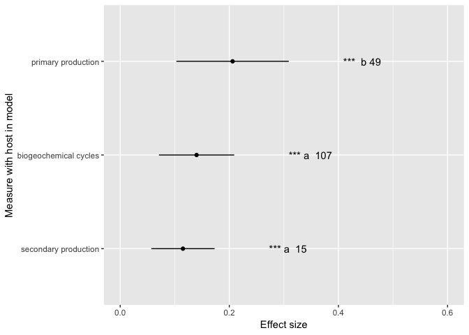
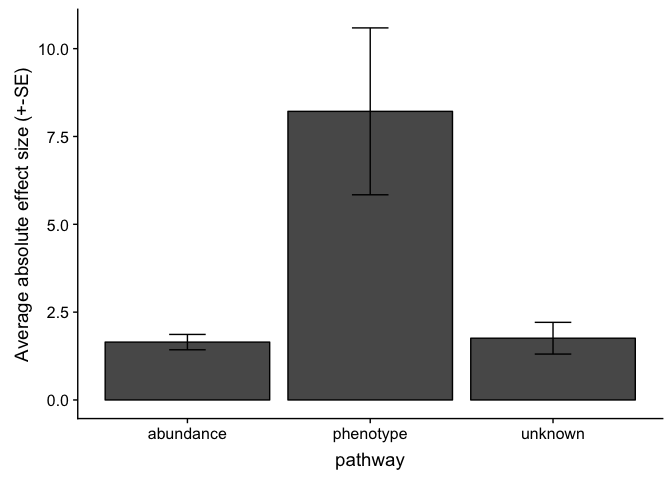

PATE\_20180817
================
Ilya
8/17/2018

To do: check whether to use variance or transform to log?
=========================================================

### To do: change to absolute value of d throughout, prior to averaging across records within a variable-- DONE

##### install packages

    ## 
    ## Attaching package: 'dplyr'

    ## The following objects are masked from 'package:stats':
    ## 
    ##     filter, lag

    ## The following objects are masked from 'package:base':
    ## 
    ##     intersect, setdiff, setequal, union

    ## 
    ## Attaching package: 'MASS'

    ## The following object is masked from 'package:dplyr':
    ## 
    ##     select

    ## 
    ## Attaching package: 'gplots'

    ## The following object is masked from 'package:stats':
    ## 
    ##     lowess

    ## Loading required package: grid

    ## Loading required package: Matrix

    ## Loading 'metafor' package (version 2.0-0). For an overview 
    ## and introduction to the package please type: help(metafor).

    ## Loading required package: mvtnorm

    ## Loading required package: survival

    ## Loading required package: TH.data

    ## 
    ## Attaching package: 'TH.data'

    ## The following object is masked from 'package:MASS':
    ## 
    ##     geyser

    ## 
    ## Attaching package: 'lmerTest'

    ## The following object is masked from 'package:lme4':
    ## 
    ##     lmer

    ## The following object is masked from 'package:stats':
    ## 
    ##     step

    ## 
    ## Attaching package: 'nlme'

    ## The following object is masked from 'package:lme4':
    ## 
    ##     lmList

    ## The following object is masked from 'package:dplyr':
    ## 
    ##     collapse

    ## Loading required package: splines

    ## Loading required package: gamlss.data

    ## Loading required package: parallel

    ##  **********   GAMLSS Version 5.1-2  **********

    ## For more on GAMLSS look at http://www.gamlss.org/

    ## Type gamlssNews() to see new features/changes/bug fixes.

    ## 
    ## Attaching package: 'gamlss'

    ## The following object is masked from 'package:lme4':
    ## 
    ##     refit

    ## NOTE: As of emmeans versions > 1.2.3,
    ##       The 'cld' function will be deprecated in favor of 'CLD'.
    ##       You may use 'cld' only if you have package:multcomp attached.

    ## 
    ## Attaching package: 'emmeans'

    ## The following object is masked from 'package:multcomp':
    ## 
    ##     cld

### summarize results of screening, based on each screener's results

``` r
path = "screened_20180918"
files = list.files(path)
out = NULL
a =1
tmp = read.csv(paste0(path, "/", files[a]))
names(tmp)= tolower(names(tmp))
names.tmp = names(tmp)
out = rbind(out, tmp)
for (a in 2:length(files)){
  tmp = read.csv(paste0(path, "/", files[a]))
  names(tmp)= tolower(names(tmp))
  fields = intersect(names(tmp), names(out))
  out = out[,fields]
  #add 
  tmp = tmp[,fields]
  out = rbind(out, tmp)
}
print("number of articles")
```

    ## [1] "number of articles"

``` r
dim(out)[1]
```

    ## [1] 2169

``` r
#check there is only one row for each paper id number, should be TRUE
dim(out)[1] == length(unique(out$id))
```

    ## [1] TRUE

``` r
out$include = tolower(out$include)
out$include[out$include == "n"] = "no"
out$include[out$include == "y"] = "yes"
out$include[out$include == "m"] = "maybe"
print("excluded after title and abstract screen")
```

    ## [1] "excluded after title and abstract screen"

``` r
tab = data.frame(table(out$include))
tab
```

    ##    Var1 Freq
    ## 1 maybe  195
    ## 2    no 1840
    ## 3   yes  134

``` r
print("full-text articles           assessed for eligibility")
```

    ## [1] "full-text articles \t\t\tassessed for eligibility"

``` r
tab$Freq[tab$Var1=="yes"]+tab$Freq[tab$Var1=="maybe"]
```

    ## [1] 329

``` r
#compute whether study was included or not 
# include_abstract = rep(NA, dim(out)[1])
# inds.no.abstract = which(out$include == "no")
# include_abstract[inds.no.abstract]
#check those that are blank
blank = subset(out, include == "")
table(blank$screened_by)#these should all be 0
```

    ## 
    ##                                                  BH 
    ##                                                   0 
    ##                                                  CS 
    ##                                                   0 
    ##                                                  ER 
    ##                                                   0 
    ##                                                  IF 
    ##                                                   0 
    ## occupancy of competitors of host -- but not biomass 
    ##                                                   0 
    ##                                                  RO 
    ##                                                   0 
    ##                                                  SH 
    ##                                                   0 
    ##                                                  SL 
    ##                                                   0 
    ##                                                  TH 
    ##                                                   0

``` r
#articles excluded on full text review
df = data.frame(table(out$exclude_reason))
df = subset(df, Var1 != "")
print("articles excluded after full-text screen")
```

    ## [1] "articles excluded after full-text screen"

``` r
sum(df$Freq)
```

    ## [1] 187

``` r
#reasons for exclusion
table(out$exclude_reason)
```

    ## 
    ##                                                          
    ##                                                     1982 
    ## data on PP but not on ecosystem processes affected by PP 
    ##                                                      129 
    ##                   effects of PP and non-PP not separable 
    ##                                                       21 
    ##                                            no data on PP 
    ##                                                       22 
    ##                                                   review 
    ##                                                        9 
    ##                         meta-analysis with relevant data 
    ##                                                        2 
    ##                                           modeling study 
    ##                                                        4

``` r
#check ones that are no for include and non-blank for include_article_review
#this should be empty
check = subset(out, include == "no" & exclude_reason !="")
check
```

    ##  [1] include                authors                year                  
    ##  [4] title                  journal                lpages                
    ##  [7] upages                 doi                    abstract              
    ## [10] id                     screened_by            include_article_review
    ## [13] exclude_reason        
    ## <0 rows> (or 0-length row.names)

``` r
# subset(out, exclude_reason == "no information on ecosystem effects (host abundance, mortality, not basal area); small stem density")
out$include_article_review = tolower(out$include_article_review)

#records that are no at include should be blank at include_article_review
inds.include1_no = which(out$include=="no")
out$include_article_review[inds.include1_no]=""
table(out$include, out$include_article_review)
```

    ##        
    ##              maybe maybe -- requested ill   no  yes yes -- requested ill
    ##   maybe    0    15                      0  114   65                    1
    ##   no    1840     0                      0    0    0                    0
    ##   yes      0     4                      1   54   75                    0

``` r
#this should be empty -- should have always indicated whether to include an article on full screen of article, for abstracts that were not marked as no at abstract/title stage
df_blank_odd = subset(out, include_article_review == "" & include != "no")
dim(df_blank_odd)
```

    ## [1]  0 13

``` r
df.include = data.frame(table(out$include_article_review))
df.include = subset(df.include, Var1 !="")
df.include
```

    ##                     Var1 Freq
    ## 2                  maybe   19
    ## 3 maybe -- requested ill    1
    ## 4                     no  168
    ## 5                    yes  140
    ## 6   yes -- requested ill    1

``` r
#check that maybe ("effects...not separable") and no add up to exclude 
print("exclude check")
```

    ## [1] "exclude check"

``` r
df.include$Freq[df.include$Var1=="maybe"]+df.include$Freq[df.include$Var1=="no"]
```

    ## [1] 187

``` r
print("include check")#this plus nos (at include_article_review) should add up to number checked full article 
```

    ## [1] "include check"

``` r
df.include$Freq[df.include$Var1=="yes"]+
  df.include$Freq[df.include$Var1=="maybe -- requested ill"]+
  df.include$Freq[df.include$Var1=="yes -- requested ill"]
```

    ## [1] 142

``` r
#check ones that are yes at include_article_review and something other than yes or maybe at include. this should be empty
inds.include_review_yes = which(out$include_article_review!="maybe" & out$include_article_review !="no" & out$include_article_review !="" )
inds.include_no = which(out$include=="no")
intersect(inds.include_review_yes, inds.include_no)
```

    ## integer(0)

``` r
#check that all the ones that have exclude reason are also no for include_article_review
table(out$include_article_review, out$exclude_reason)
```

    ##                         
    ##                              
    ##                          1840
    ##   maybe                     0
    ##   maybe -- requested ill    1
    ##   no                        0
    ##   yes                     140
    ##   yes -- requested ill      1
    ##                         
    ##                          data on PP but not on ecosystem processes affected by PP
    ##                                                                                 0
    ##   maybe                                                                         0
    ##   maybe -- requested ill                                                        0
    ##   no                                                                          129
    ##   yes                                                                           0
    ##   yes -- requested ill                                                          0
    ##                         
    ##                          effects of PP and non-PP not separable
    ##                                                               0
    ##   maybe                                                      19
    ##   maybe -- requested ill                                      0
    ##   no                                                          2
    ##   yes                                                         0
    ##   yes -- requested ill                                        0
    ##                         
    ##                          no data on PP review
    ##                                      0      0
    ##   maybe                              0      0
    ##   maybe -- requested ill             0      0
    ##   no                                22      9
    ##   yes                                0      0
    ##   yes -- requested ill               0      0
    ##                         
    ##                          meta-analysis with relevant data modeling study
    ##                                                         0              0
    ##   maybe                                                 0              0
    ##   maybe -- requested ill                                0              0
    ##   no                                                    2              4
    ##   yes                                                   0              0
    ##   yes -- requested ill                                  0              0

``` r
#check rows that are yes on include_article_review and have entry for exclude_reason -- these need to be corrected for consistency in original data so that this is empty  
test = subset(out, include_article_review=="yes" & exclude_reason !="")
test
```

    ##  [1] include                authors                year                  
    ##  [4] title                  journal                lpages                
    ##  [7] upages                 doi                    abstract              
    ## [10] id                     screened_by            include_article_review
    ## [13] exclude_reason        
    ## <0 rows> (or 0-length row.names)

``` r
table(out$include_article_review)
```

    ## 
    ##                                         maybe maybe -- requested ill 
    ##                   1840                     19                      1 
    ##                     no                    yes   yes -- requested ill 
    ##                    168                    140                      1

#### read in studies spreadsheet and remove ones that were later excluded

``` r
S <- read.csv("meta_data_20180724 - studies.csv")
#unique(S$exclude)
S <- subset(S, is.na(exclude))#record is okay if it is empty, exclude those that are 1
save(S, file = "S.Rdata")
```

### read in measures data and generate a PP --&gt; abund/morbidity row for each abund/morbidity --&gt; ecosystem process record that does not have an accompanying PP --&gt; abund/morbidity

``` r
P = read.csv("meta_data_20180724 - quant_data.csv")
dim(P)
```

    ## [1] 2038   65

``` r
P = subset(P, is.na(exclude.as.ecosystem.measure))
dim(P)[1]
```

    ## [1] 1935

``` r
P = subset(P, !is.na(pathway))
dim(P)[1]
```

    ## [1] 1935

``` r
subset(P, is.na(paper.ID))#should be empty
```

    ##      paper.ID measureID pathway measure.general
    ## 79         NA                                  
    ## 90         NA                                  
    ## 311        NA                                  
    ## 514        NA                                  
    ## 555        NA                                  
    ## 678        NA                                  
    ## 736        NA                                  
    ## 821        NA                                  
    ## 938        NA                                  
    ## 1042       NA                                  
    ## 1584       NA                                  
    ## 1587       NA                                  
    ##      measure.specific....outcome.variable data.to.use
    ## 79                                                   
    ## 90                                                   
    ## 311                                                  
    ## 514                                                  
    ## 555                                                  
    ## 678                                                  
    ## 736                                                  
    ## 821                                                  
    ## 938                                                  
    ## 1042                                                 
    ## 1584                                                 
    ## 1587                                                 
    ##      regression.coefficient regression.coefficient.SE
    ## 79                       NA                        NA
    ## 90                       NA                        NA
    ## 311                      NA                        NA
    ## 514                      NA                        NA
    ## 555                      NA                        NA
    ## 678                      NA                        NA
    ## 736                      NA                        NA
    ## 821                      NA                        NA
    ## 938                      NA                        NA
    ## 1042                     NA                        NA
    ## 1584                     NA                        NA
    ## 1587                     NA                        NA
    ##      regression.or.correlation percent value
    ## 79                                  NA    NA
    ## 90                                  NA    NA
    ## 311                                 NA    NA
    ## 514                                 NA    NA
    ## 555                                 NA    NA
    ## 678                                 NA    NA
    ## 736                                 NA    NA
    ## 821                                 NA    NA
    ## 938                                 NA    NA
    ## 1042                                NA    NA
    ## 1584                                NA    NA
    ## 1587                                NA    NA
    ##      digitizable.or.raw.data.available
    ## 79                                  NA
    ## 90                                  NA
    ## 311                                 NA
    ## 514                                 NA
    ## 555                                 NA
    ## 678                                 NA
    ## 736                                 NA
    ## 821                                 NA
    ## 938                                 NA
    ## 1042                                NA
    ## 1584                                NA
    ## 1587                                NA
    ##      variable.greater.without.pathogen.parasite direction
    ## 79                                           NA        NA
    ## 90                                           NA        NA
    ## 311                                          NA        NA
    ## 514                                          NA        NA
    ## 555                                          NA        NA
    ## 678                                          NA        NA
    ## 736                                          NA        NA
    ## 821                                          NA        NA
    ## 938                                          NA        NA
    ## 1042                                         NA        NA
    ## 1584                                         NA        NA
    ## 1587                                         NA        NA
    ##      note.directionality.of.effect test.statistic.bounded.below
    ## 79                                                           NA
    ## 90                                                           NA
    ## 311                                                          NA
    ## 514                                                          NA
    ## 555                                                          NA
    ## 678                                                          NA
    ## 736                                                          NA
    ## 821                                                          NA
    ## 938                                                          NA
    ## 1042                                                         NA
    ## 1584                                                         NA
    ## 1587                                                         NA
    ##      percent.difference P  F df groups  t sample.size.total
    ## 79                   NA   NA NA     NA NA                NA
    ## 90                   NA   NA NA     NA NA                NA
    ## 311                  NA   NA NA     NA NA                NA
    ## 514                  NA   NA NA     NA NA                NA
    ## 555                  NA   NA NA     NA NA                NA
    ## 678                  NA   NA NA     NA NA                NA
    ## 736                  NA   NA NA     NA NA                NA
    ## 821                  NA   NA NA     NA NA                NA
    ## 938                  NA   NA NA     NA NA                NA
    ## 1042                 NA   NA NA     NA NA                NA
    ## 1584                 NA   NA NA     NA NA                NA
    ## 1587                 NA   NA NA     NA NA                NA
    ##      sample.size.control sample.size.infected secondary_factor
    ## 79                    NA                   NA                 
    ## 90                    NA                   NA                 
    ## 311                   NA                   NA                 
    ## 514                   NA                   NA                 
    ## 555                   NA                   NA                 
    ## 678                   NA                   NA                 
    ## 736                   NA                   NA                 
    ## 821                   NA                   NA                 
    ## 938                   NA                   NA                 
    ## 1042                  NA                   NA                 
    ## 1584                  NA                   NA                 
    ## 1587                   4                    4          species
    ##      secondary_factor_level tertiary_factor tertiary_factor_level
    ## 79                                                               
    ## 90                                                               
    ## 311                                                              
    ## 514                                                              
    ## 555                                                              
    ## 678                                                              
    ## 736                                                              
    ## 821                                                              
    ## 938                                                              
    ## 1042                                                             
    ## 1584                                                             
    ## 1587                 Tanoak                                      
    ##      quaternary.factor quaternary.factor.level variance.measure
    ## 79                                          NA                 
    ## 90                                          NA                 
    ## 311                                         NA                 
    ## 514                                         NA                 
    ## 555                                         NA                 
    ## 678                                         NA                 
    ## 736                                         NA                 
    ## 821                                         NA                 
    ## 938                                         NA                 
    ## 1042                                        NA                 
    ## 1584                                        NA                 
    ## 1587                                        NA               SE
    ##      control.mean control.variance variance.not.reported control.CI.lower
    ## 79                              NA                    NA               NA
    ## 90                              NA                    NA               NA
    ## 311                             NA                    NA               NA
    ## 514                             NA                    NA               NA
    ## 555                             NA                    NA               NA
    ## 678                             NA                    NA               NA
    ## 736                             NA                    NA               NA
    ## 821                             NA                    NA               NA
    ## 938                             NA                    NA               NA
    ## 1042                            NA                    NA               NA
    ## 1584                            NA                    NA               NA
    ## 1587      89.7000                6                    NA               NA
    ##      control.CI.upper infected.mean infected.variance infected.CI.lower
    ## 79                 NA                              NA                NA
    ## 90                 NA                              NA                NA
    ## 311                NA                              NA                NA
    ## 514                NA                              NA                NA
    ## 555                NA                              NA                NA
    ## 678                NA                              NA                NA
    ## 736                NA                              NA                NA
    ## 821                NA                              NA                NA
    ## 938                NA                              NA                NA
    ## 1042               NA                              NA                NA
    ## 1584               NA                              NA                NA
    ## 1587               NA          75.6               9.3                NA
    ##      infected.CI.upper correlation.coefficient R.squared R.squared.se  U
    ## 79                  NA                      NA        NA           NA NA
    ## 90                  NA                      NA        NA           NA NA
    ## 311                 NA                      NA        NA           NA NA
    ## 514                 NA                      NA        NA           NA NA
    ## 555                 NA                      NA        NA           NA NA
    ## 678                 NA                      NA        NA           NA NA
    ## 736                 NA                      NA        NA           NA NA
    ## 821                 NA                      NA        NA           NA NA
    ## 938                 NA                      NA        NA           NA NA
    ## 1042                NA                      NA        NA           NA NA
    ## 1584                NA                      NA        NA           NA NA
    ## 1587                NA                      NA        NA           NA NA
    ##      digitized_data predictor.variable predictor.value predictor.unit
    ## 79               NA                                                  
    ## 90               NA                                                  
    ## 311              NA                                                  
    ## 514              NA                                                  
    ## 555              NA                                                  
    ## 678              NA                                                  
    ## 736              NA                                                  
    ## 821              NA                                                  
    ## 938              NA                                                  
    ## 1042             NA          BBD score                               
    ## 1584             NA                                                  
    ## 1587             NA                                                  
    ##      outcome.unit...concat.w.measure.specific
    ## 79                                           
    ## 90                                           
    ## 311                                          
    ## 514                                          
    ## 555                                          
    ## 678                                          
    ## 736                                          
    ## 821                                          
    ## 938                                          
    ## 1042                                         
    ## 1584                                         
    ## 1587                                         
    ##      morbid_or_abund_biomass_measure effects.on.host effects.on.community
    ## 79                                                                       
    ## 90                                                                       
    ## 311                                                                      
    ## 514                                                                      
    ## 555                                                                      
    ## 678                                                                      
    ## 736                                                                      
    ## 821                                                                      
    ## 938                                                                      
    ## 1042                                                                     
    ## 1584                                                                     
    ## 1587                                                                     
    ##      ecosystem_process_mediate have.not.added.double.counting
    ## 79                          NA                             NA
    ## 90                          NA                             NA
    ## 311                         NA                             NA
    ## 514                         NA                             NA
    ## 555                         NA                             NA
    ## 678                         NA                             NA
    ## 736                         NA                             NA
    ## 821                         NA                             NA
    ## 938                         NA                             NA
    ## 1042                        NA                             NA
    ## 1584                        NA                             NA
    ## 1587                        NA                             NA
    ##      double.counted.effect.on.plants...photosynthesizers.as.ecosystem.effect
    ## 79                                                                        NA
    ## 90                                                                        NA
    ## 311                                                                       NA
    ## 514                                                                       NA
    ## 555                                                                       NA
    ## 678                                                                       NA
    ## 736                                                                       NA
    ## 821                                                                       NA
    ## 938                                                                       NA
    ## 1042                                                                      NA
    ## 1584                                                                      NA
    ## 1587                                                                      NA
    ##      double.counted.effect.on.non.plant.hosts.as.ecosystem.effect
    ## 79                                                             NA
    ## 90                                                             NA
    ## 311                                                            NA
    ## 514                                                            NA
    ## 555                                                            NA
    ## 678                                                            NA
    ## 736                                                            NA
    ## 821                                                            NA
    ## 938                                                            NA
    ## 1042                                                           NA
    ## 1584                                                           NA
    ## 1587                                                           NA
    ##      ecosystem.function.not.linked.to.morbidity.or.abund location.in.paper
    ## 79                                                    NA                  
    ## 90                                                    NA                  
    ## 311                                                   NA                  
    ## 514                                                   NA                  
    ## 555                                                   NA                  
    ## 678                                                   NA                  
    ## 736                                                   NA                  
    ## 821                                                   NA                  
    ## 938                                                   NA                  
    ## 1042                                                  NA                  
    ## 1584                                                  NA                  
    ## 1587                                                  NA                  
    ##      note exclude.as.ecosystem.measure include.as.ecosystem.measure
    ## 79                                  NA                             
    ## 90                                  NA                             
    ## 311                                 NA                             
    ## 514                                 NA                             
    ## 555                                 NA                             
    ## 678                                 NA                             
    ## 736                                 NA                             
    ## 821                                 NA                             
    ## 938                                 NA                             
    ## 1042                                NA                             
    ## 1584                                NA                             
    ## 1587                                NA                             
    ##      reason.for.inclusion.or.exclusion.as.ecosystem.measure notes confirm
    ## 79                                                                     NA
    ## 90                                                                     NA
    ## 311                                                                    NA
    ## 514                                                                    NA
    ## 555                                                                    NA
    ## 678                                                                    NA
    ## 736                                                                    NA
    ## 821                                                                    NA
    ## 938                                                                    NA
    ## 1042                                                                   NA
    ## 1584                                                                   NA
    ## 1587                                                                   NA

``` r
P$have.not.added.double.counting=trimws(P$have.not.added.double.counting)
##find rows for which "have.not.added.double.counting" is non-empty
# D = subset(P, have.not.added.double.counting !="" &
#              (P$pathway == "morbidity to ecosystem fxn" | P$pathway == "abund biomass to ecosystem fxn"))

D = subset(P, have.not.added.double.counting !="")
list1 = sort(unique(D$pathway))
list0 = c("PP to abund biomass",
          "PP to morbidity", 
          "PP to unknown")
# D.not = subset(P, have.not.added.double.counting =="" |
#                               (P$have.not.added.double.counting !="" & P$pathway != "morbidity to ecosystem fxn" & P$pathway != "abund biomass to ecosystem fxn"))

D.not = subset(P, is.na(have.not.added.double.counting))

dim(D)[1]+dim(D.not)[1]                 
```

    ## [1] 1935

``` r
out = NULL
a = 1
for (a in 1:dim(D)[1]){
  tmp = D[a,]
  tmp$have.not.added.double.counting = ""
  tmp.1 = tmp
  index = which(list1 == tmp$pathway)
  tmp.1$measure.general = tmp.1$morbid_or_abund_biomass_measure
  tmp.1$pathway = list0[index]
  tmp.both = rbind(tmp, tmp.1)#both rows
  out = rbind(out, tmp.both)
}
P = rbind(D.not, out)
save(P, file = "P.Rdata")
```

#### combine study and measures data

### includes error check that identifies couple of papers inadvertantly reviewed twice.

fields in PATE\_data.csv:
-------------------------

paper.ID: unique identifier for each paper (matches numbers in each screener's file)
------------------------------------------------------------------------------------

author: study lead author
-------------------------

Pathogen.kingdom; Host.kingdom: note that there are some entries here for entities that are higher or lower than kingdom or (e.g. dinoflagellates) paraphyletic. We may want to limit analysis to categories that appear relatively frequently.
-----------------------------------------------------------------------------------------------------------------------------------------------------------------------------------------------------------------------------------------------

### System: aquatic, terrestrial

### System.2: if we decide to use this we may want to bin these into fewer categories of biomes

### PP.to.ecosystem.fxn: 1 (pathway present), 0 (absent); this describes direct effect of PP on ecosystem function, e.g. biomass of trematodes, primary production of hemiparasitic plants

### "PP.abundance": this seems lower priority for analysis, refers to whether study included info on abundance of PP in the environment

### "PP.morbidity": did the study contain info on the phenotype of pathogens (e.g. vigor of hemiparasitic plants). this seems lower priority for inclusion in analysis.

### "PP.to.host.infection.prevalence...intensity": does the paper report on PP infection prevalence or intensity? lower priority for analysis

### "PP.to.abund.biomass", "PP.to.morbidity", "PP.to.unknown": does paper report on each of these pathways from PP to host/community. Unknown includes cases where it is not possible to determine whether effects are on abund/biomass or on morbidity

### "abund.biomass.to.ecosystem.fxn", "morbidity.to.ecosystem.fxn", "unknown.to.ecosystem.fxn": does paper report on each of these pathways

### abiotic.or.biotic: does paper report on abiotic or biotic factors that mediate influence of PP on other components in model?

### "experimental..PP.manipulation.or.mimic...1..observational..2..both..3.": is paper experimental, observational, or both; note entries in this field currently include some notes and would need to be cleaned up to be used in analysis.

### "process.vs..standing.stock.vs..both": does paper report on ecosystem effects as process (e.g. rate), standing stock, or report on both?

### "highest.observational.scale..species.vs..community.ecosystem..of.ecosystem.impact": what is the highest observational scale at which ecosystem function effects have been measured: species, assemblage (multiple species), or ecosystem (includes papers in which effects at level of a functional group have been measured e.g. biomass of all trees)

### spatial scale: area or volume of sampling unit; description would require some recoding to be used in analysis

### "coordinates.in.paper": are lat/long reported in paper (note: have not extracted this info)

### measureID: if a study reported on an ecosystem process measure (e.g. morbidity --&gt; ecosystem fxn), we assumed that there was also a measure at an earlier stage in the conceptual diagram (PP --&gt; morbidity). We created an additional record for this earlier stage, and linked the two stages with a measureID unique to that study. The two measures are also linked by having the same value for "measure.specific....outcome.variable", which is also unique within the study.

### pathway: what pathway has been measued

### measure.general: in the case of (X --&gt; ecosystem fxn), this is either biogeochemical cycles, primary production, or secondary production. For (PP --&gt; X), there is more variation in how measures have been described, and some recoding would be needed to make these data comparable.

### "measure.specific....outcome.variable": the measure as described in the paper

### effects.on.host; effects.on.community: was the PP --&gt; X effect on the host or not, on the community or not; note this has not been filled in for all rows but could be based (have checked this for part) on the measure.general and measure.specific

### ecosystem\_process\_mediate: did an ecosystem process mediate the relationship between PP and other components of the conceptual diagram. Note this has not been filled in throughout, but could be based on other data (have checked this for part)

``` r
load("S.Rdata")
load("P.Rdata")

names(S)[names(S)=="ID"]="paper.ID"
setdiff(S$paper.ID, P$paper.ID)
```

    ## integer(0)

``` r
ids = setdiff(P$paper.ID, S$paper.ID)#this has two that determined later needed to be excluded
ids.common = intersect(P$paper.ID, S$paper.ID)#
dim(P)
```

    ## [1] 2256   65

``` r
P = subset(P, paper.ID %in% ids.common)
dim(P)
```

    ## [1] 2148   65

``` r
out = NULL 
uid = unique(P$paper.ID)
a = 37
out = NULL 
for (a in 1:length(uid)){
  tmpS = subset(S, paper.ID == uid[a])
  tmpP = subset(P, paper.ID == uid[a])
  #compute PP.to.abund.biomass
  tmpS$PP.to.abund.biomass=0
  PP_abund = subset(tmpP, pathway == "PP to abund biomass")
  if (dim(PP_abund)[1]>0){
    tmpS$PP.to.abund.biomass=1
  }
  #compute PP.to.morbidity
  tmpS$PP.to.morbidity=0
  PP_morb = subset(tmpP, pathway == "PP to morbidity")
  if (dim(PP_morb)[1]>0){
    tmpS$PP.to.morbidity=1
  }
  
  #compute PP.to.unknown
  tmpS$PP.to.unknown=0
  PP_unk = subset(tmpP, pathway == "PP to unknown")
  if (dim(PP_unk)[1]>0){
    tmpS$PP.to.unknown=1
  }

  #compute abund biomass to ecosystem fxn
  tmpS$abund.biomass.to.ecosystem.fxn=0
  PP_ab_ef = subset(tmpP, pathway == "abund biomass to ecosystem fxn")
  if (dim(PP_ab_ef)[1]>0){
    tmpS$abund.biomass.to.ecosystem.fxn=1
  }

  #compute morbidity to ecosystem fxn
  tmpS$morbidity.to.ecosystem.fxn=0
  PP_m_ef = subset(tmpP, pathway == "morbidity to ecosystem fxn")
  if (dim(PP_m_ef)[1]>0){
    tmpS$morbidity.to.ecosystem.fxn=1
  }

  #compute unknown to ecosystem fxn
  tmpS$unknown.to.ecosystem.fxn=0
  PP_u_ef = subset(tmpP, pathway == "unknown to ecosystem fxn")
  if (dim(PP_u_ef)[1]>0){
    tmpS$unknown.to.ecosystem.fxn=1
  }
  tmpM = merge(tmpS, tmpP, by = "paper.ID")
  out = rbind(out, tmpM)
  
  if (dim(tmpM)[1] > dim(tmpP)[1]){
    #this will print if there are papers that have been entered twice in spreadsheet "studies"
    print("a")
    print(uid[a])
    print(a)
  }
}
M = merge(S, P, by = "paper.ID")
dim(M)[1]==dim(out)[1]
```

    ## [1] TRUE

``` r
dim(M)
```

    ## [1] 2148  107

``` r
M <- out
save(M, file = "M.Rdata")
write.csv(M, file ="PATE_data.csv")
```

### meta-analysis

### functions

### write function to get pooled value for variable across all "levels" within a study, pathway, and general.measure

``` r
b  = 14
c = 3
d = 2
e = 1
one.per.var = function(M.y){
  ustudy = unique(M.y$paper.ID)
  out = NULL
  for (b in 1:length(ustudy)){
  print("b")
  print(b)

    print(ustudy[b])
  s.tmp = subset(M.y, paper.ID == ustudy[b])
  upath = unique(s.tmp$pathway)
#for each pathway in study
    for (c in 1:length(upath)){
      p.tmp = subset(s.tmp, pathway == upath[c])
      umeasure = unique(p.tmp$measure.general)
      print("c")
      print(c)
      #for each general measure, find all variables within that measure
      for (d in 1:length(umeasure)){
        print("d")
        print(d)
        inds = which(p.tmp$measure.general == umeasure[d])
        m.tmp = p.tmp[inds,]
        #unique variable
        uvar = unique(m.tmp$measure.specific....outcome.variable)
        for (e in 1:length(uvar)){
          print("e")
          print(e)

          v.tmp = subset(m.tmp, measure.specific....outcome.variable == uvar[e])
          if (dim(v.tmp)[1]>1){
            #if more than one record for a variable, find pooled estimate across all records     
            print("pooled estimate")
            m = rma(yi = abs(v.tmp$d),
                       vi = v.tmp$d.sampling.variance,
                       measure = "MN")  
            #print(m)
            v.tmp$d = m$yi[1]
            v.tmp$d.sampling.variance = m$vi[1]
            v.tmp = v.tmp[1,]
            
            out = rbind(out, v.tmp)
          }#end if statement
          else {#else use value already gotten
            out = rbind(out, v.tmp)
          }#end else
 
  
          print(v.tmp$d)
          
        }#end variable
        
      }#end general measure
   }#end pathway
  }#end study
  return(out)
}#end function

save(one.per.var, file = "one.per.var.Rdata")
```

### write function to get standard error based on p value and effect size

``` r
se_from_p <- function(effect, p){
  z = -0.862 + sqrt(0.743 - 2.404*log(p))
  SE = effect/z
  return(SE)
}
save(se_from_p, file = "se_from_p.Rdata")
```

### function to calculate SE for correlation coefficient (r) from r and n (sample size)

### source: Zar, J. 1999. Biostatistical analysis. p. 373

``` r
se.calc.from.r.n <-  function( r, n){
  se.calc = sqrt((1-r^2)/(n-2))
  return (se.calc)
}
save(se.calc.from.r.n,file="se.calc.from.r.n.Rdata")
```

### function to calculate standardized mean difference (d) from regression coefficient (log odds ratio) and SE of coefficient

``` r
or_to_d <- function(df){
  r = df$regression.coefficient
  r.se = df$regression.coefficient.SE
  r.variance = r.se^2
  #https://www.meta-analysis.com/downloads/Meta-analysis%20Converting%20among%20effect%20sizes.pdf
  df$d = r*(sqrt(3)/pi)
  df$d.sampling.variance=r.variance*(3/pi^2)
  return(df)
}
save(or_to_d, file = "or_to_d.Rdata")
```

### function to calculate standardized mean difference (d) from correlation coefficient (r) and SE of r

``` r
r_to_d <- function(df ){
      r = df$correlation.coefficient
      r2 = r^2
      d = 2*r/sqrt(1-r2)
      #Standard deviation (s) = Standard Error * √n 
      print(as.numeric(as.character(df$correlation.coefficient.se)))
      s_r = as.numeric(as.character(df$correlation.coefficient.se))*sqrt(df$sample.size.total)
      var_r = s_r^2
      var_d = 4*var_r/((1-r2)^3)
      #from d and var_d to log odds ratio
      df$d =d
      df$d.sampling.variance = var_d
      df2 <-df
  return(df2)
}
save(r_to_d, file = "r_to_d.Rdata")
```

fix P values that have characters in them
=========================================

``` r
load("M.Rdata")

M$P = as.character(M$P)
P = as.numeric(M$P)#this should convert some to NA
```

    ## Warning: NAs introduced by coercion

``` r
inds.na = which(is.na(P))
is.not.empty = which(M$P !="")
inds.na = intersect(inds.na, is.not.empty)
a = 1
for (a in 1:length(inds.na)){
  M$P[inds.na[a]]=strsplit(M$P[inds.na[a]],"<")[[1]][2]
  print(M$P[inds.na[a]])
}
```

    ## [1] "0.01"
    ## [1] "0.01"
    ## [1] "0.001"
    ## [1] "0.001"
    ## [1] "0.001"
    ## [1] "0.001"
    ## [1] "0.001"
    ## [1] "0.001"
    ## [1] "0.001"
    ## [1] "0.001"
    ## [1] "0.001"
    ## [1] "0.001"
    ## [1] "0.001"
    ## [1] "0.0005"
    ## [1] "0.0005"
    ## [1] "0.0005"
    ## [1] "0.0005"
    ## [1] "0.01"
    ## [1] "0.001"
    ## [1] "0.0001"
    ## [1] "0.0001"
    ## [1] ".01"

``` r
M$P = as.numeric(M$P)
save(M, file = "M.Rdata")
```

### following chunks each handle one data type encountered in papers, and convert that data type to d (standardized mean difference) and sampling variance in d

### mean\_variance

### include pre- vs. post (e.g. Colon-Gaud\_1263 2010)

### exclude data points with standard deviation equal to zero

### includes parasite/pathogen removal (as control)

### includes less vs. more virulent form of disease

### includes only "control" treatments (invaded vs. uninvaded), in cases where host abundance was manipulated at local scale on top of effect of pathogen on host abundance (Connelly et al.\_2093)

``` r
load("M.Rdata")
M$d.absolute = 0#is d absolute value

load("one.per.var.Rdata")

# sd_adjust = 0.0001
M = subset(M, pathway %in% c("morbidity to ecosystem fxn",
                             "unknown to ecosystem fxn",
                             "abund biomass to ecosystem fxn",
                             "PP to ecosystem fxn"))
#M = subset(M, exclude.as.ecosystem.measure !=1)
M$d = NA
M$control_sd=NA
M$infected_sd = NA
M$d = NA
M$d.sampling.variance = NA
M$control.mean=as.numeric(as.character(M$control.mean))
```

    ## Warning: NAs introduced by coercion

``` r
M$infected.mean=as.numeric(as.character(M$infected.mean))
```

    ## Warning: NAs introduced by coercion

``` r
unique(as.character(M$sample.size.infected))
```

    ##  [1] "6"  "19" NA   "18" "5"  "1"  "20" "21" "82" "36" "63" "46" "10" "28"
    ## [15] "38" "15" "4"  "40" "3"  "25" "23" "11" "12" "30" "31" "29" "14" "54"
    ## [29] "60" "45"

``` r
M$sample.size.infected=as.numeric(as.character(M$sample.size.infected))
M.y = subset(M, (data.to.use == "mean_variance" | data.to.use == "mean_variance levels of disease" ) 
             & !is.na(control.mean))
M.n  = subset(M, (data.to.use != "mean_variance" & data.to.use != "mean_variance levels of disease") | ((data.to.use == "mean_variance" | data.to.use == "mean_variance levels of disease") & is.na(control.mean)))
dim(M.y)[1]+dim(M.n)[1]==dim(M)[1]
```

    ## [1] TRUE

``` r
#for each record, get effect size and SE
a = 31
#M.y = subset(M.y, paper.ID == 1924)
for (a in 1:dim(M.y)[1]){
  #find out what type of variance measure is there
  var_measure = M.y$variance.measure[a]
  if (var_measure == "SD"){
    M.y$control_sd[a]=M.y$control.variance[a]
    M.y$infected_sd[a]=M.y$infected.variance[a]
  }
  if (var_measure == "SE"){
    M.y$control_sd[a]=M.y$control.variance[a]*sqrt(M.y$sample.size.control[a])
    M.y$infected_sd[a]=M.y$infected.variance[a]*sqrt(M.y$sample.size.infected[a])
  }
  if (var_measure == "CV"){
    M.y$control_sd[a] = M.y$control.variance[a]*M.y$control.mean[a]/100
    M.y$infected_sd[a] = M.y$infected.variance[a]*M.y$infected.mean[a]/100
  }
  
  if (var_measure == "CI"){
    control.se = (M.y$control.CI.upper[a] - M.y$control.mean[a])/1.96
    M.y$control_sd[a]= control.se * sqrt(M.y$sample.size.control[a])

    infected.se = (M.y$infected.CI.upper[a] - M.y$infected.mean[a])/1.96        
    M.y$infected_sd[a]= infected.se * sqrt(M.y$sample.size.infected[a])
    }
  m1i = M.y$control.mean[a]
  m2i = M.y$infected.mean[a]
  sd1i = M.y$control_sd[a]
  sd2i = M.y$infected_sd[a]
  n1i = M.y$sample.size.control[a]
  n2i = M.y$sample.size.infected[a]
  m = escalc(measure = "SMD",
         m1i = m1i,
         m2i = m2i,
         sd1i = sd1i,
         sd2i = sd2i,
         n1i = n1i,
         n2i = n2i)
  M.y$d[a] =m$yi[1]
  #print("a")
  #print(a)
  #print(M.y$d[a])
  M.y$d.sampling.variance[a] = m$vi[1]
}

#change d to absolute value of d
M.y$d = abs(M.y$d)
M.y$d.absolute=1
ustudy = unique(M.y$paper.ID)
#for each study
out = one.per.var(M.y)
```

    ## [1] "b"
    ## [1] 1
    ## [1] 42
    ## [1] "c"
    ## [1] 1
    ## [1] "d"
    ## [1] 1
    ## [1] "e"
    ## [1] 1
    ## [1] "pooled estimate"
    ## [1] 0.8475836
    ## [1] "b"
    ## [1] 2
    ## [1] 53
    ## [1] "c"
    ## [1] 1
    ## [1] "d"
    ## [1] 1
    ## [1] "e"
    ## [1] 1
    ## [1] 1.588274
    ## [1] "e"
    ## [1] 2
    ## [1] 1.15229
    ## [1] "b"
    ## [1] 3
    ## [1] 59
    ## [1] "c"
    ## [1] 1
    ## [1] "d"
    ## [1] 1
    ## [1] "e"
    ## [1] 1
    ## [1] "pooled estimate"
    ## [1] 2.085546
    ## [1] "e"
    ## [1] 2
    ## [1] "pooled estimate"
    ## [1] 1.837976
    ## [1] "e"
    ## [1] 3
    ## [1] "pooled estimate"

    ## Warning in rma(yi = abs(v.tmp$d), vi = v.tmp$d.sampling.variance, measure =
    ## "MN"): Studies with NAs omitted from model fitting.

    ## [1] 0.3179377
    ## [1] "e"
    ## [1] 4
    ## [1] NA
    ## [1] "e"
    ## [1] 5
    ## [1] NA
    ## [1] "b"
    ## [1] 4
    ## [1] 328
    ## [1] "c"
    ## [1] 1
    ## [1] "d"
    ## [1] 1
    ## [1] "e"
    ## [1] 1
    ## [1] 2.25913
    ## [1] "c"
    ## [1] 2
    ## [1] "d"
    ## [1] 1
    ## [1] "e"
    ## [1] 1
    ## [1] 2.722881
    ## [1] "e"
    ## [1] 2
    ## [1] 2.201161
    ## [1] "b"
    ## [1] 5
    ## [1] 474
    ## [1] "c"
    ## [1] 1
    ## [1] "d"
    ## [1] 1
    ## [1] "e"
    ## [1] 1
    ## [1] "pooled estimate"
    ## [1] 3.493121
    ## [1] "e"
    ## [1] 2
    ## [1] "pooled estimate"
    ## [1] 0.1276036
    ## [1] "b"
    ## [1] 6
    ## [1] 1375
    ## [1] "c"
    ## [1] 1
    ## [1] "d"
    ## [1] 1
    ## [1] "e"
    ## [1] 1
    ## [1] "pooled estimate"
    ## [1] 2.998027
    ## [1] "e"
    ## [1] 2
    ## [1] 0
    ## [1] "d"
    ## [1] 2
    ## [1] "e"
    ## [1] 1
    ## [1] 1.009494
    ## [1] "b"
    ## [1] 7
    ## [1] 1493
    ## [1] "c"
    ## [1] 1
    ## [1] "d"
    ## [1] 1
    ## [1] "e"
    ## [1] 1
    ## [1] 0.11444
    ## [1] "b"
    ## [1] 8
    ## [1] 1600
    ## [1] "c"
    ## [1] 1
    ## [1] "d"
    ## [1] 1
    ## [1] "e"
    ## [1] 1
    ## [1] 0.320941
    ## [1] "b"
    ## [1] 9
    ## [1] 1859
    ## [1] "c"
    ## [1] 1
    ## [1] "d"
    ## [1] 1
    ## [1] "e"
    ## [1] 1
    ## [1] "pooled estimate"
    ## [1] 0.6990683
    ## [1] "c"
    ## [1] 2
    ## [1] "d"
    ## [1] 1
    ## [1] "e"
    ## [1] 1
    ## [1] "pooled estimate"
    ## [1] 0
    ## [1] "e"
    ## [1] 2
    ## [1] "pooled estimate"
    ## [1] 0.6467786
    ## [1] "e"
    ## [1] 3
    ## [1] "pooled estimate"
    ## [1] 7.28856
    ## [1] "e"
    ## [1] 4
    ## [1] "pooled estimate"
    ## [1] 0.7724622
    ## [1] "e"
    ## [1] 5
    ## [1] "pooled estimate"
    ## [1] 0.8388898
    ## [1] "e"
    ## [1] 6
    ## [1] "pooled estimate"
    ## [1] 1.702444
    ## [1] "e"
    ## [1] 7
    ## [1] "pooled estimate"
    ## [1] 3.349469
    ## [1] "e"
    ## [1] 8
    ## [1] "pooled estimate"
    ## [1] 19.06656
    ## [1] "e"
    ## [1] 9
    ## [1] "pooled estimate"
    ## [1] 5.155392
    ## [1] "e"
    ## [1] 10
    ## [1] "pooled estimate"
    ## [1] 0.08435282
    ## [1] "e"
    ## [1] 11
    ## [1] "pooled estimate"
    ## [1] 7.28509
    ## [1] "b"
    ## [1] 10
    ## [1] 1881
    ## [1] "c"
    ## [1] 1
    ## [1] "d"
    ## [1] 1
    ## [1] "e"
    ## [1] 1
    ## [1] "pooled estimate"
    ## [1] 4.946866
    ## [1] "b"
    ## [1] 11
    ## [1] 1924
    ## [1] "c"
    ## [1] 1
    ## [1] "d"
    ## [1] 1
    ## [1] "e"
    ## [1] 1
    ## [1] 2.383512
    ## [1] "b"
    ## [1] 12
    ## [1] 2012
    ## [1] "c"
    ## [1] 1
    ## [1] "d"
    ## [1] 1
    ## [1] "e"
    ## [1] 1
    ## [1] "pooled estimate"
    ## [1] 0.799245
    ## [1] "b"
    ## [1] 13
    ## [1] 2123
    ## [1] "c"
    ## [1] 1
    ## [1] "d"
    ## [1] 1
    ## [1] "e"
    ## [1] 1
    ## [1] 0.4268724
    ## [1] "b"
    ## [1] 14
    ## [1] 857
    ## [1] "c"
    ## [1] 1
    ## [1] "d"
    ## [1] 1
    ## [1] "e"
    ## [1] 1
    ## [1] 0.5056529
    ## [1] "e"
    ## [1] 2
    ## [1] 0.1152573
    ## [1] "b"
    ## [1] 15
    ## [1] 917
    ## [1] "c"
    ## [1] 1
    ## [1] "d"
    ## [1] 1
    ## [1] "e"
    ## [1] 1
    ## [1] "pooled estimate"
    ## [1] 0.2948486
    ## [1] "e"
    ## [1] 2
    ## [1] "pooled estimate"
    ## [1] 0.3115062
    ## [1] "e"
    ## [1] 3
    ## [1] "pooled estimate"
    ## [1] 0.4122003
    ## [1] "e"
    ## [1] 4
    ## [1] "pooled estimate"
    ## [1] 0.537751
    ## [1] "e"
    ## [1] 5
    ## [1] "pooled estimate"
    ## [1] 0.1151896
    ## [1] "b"
    ## [1] 16
    ## [1] 930
    ## [1] "c"
    ## [1] 1
    ## [1] "d"
    ## [1] 1
    ## [1] "e"
    ## [1] 1
    ## [1] 5.994657
    ## [1] "e"
    ## [1] 2
    ## [1] "pooled estimate"
    ## [1] 9.421995
    ## [1] "e"
    ## [1] 3
    ## [1] "pooled estimate"
    ## [1] 13.54577
    ## [1] "e"
    ## [1] 4
    ## [1] "pooled estimate"
    ## [1] 25.43809
    ## [1] "c"
    ## [1] 2
    ## [1] "d"
    ## [1] 1
    ## [1] "e"
    ## [1] 1
    ## [1] 3.164386
    ## [1] "b"
    ## [1] 17
    ## [1] 570
    ## [1] "c"
    ## [1] 1
    ## [1] "d"
    ## [1] 1
    ## [1] "e"
    ## [1] 1
    ## [1] "pooled estimate"
    ## [1] 0.4881669
    ## [1] "e"
    ## [1] 2
    ## [1] "pooled estimate"
    ## [1] 0.8806509
    ## [1] "e"
    ## [1] 3
    ## [1] "pooled estimate"
    ## [1] 0.2128366
    ## [1] "d"
    ## [1] 2
    ## [1] "e"
    ## [1] 1
    ## [1] "pooled estimate"
    ## [1] 0.8532309
    ## [1] "e"
    ## [1] 2
    ## [1] "pooled estimate"
    ## [1] 0.8198154
    ## [1] "e"
    ## [1] 3
    ## [1] "pooled estimate"
    ## [1] 0.2594642
    ## [1] "e"
    ## [1] 4
    ## [1] "pooled estimate"
    ## [1] 0
    ## [1] "b"
    ## [1] 18
    ## [1] 608
    ## [1] "c"
    ## [1] 1
    ## [1] "d"
    ## [1] 1
    ## [1] "e"
    ## [1] 1
    ## [1] 0.361956
    ## [1] "e"
    ## [1] 2
    ## [1] 0.5536563
    ## [1] "e"
    ## [1] 3
    ## [1] 0.476961
    ## [1] "e"
    ## [1] 4
    ## [1] 0.4875272
    ## [1] "e"
    ## [1] 5
    ## [1] 1.465349
    ## [1] "b"
    ## [1] 19
    ## [1] 683
    ## [1] "c"
    ## [1] 1
    ## [1] "d"
    ## [1] 1
    ## [1] "e"
    ## [1] 1
    ## [1] "pooled estimate"
    ## [1] 0.08986657
    ## [1] "b"
    ## [1] 20
    ## [1] 764
    ## [1] "c"
    ## [1] 1
    ## [1] "d"
    ## [1] 1
    ## [1] "e"
    ## [1] 1
    ## [1] "pooled estimate"

    ## Warning in rma(yi = abs(v.tmp$d), vi = v.tmp$d.sampling.variance, measure =
    ## "MN"): Studies with NAs omitted from model fitting.

    ## [1] 1.026506
    ## [1] "e"
    ## [1] 2
    ## [1] "pooled estimate"
    ## [1] 0.5650913
    ## [1] "b"
    ## [1] 21
    ## [1] 1132
    ## [1] "c"
    ## [1] 1
    ## [1] "d"
    ## [1] 1
    ## [1] "e"
    ## [1] 1
    ## [1] 13.26072
    ## [1] "e"
    ## [1] 2
    ## [1] 56.6498
    ## [1] "e"
    ## [1] 3
    ## [1] 59.33135
    ## [1] "e"
    ## [1] 4
    ## [1] 61.52463
    ## [1] "e"
    ## [1] 5
    ## [1] 55.69085
    ## [1] "e"
    ## [1] 6
    ## [1] 53.49401
    ## [1] "e"
    ## [1] 7
    ## [1] 12.4486
    ## [1] "e"
    ## [1] 8
    ## [1] 24.78486
    ## [1] "e"
    ## [1] 9
    ## [1] 2.544279
    ## [1] "e"
    ## [1] 10
    ## [1] 4.231521
    ## [1] "b"
    ## [1] 22
    ## [1] 1176
    ## [1] "c"
    ## [1] 1
    ## [1] "d"
    ## [1] 1
    ## [1] "e"
    ## [1] 1
    ## [1] 9.142787
    ## [1] "e"
    ## [1] 2
    ## [1] 6.17962
    ## [1] "e"
    ## [1] 3
    ## [1] 2.34072
    ## [1] "e"
    ## [1] 4
    ## [1] 0.6479996
    ## [1] "e"
    ## [1] 5
    ## [1] 0.9148843
    ## [1] "e"
    ## [1] 6
    ## [1] 0.5010752
    ## [1] "e"
    ## [1] 7
    ## [1] "pooled estimate"
    ## [1] 1.542103
    ## [1] "e"
    ## [1] 8
    ## [1] "pooled estimate"
    ## [1] 0.7992521
    ## [1] "e"
    ## [1] 9
    ## [1] 8.115066
    ## [1] "e"
    ## [1] 10
    ## [1] 2.89534
    ## [1] "d"
    ## [1] 2
    ## [1] "e"
    ## [1] 1
    ## [1] 1.093939
    ## [1] "b"
    ## [1] 23
    ## [1] 1183
    ## [1] "c"
    ## [1] 1
    ## [1] "d"
    ## [1] 1
    ## [1] "e"
    ## [1] 1
    ## [1] 8.394141
    ## [1] "c"
    ## [1] 2
    ## [1] "d"
    ## [1] 1
    ## [1] "e"
    ## [1] 1
    ## [1] 1.199163
    ## [1] "d"
    ## [1] 2
    ## [1] "e"
    ## [1] 1
    ## [1] 1.857855
    ## [1] "e"
    ## [1] 2
    ## [1] 1.257504
    ## [1] "e"
    ## [1] 3
    ## [1] 1.358415
    ## [1] "e"
    ## [1] 4
    ## [1] 0.461441
    ## [1] "e"
    ## [1] 5
    ## [1] 0.8296003
    ## [1] "c"
    ## [1] 3
    ## [1] "d"
    ## [1] 1
    ## [1] "e"
    ## [1] 1
    ## [1] 0.9998739
    ## [1] "e"
    ## [1] 2
    ## [1] "pooled estimate"
    ## [1] 0.6571926
    ## [1] "e"
    ## [1] 3
    ## [1] "pooled estimate"
    ## [1] 0.8235464
    ## [1] "e"
    ## [1] 4
    ## [1] "pooled estimate"
    ## [1] 0.343708
    ## [1] "b"
    ## [1] 24
    ## [1] 1263
    ## [1] "c"
    ## [1] 1
    ## [1] "d"
    ## [1] 1
    ## [1] "e"
    ## [1] 1
    ## [1] 0.08196578
    ## [1] "e"
    ## [1] 2
    ## [1] "pooled estimate"
    ## [1] 0.06162072
    ## [1] "d"
    ## [1] 2
    ## [1] "e"
    ## [1] 1
    ## [1] 0.2754573
    ## [1] "e"
    ## [1] 2
    ## [1] 0.03230319
    ## [1] "e"
    ## [1] 3
    ## [1] 0.01595378
    ## [1] "e"
    ## [1] 4
    ## [1] 0.2118236
    ## [1] "d"
    ## [1] 3
    ## [1] "e"
    ## [1] 1
    ## [1] 0.654683
    ## [1] "b"
    ## [1] 25
    ## [1] 1290
    ## [1] "c"
    ## [1] 1
    ## [1] "d"
    ## [1] 1
    ## [1] "e"
    ## [1] 1
    ## [1] "pooled estimate"
    ## [1] 0.190606
    ## [1] "e"
    ## [1] 2
    ## [1] "pooled estimate"
    ## [1] 0.751518
    ## [1] "c"
    ## [1] 2
    ## [1] "d"
    ## [1] 1
    ## [1] "e"
    ## [1] 1
    ## [1] "pooled estimate"
    ## [1] 0.3251523
    ## [1] "e"
    ## [1] 2
    ## [1] "pooled estimate"
    ## [1] 0.2993274
    ## [1] "e"
    ## [1] 3
    ## [1] "pooled estimate"
    ## [1] 0.4150337
    ## [1] "e"
    ## [1] 4
    ## [1] "pooled estimate"
    ## [1] 0.2926221
    ## [1] "e"
    ## [1] 5
    ## [1] "pooled estimate"
    ## [1] 0.1477965

``` r
dim(out)
```

    ## [1] 107 112

``` r
M = rbind(M.n, out)
out$d
```

    ##   [1]  0.84758364  1.58827419  1.15228964  2.08554620  1.83797592
    ##   [6]  0.31793767          NA          NA  2.25912972  2.72288063
    ##  [11]  2.20116132  3.49312060  0.12760364  2.99802746  0.00000000
    ##  [16]  1.00949416  0.11444004  0.32094103  0.69906826  0.00000000
    ##  [21]  0.64677856  7.28855991  0.77246217  0.83888982  1.70244399
    ##  [26]  3.34946917 19.06655631  5.15539160  0.08435282  7.28508977
    ##  [31]  4.94686605  2.38351163  0.79924498  0.42687239  0.50565292
    ##  [36]  0.11525726  0.29484856  0.31150621  0.41220028  0.53775096
    ##  [41]  0.11518963  5.99465703  9.42199504 13.54576986 25.43808878
    ##  [46]  3.16438571  0.48816686  0.88065086  0.21283657  0.85323085
    ##  [51]  0.81981538  0.25946425  0.00000000  0.36195598  0.55365633
    ##  [56]  0.47696105  0.48752722  1.46534857  0.08986657  1.02650645
    ##  [61]  0.56509128 13.26071605 56.64980382 59.33134631 61.52462817
    ##  [66] 55.69085346 53.49400537 12.44859889 24.78485646  2.54427932
    ##  [71]  4.23152064  9.14278738  6.17961988  2.34072010  0.64799960
    ##  [76]  0.91488433  0.50107515  1.54210329  0.79925214  8.11506637
    ##  [81]  2.89533963  1.09393949  8.39414104  1.19916301  1.85785470
    ##  [86]  1.25750427  1.35841476  0.46144100  0.82960033  0.99987388
    ##  [91]  0.65719262  0.82354645  0.34370805  0.08196578  0.06162072
    ##  [96]  0.27545725  0.03230319  0.01595378  0.21182362  0.65468297
    ## [101]  0.19060599  0.75151802  0.32515225  0.29932742  0.41503370
    ## [106]  0.29262210  0.14779648

``` r
out$d.sampling.variance
```

    ##   [1]   0.36326658   0.14614743   0.12955238   0.61747515   0.56890777
    ##   [6]   0.40505422           NA           NA   0.16379584   0.19267599
    ##  [11]   0.16056389   0.31582953   0.13119909   0.99934270   0.50000000
    ##  [16]   0.55661547   0.19122091   0.05330923   0.14147827   0.13333333
    ##  [21]   0.14030538   1.01871843   0.14327830   0.14506227   0.18163859
    ##  [26]   0.32031573   6.19222616   0.57630104   0.13345192   1.01787555
    ##  [31]   1.62357418   0.85507048   0.71989938   0.11926981   0.08255685
    ##  [36]   0.08013284   0.25241488   0.26042976   0.26257308   0.26608094
    ##  [41]   0.25036857   2.19679565   2.41934976   4.78719702  16.37740902
    ##  [46]   1.12583356   0.14711262   0.15670618   0.14366606   0.15585719
    ##  [51]   0.15485888   0.14405932   0.14285714   0.06775843   0.06922113
    ##  [56]   0.06856243   0.06864736   0.08456039   0.20020190   0.56585722
    ##  [61]   0.51995801  15.32054919 268.10002271 294.01738791 316.10665594
    ##  [66] 259.12259662 239.13405085  13.58063453  51.85742580   1.20611310
    ##  [71]   2.15881391   0.76325468   0.38489752   0.11232475   0.07016586
    ##  [76]   0.07364178   0.06875897   0.08648402   0.07199003   0.61545252
    ##  [81]   0.13652493   0.07663920   1.96154009   0.23594980   0.28629060
    ##  [86]   0.23953292   0.24613227   0.20532319   0.21720592   0.22499369
    ##  [91]   0.21079755   0.21695572   0.20295338   0.02647369   0.02381902
    ##  [96]   0.02399922   0.02381213   0.02381016   0.02392170   0.02488105
    ## [101]   0.04464628   0.04758211   0.04503180   0.04494221   0.04540141
    ## [106]   0.04492015   0.04456580

``` r
out$paper.ID
```

    ##   [1]   42   53   53   59   59   59   59   59  328  328  328  474  474 1375
    ##  [15] 1375 1375 1493 1600 1859 1859 1859 1859 1859 1859 1859 1859 1859 1859
    ##  [29] 1859 1859 1881 1924 2012 2123  857  857  917  917  917  917  917  930
    ##  [43]  930  930  930  930  570  570  570  570  570  570  570  608  608  608
    ##  [57]  608  608  683  764  764 1132 1132 1132 1132 1132 1132 1132 1132 1132
    ##  [71] 1132 1176 1176 1176 1176 1176 1176 1176 1176 1176 1176 1176 1183 1183
    ##  [85] 1183 1183 1183 1183 1183 1183 1183 1183 1183 1263 1263 1263 1263 1263
    ##  [99] 1263 1263 1290 1290 1290 1290 1290 1290 1290

``` r
save(M, file = "M.Rdata")


####brainstorming, more complicated version, not doing
#find number of variables and number of secondary factors for each variable
#for each variable and each secondary, etc. factor within that variable
#if number of secondary, etc. factors is three
#for each quaternary factor, find the pooled estimate for all records across that quaternary factor, save to output including pooled estimates for tertiary factors
#if one variable and no secondary_factors, use effect size and SE for that record
#else if one variable and secondary variables within that
#if more than one variable, then for each variable:
#find whether secondary_factor, tertiary_factor, quaternary_factor have been filled in
#if secondary_factor filled in, then get  pooled estimate across all variables within that measure.
#if there are more than one variable within that measure
#if there is a secondary level within , get pooled estimate for all records within that  
```

### t and sample sizes and p

``` r
load("M.Rdata")
load("se_from_p.Rdata")
load("one.per.var.Rdata")
#d = t*sqrt((nt+nc)/nt*nc)#formula from p. 200 of Koricheva et al. 2013
M.y = subset(M, data.to.use == "t and sample sizes and p")
M.n = subset(M, data.to.use != "t and sample sizes and p")
M.y$P=as.character(M.y$P)
M.y$P[M.y$P=="<0.0005"]=0.0005
M.y$P = as.numeric(M.y$P)
unique_vars = length(unique(M.y$measure.specific....outcome.variable))
dimM = dim(M.y)[1]
if (dimM==unique_vars){
  print("okay")  
} else {
  #for each record
  for (a in 1:dimM){
    M.y$d[a] = M.y$t[a] * sqrt((M.y$sample.size.control[a] + M.y$sample.size.infected[a])/
                              (M.y$sample.size.control[a] * M.y$sample.size.infected[a]))
    se = se_from_p(M.y$d[a],M.y$P[a])
    #http://mathworld.wolfram.com/StandardError.html
    M.y$d.sampling.variance[a]=se^2
    if (!is.na(M.y$variable.greater.without.pathogen.parasite[a])){
      if(M.y$variable.greater.without.pathogen.parasite[a]==1){
        M.y$d[a]=M.y$d[a]*-1
      }
    }
  }
}
#change d to absolute value
M.y$d = abs(M.y$d)
M.y$d.absolute=1

M.y.2 = one.per.var(M.y)
```

    ## [1] "b"
    ## [1] 1
    ## [1] 59
    ## [1] "c"
    ## [1] 1
    ## [1] "d"
    ## [1] 1
    ## [1] "e"
    ## [1] 1
    ## [1] "pooled estimate"
    ## [1] 2.561445
    ## [1] "e"
    ## [1] 2
    ## [1] "pooled estimate"
    ## [1] 2.359059
    ## [1] "b"
    ## [1] 2
    ## [1] 1568
    ## [1] "c"
    ## [1] 1
    ## [1] "d"
    ## [1] 1
    ## [1] "e"
    ## [1] 1
    ## [1] "pooled estimate"
    ## [1] 0.9543775
    ## [1] "b"
    ## [1] 3
    ## [1] 892
    ## [1] "c"
    ## [1] 1
    ## [1] "d"
    ## [1] 1
    ## [1] "e"
    ## [1] 1
    ## [1] 1.62491
    ## [1] "e"
    ## [1] 2
    ## [1] 0.7449027
    ## [1] "d"
    ## [1] 2
    ## [1] "e"
    ## [1] 1
    ## [1] 0.8544472
    ## [1] "e"
    ## [1] 2
    ## [1] 0.07668116
    ## [1] "e"
    ## [1] 3
    ## [1] 0.1314534
    ## [1] "c"
    ## [1] 2
    ## [1] "d"
    ## [1] 1
    ## [1] "e"
    ## [1] 1
    ## [1] 0.7302967
    ## [1] "c"
    ## [1] 3
    ## [1] "d"
    ## [1] 1
    ## [1] "e"
    ## [1] 1
    ## [1] 0.8654016

``` r
M.y.2$d
```

    ##  [1] 2.56144490 2.35905913 0.95437750 1.62491025 0.74490268 0.85444719
    ##  [7] 0.07668116 0.13145341 0.73029674 0.86540164

``` r
M.y.2$d.sampling.variance
```

    ##  [1] 1.11085740 1.03082951 0.07440992 0.24197912 0.15736417 0.15552134
    ##  [7] 0.11183253 0.12220631 0.13930804 0.17816543

``` r
M.n$P = as.numeric(as.character(M.n$P))

M = rbind(M.n, M.y.2)
save(M, file = "M.Rdata")
```

### R2 and direction and sample size

``` r
load("se.calc.from.r.n.Rdata")#fxn to get SE from r and n
load("r_to_d.Rdata")#function to get d, var.d from r
load("one.per.var.Rdata")
load("M.Rdata")
M$correlation.coefficient.se = NA
M.n = subset(M,data.to.use!="R2 and direction and sample size")
M.y = subset(M,data.to.use=="R2 and direction and sample size")

#M.y.se =subset(M.y, R-squared-se !="") 
#M.y.nose =subset(M.y, R-squared-se !="") 
lev = dim(M.y)[1]
for (c in 1:lev){
      ri = as.numeric(as.character(M.y$R.squared[c]))#get inputs for rma
      ri = sqrt(ri)
      ri = ri*as.numeric(as.character(M.y$direction[c]))#multiply by 1 or -1
      M.y$correlation.coefficient[c]=ri
      ni = M.y$sample.size.total[c]
      M.y$correlation.coefficient.se[c] = se.calc.from.r.n(ri, ni)#get SE
      M.y[c,]=r_to_d(M.y[c,])
}
```

    ## [1] 0.6745369
    ## [1] 0.6892024
    ## [1] 0.1681543
    ## [1] 0.1371989
    ## [1] 0.1283378

``` r
#change d to absolute value
M.y$d = abs(M.y$d)
M.y$d.absolute=1

print("d")
```

    ## [1] "d"

``` r
M.y$d
```

    ## [1] 0.6289709 0.4588315 0.9370426 2.9154759 1.7728105

``` r
print("variance")
```

    ## [1] "variance"

``` r
M.y$d.sampling.variance
```

    ## [1]  9.660669  8.864266  6.359105 43.658088 13.505402

``` r
#for each study
out = one.per.var(M.y)
```

    ## [1] "b"
    ## [1] 1
    ## [1] 1371
    ## [1] "c"
    ## [1] 1
    ## [1] "d"
    ## [1] 1
    ## [1] "e"
    ## [1] 1
    ## [1] "pooled estimate"
    ## [1] 0.6289709
    ## [1] "b"
    ## [1] 2
    ## [1] 2119
    ## [1] "c"
    ## [1] 1
    ## [1] "d"
    ## [1] 1
    ## [1] "e"
    ## [1] 1
    ## [1] 0.9370426
    ## [1] "b"
    ## [1] 3
    ## [1] 2145
    ## [1] "c"
    ## [1] 1
    ## [1] "d"
    ## [1] 1
    ## [1] "e"
    ## [1] 1
    ## [1] 2.915476
    ## [1] "b"
    ## [1] 4
    ## [1] 1063
    ## [1] "c"
    ## [1] 1
    ## [1] "d"
    ## [1] 1
    ## [1] "e"
    ## [1] 1
    ## [1] 1.772811

``` r
M = rbind(out, M.n)
save(M, file = "M.Rdata")
```

### correlation coefficient and sample size and P

``` r
load("se.calc.from.r.n.Rdata")#fxn to get SE from r and n
#load("se_from_p.Rdata")#fxn to get SE from P
load("r_to_d.Rdata")#function to get d, var.d from r
load("one.per.var.Rdata")
load("M.Rdata")
M$correlation.coefficient.se = NA
M.n = subset(M,data.to.use!="correlation coefficient and sample size and P")
M.y = subset(M,data.to.use=="correlation coefficient and sample size and P")
# M.y$P = as.character(M.y$P)
# M.y$P[M.y$P == "<0.001"]="0.001"
# M.y$P = as.numeric(M.y$P)

lev = dim(M.y)[1]
for (c in 1:lev){
      ri = as.numeric(as.character(M.y$correlation.coefficient[c]))#get inputs for rma
      ni = M.y$sample.size.total[c]
      P = M.y$P[c]
      #M.y$correlation.coefficient.se[c] = se_from_p(ri, P)#get SE#this results in even larger variance
      M.y$correlation.coefficient.se[c] = se.calc.from.r.n(ri, ni)#get SE
      M.y[c,]=r_to_d(M.y[c,])
}
```

    ## [1] 0.035915
    ## [1] 0.1336819
    ## [1] 0.1047341
    ## [1] 0.1027569
    ## [1] 0.07085558
    ## [1] 0.0735893
    ## [1] 0.1686974
    ## [1] 0.1247197
    ## [1] 0.1019559
    ## [1] 0.1635992
    ## [1] 0.02724532

``` r
#change d to absolute value
M.y$d = abs(M.y$d)
M.y$d.absolute=1

#for each study
out = one.per.var(M.y)
```

    ## [1] "b"
    ## [1] 1
    ## [1] 474
    ## [1] "c"
    ## [1] 1
    ## [1] "d"
    ## [1] 1
    ## [1] "e"
    ## [1] 1
    ## [1] 5.896022
    ## [1] "b"
    ## [1] 2
    ## [1] 1590
    ## [1] "c"
    ## [1] 1
    ## [1] "d"
    ## [1] 1
    ## [1] "e"
    ## [1] 1
    ## [1] 2.484754
    ## [1] "b"
    ## [1] 3
    ## [1] 2167
    ## [1] "c"
    ## [1] 1
    ## [1] "d"
    ## [1] 1
    ## [1] "e"
    ## [1] 1
    ## [1] 0.8216336
    ## [1] "d"
    ## [1] 2
    ## [1] "e"
    ## [1] 1
    ## [1] 0.9255952
    ## [1] "e"
    ## [1] 2
    ## [1] 2.492891
    ## [1] "e"
    ## [1] 3
    ## [1] 2.338738
    ## [1] "b"
    ## [1] 4
    ## [1] 928
    ## [1] "c"
    ## [1] 1
    ## [1] "d"
    ## [1] 1
    ## [1] "e"
    ## [1] 1
    ## [1] 0.3659777
    ## [1] "b"
    ## [1] 5
    ## [1] 631
    ## [1] "c"
    ## [1] 1
    ## [1] "d"
    ## [1] 1
    ## [1] "e"
    ## [1] 1
    ## [1] "pooled estimate"
    ## [1] 2.976172
    ## [1] "b"
    ## [1] 6
    ## [1] 762
    ## [1] "c"
    ## [1] 1
    ## [1] "d"
    ## [1] 1
    ## [1] "e"
    ## [1] 1
    ## [1] 0.6289709
    ## [1] "b"
    ## [1] 7
    ## [1] 781
    ## [1] "c"
    ## [1] 1
    ## [1] "d"
    ## [1] 1
    ## [1] "e"
    ## [1] 1
    ## [1] 5.060405

``` r
out$d
```

    ##  [1] 5.8960216 2.4847537 0.8216336 0.9255952 2.4928908 2.3387383 0.3659777
    ##  [8] 2.9761724 0.6289709 5.0604049

``` r
out$d.sampling.variance
```

    ##  [1] 385.035005  28.230080   5.604203   6.048152  26.752847  22.993631
    ##  [7]   4.523680  45.462431   5.114472 221.562230

``` r
M = rbind(out, M.n)
save(M, file = "M.Rdata")
```

### effect and raw predictor

note: have not attempted to fix so that negative effects of PP have negative effect size
========================================================================================

``` r
load("M.Rdata")
M.y = subset(M, data.to.use == "effect and raw predictor")
M.y$predictor.value=as.character(M.y$predictor.value)
M.y$predictor.value[M.y$predictor.value=="–"]=NA
M.y$predictor.value=as.numeric(M.y$predictor.value)
M.y = subset(M.y, !is.na(predictor.value))
M.n = subset(M, data.to.use != "effect and raw predictor")
#str(M.y$infected.mean)
b = 1
c = 1
d = 1
e = 1
one.per.var.regression = function(M.y){
  ustudy = unique(M.y$paper.ID)
  out = NULL
  for (b in 1:length(ustudy)){
  s.tmp = subset(M.y, paper.ID == ustudy[b])
  upath = unique(s.tmp$pathway)
#for each pathway in study
    for (c in 1:length(upath)){
      p.tmp = subset(s.tmp, pathway == upath[c])
      umeasure = unique(p.tmp$measure.general)
      #for each general measure, find all variables within that measure
      for (d in 1:length(umeasure)){
        inds = which(p.tmp$measure.general == umeasure[d])
        m.tmp = p.tmp[inds,]
        #unique variable
        uvar = unique(m.tmp$measure.specific....outcome.variable)
        for (e in 1:length(uvar)){
          # print("e")
          # print(e)
          v.tmp = subset(m.tmp, measure.specific....outcome.variable == uvar[e])
            #if more than one record for a variable, find pooled estimate across all records
            #print(v.tmp$d)
            m = stats::lm(infected.mean ~ predictor.value,
                       data = v.tmp,
                   na.action = na.omit)
            #print(m)
            ##############
            # s = data.frame(m$coefficients)
            # row.ind = which(row.names(s)=="predictor.value")
            # col.ind.estimate = which(names(s)=="Estimate")
            # col.ind.se = which(names(s)=="Std..Error")
            # log.odds.ratio = s[row.ind,col.ind.estimate]
            # log.odds.se = s[row.ind,col.ind.se]
            ind = which(row.names(coef(summary(m)))=="predictor.value")
            log.odds.ratio = coef(summary(m))[ind,"Estimate"]
            log.odds.se = coef(summary(m))[ind,"Std. Error"]
            log.odds.variance = log.odds.se^2
            #https://www.meta-analysis.com/downloads/Meta-analysis%20Converting%20among%20effect%20sizes.pdf
            v.tmp$d = log.odds.ratio*(sqrt(3)/pi)
            v.tmp$d.sampling.variance=log.odds.variance*(3/pi^2)
            v.tmp = v.tmp[1,]
            # 
            out = rbind(out, v.tmp)
          # print("b")
          # print(b)
          # print("c")
          # print(c)
          # print("d")
          # print(d)
          # print("e")
          # print(e)
          # print(v.tmp$d)
          
        }#end variable
        
      }#end general measure
   }#end pathway
  }#end study
  return(v.tmp)
}#end function

#change d to absolute value
M.y$d = abs(M.y$d)
M.y$d.absolute=1

out = one.per.var.regression(M.y)#this function is in the same chunk
out
```

    ##     paper.ID year author
    ## 407     1491          Li
    ##                                                                                       title
    ## 407 Lytic viral infection of bacterioplankton in deep waters of the western   Pacific Ocean
    ##     Pathogen.kingdom pathogen.kingdom.notes Host.kingdom
    ## 407            virus                            bacteria
    ##     host.kingdom.notes  System System.2 System.2.simplified
    ## 407                    aquatic    ocean                    
    ##     PP.to.ecosystem.fxn PP.abundance PP.morbidity
    ## 407                   0            1           NA
    ##     PP.to.host.infection.prevalence...intensity PP.to.abund.biomass
    ## 407                                           0                   1
    ##     PP.to.morbidity PP.to.unknown abund.biomass.to.ecosystem.fxn
    ## 407               0             0                              1
    ##     morbidity.to.ecosystem.fxn unknown.to.ecosystem.fxn
    ## 407                          0                        0
    ##     ecosystem.fxn.to.PP abiotic.or.biotic        location
    ## 407                   0                 1 western Pacific
    ##                         note.x
    ## 407 assemblage = Synechococcus
    ##     experimental..PP.manipulation.or.mimic...1..observational..2..both..3.
    ## 407                                                                      2
    ##     process.vs..standing.stock.vs..both process.vs..standing.stock.notes
    ## 407                             process                          process
    ##     highest.observational.scale..species.vs..community.ecosystem..of.ecosystem.impact
    ## 407                                                                        assemblage
    ##        type.of.manipulation.or.comparison
    ## 407 lab assays with environmental samples
    ##                                            spatial.scale
    ## 407 bottles collected from 10 stations along 2 transects
    ##     coordinates.in.paper date.processed time.start time.end time.elapsed
    ## 407                    1            8/3      16:48    17:09      0:21:00
    ##     date.quant.data time.elapsed.1 digitizing.time figures.digitized
    ## 407            10/2             24              NA                NA
    ##                                                        note.on.quant
    ## 407 only gathered data on X --> ecosystem function, skipped PP --> X
    ##     exclude reason.for.excluding measureID                        pathway
    ## 407      NA                                abund biomass to ecosystem fxn
    ##           measure.general measure.specific....outcome.variable
    ## 407 biogeochemical cycles              carbon released per day
    ##                  data.to.use regression.coefficient
    ## 407 effect and raw predictor                     NA
    ##     regression.coefficient.SE regression.or.correlation percent value
    ## 407                        NA                                NA    NA
    ##     digitizable.or.raw.data.available
    ## 407                                NA
    ##     variable.greater.without.pathogen.parasite direction
    ## 407                                         NA        NA
    ##     note.directionality.of.effect test.statistic.bounded.below
    ## 407                                                         NA
    ##     percent.difference  P  F df groups  t sample.size.total
    ## 407                 NA NA NA NA     NA NA                NA
    ##     sample.size.control sample.size.infected secondary_factor
    ## 407                  NA                   NA            depth
    ##     secondary_factor_level tertiary_factor tertiary_factor_level
    ## 407                      0         station                    N1
    ##     quaternary.factor quaternary.factor.level variance.measure
    ## 407                                        NA                 
    ##     control.mean control.variance variance.not.reported control.CI.lower
    ## 407           NA               NA                    NA               NA
    ##     control.CI.upper infected.mean infected.variance infected.CI.lower
    ## 407               NA          4.35                NA                NA
    ##     infected.CI.upper correlation.coefficient R.squared R.squared.se  U
    ## 407                NA                      NA        NA           NA NA
    ##     digitized_data predictor.variable predictor.value       predictor.unit
    ## 407             NA          lytic vmm           35.12 ×107 cells L−1 day−1
    ##     outcome.unit...concat.w.measure.specific
    ## 407                             ug L-1 day-1
    ##     morbid_or_abund_biomass_measure effects.on.host effects.on.community
    ## 407                                                                     
    ##     ecosystem_process_mediate have.not.added.double.counting
    ## 407                        NA                           <NA>
    ##     double.counted.effect.on.plants...photosynthesizers.as.ecosystem.effect
    ## 407                                                                      NA
    ##     double.counted.effect.on.non.plant.hosts.as.ecosystem.effect
    ## 407                                                           NA
    ##     ecosystem.function.not.linked.to.morbidity.or.abund location.in.paper
    ## 407                                                  NA                T4
    ##     note.y exclude.as.ecosystem.measure include.as.ecosystem.measure
    ## 407                                  NA                             
    ##     reason.for.inclusion.or.exclusion.as.ecosystem.measure notes confirm
    ## 407                                                                   NA
    ##     d.absolute          d control_sd infected_sd d.sampling.variance
    ## 407          1 0.01179567         NA          NA        7.869836e-06
    ##     correlation.coefficient.se
    ## 407                         NA

``` r
print(out$d)
```

    ## [1] 0.01179567

``` r
print(out$d.sampling.variance)
```

    ## [1] 7.869836e-06

``` r
M = rbind(M.n, out)
save(M, file = "M.Rdata")
```

one-way ANOVA: calculate effect sizes from F and sample size
------------------------------------------------------------

determined we cannot infer positive or negative in effect size if study does not report direction or means, for non-significant results, because F value is always positive.
----------------------------------------------------------------------------------------------------------------------------------------------------------------------------

where sample size not reported, assumed equal sample size for infected vs. control, used df = n-k (k = number of groups = 2) to determine sample size total.
============================================================================================================================================================

``` r
load("M.Rdata")
M.y = subset(M, data.to.use == "one-way ANVOA F _ degrees freedom")
M.n = subset(M, data.to.use != "one-way ANVOA F _ degrees freedom")
na.inds = which(is.na(M.y$sample.size.control))
M.y$sample.size.control[na.inds]=(M.y$df[na.inds]+2)/2
M.y$sample.size.infected[na.inds]=(M.y$df[na.inds]+2)/2

#calculate d (effect size) from F and sample size (Koricheva et al. p. 200, F ratio from one-way ANOVA)
for (a in 1:dim(M.y)[1]){
  ni = M.y$sample.size.infected[a]
  nc = M.y$sample.size.control[a]
  M.y$d[a]= sqrt(M.y$F[a]*(ni + nc)/(ni*nc))
  #calculate SE from d and P value 
  d_se = se_from_p(M.y$d[a], M.y$P[a])
  #standard error = square root of the estimated error variance
  var_d = d_se^2
  M.y$d.sampling.variance[a]=var_d
}
M.y$d.absolute=1#these ones are absolute value
print(M.y$d)
```

    ##  [1] 1.9408494 0.3342516 0.1144703 0.1174440 3.9653499 1.9411337 2.1559221
    ##  [8] 2.7473624 5.3717781 2.9799329 4.9428737 2.0142351 2.7400730

``` r
print(M.y$d.sampling.variance)
```

    ##  [1] 0.56805060 0.07058640 0.06251936 0.05850665 1.63814959 0.69794320
    ##  [7] 0.68138795 0.82222412 2.64457116 1.64483429 2.23912402 0.61181994
    ## [13] 0.48815229

``` r
M = rbind(M.n, M.y)
save(M, file = "M.Rdata")
```

### R2 and sample size

### if direction not given for some measures in a study, then exclude direction information for all measures (e.g. Lovett et al. 2010)

``` r
load("se.calc.from.r.n.Rdata")#fxn to get SE from r and n
load("r_to_d.Rdata")#function to get d, var.d from r
load("one.per.var.Rdata")
load("M.Rdata")
M.n = subset(M,data.to.use!="R2 and sample size")
M.y = subset(M,data.to.use=="R2 and sample size")

lev = dim(M.y)[1]
for (c in 1:lev){
      ri = as.numeric(as.character(M.y$R.squared[c]))#get inputs for rma
      ri = sqrt(ri)
      M.y$correlation.coefficient[c]=ri
      ni = M.y$sample.size.total[c]
      M.y$correlation.coefficient.se[c] = se.calc.from.r.n(ri, ni)#get SE
      M.y[c,]=r_to_d(M.y[c,])
      M.y$d.absolute[c]=1

}
```

    ## [1] 0.2254407
    ## [1] 0.1956888
    ## [1] 0.2373877
    ## [1] 0.1514634
    ## [1] 0.2180124
    ## [1] 0.2397302
    ## [1] 0.2355219
    ## [1] 0.1764019
    ## [1] 0.2096215
    ## [1] 0.2196253
    ## [1] 0.1626978
    ## [1] 0.1835916
    ## [1] 0.2295776
    ## [1] 0.2399755
    ## [1] 0.2276478
    ## [1] 0.1657425
    ## [1] 0.1445073
    ## [1] 0.1714986
    ## [1] 0.1566187
    ## [1] 0.2421715
    ## [1] 0.2337671
    ## [1] 0.2382534
    ## [1] 0.2385002
    ## [1] 0.153393
    ## [1] 0.2420501
    ## [1] 0.2420501
    ## [1] 0.2311099
    ## [1] 0.235397
    ## [1] 0.1502938
    ## [1] 0.1524313

``` r
#change d to absolute value
M.y$d = abs(M.y$d)
M.y$d.absolute=1

print("d")
```

    ## [1] "d"

``` r
print("variance")
```

    ## [1] "variance"

``` r
M.y$d.sampling.variance
```

    ##  [1]  5.988764 10.548791  4.871174 29.392428  6.847656  4.683554  5.027375
    ##  [8] 15.975458  8.011678  6.648704 22.076979 13.616184  5.568634  4.664438
    ## [15]  5.759872 20.498917 35.473821 17.882353 25.709437  4.497533  5.180042
    ## [22]  4.800761  4.780923 27.941176  4.506569  4.506569  5.422418  5.038055
    ## [29] 30.318117  6.786243

``` r
#for each study
out = one.per.var(M.y)
```

    ## [1] "b"
    ## [1] 1
    ## [1] 2146
    ## [1] "c"
    ## [1] 1
    ## [1] "d"
    ## [1] 1
    ## [1] "e"
    ## [1] 1
    ## [1] "pooled estimate"
    ## [1] 0.793492
    ## [1] "e"
    ## [1] 2
    ## [1] "pooled estimate"
    ## [1] 0.4187665
    ## [1] "c"
    ## [1] 2
    ## [1] "d"
    ## [1] 1
    ## [1] "e"
    ## [1] 1
    ## [1] 0.9749334
    ## [1] "e"
    ## [1] 2
    ## [1] 0.3068645
    ## [1] "e"
    ## [1] 3
    ## [1] 0.4917129
    ## [1] "e"
    ## [1] 4
    ## [1] "pooled estimate"
    ## [1] 1.887177
    ## [1] "e"
    ## [1] 5
    ## [1] "pooled estimate"
    ## [1] 0.9370426
    ## [1] "e"
    ## [1] 6
    ## [1] "pooled estimate"
    ## [1] 1.7265
    ## [1] "e"
    ## [1] 7
    ## [1] "pooled estimate"
    ## [1] 0.2929195
    ## [1] "e"
    ## [1] 8
    ## [1] "pooled estimate"
    ## [1] 2.136659
    ## [1] "e"
    ## [1] 9
    ## [1] "pooled estimate"
    ## [1] 2
    ## [1] "e"
    ## [1] 10
    ## [1] 0.1097092
    ## [1] "e"
    ## [1] 11
    ## [1] 0.552906
    ## [1] "e"
    ## [1] 12
    ## [1] 0.3808907
    ## [1] "e"
    ## [1] 13
    ## [1] 0.3694654
    ## [1] "e"
    ## [1] 14
    ## [1] 2.44949
    ## [1] "e"
    ## [1] 15
    ## [1] 0.1267449
    ## [1] "e"
    ## [1] 16
    ## [1] 0.1267449
    ## [1] "e"
    ## [1] 17
    ## [1] 0.636621
    ## [1] "e"
    ## [1] 18
    ## [1] 0.4962706
    ## [1] "e"
    ## [1] 19
    ## [1] 2.533114
    ## [1] "b"
    ## [1] 2
    ## [1] 762
    ## [1] "c"
    ## [1] 1
    ## [1] "d"
    ## [1] 1
    ## [1] "e"
    ## [1] 1
    ## [1] 1.03116

``` r
M = rbind(out, M.n)
save(M, file = "M.Rdata")
```

### regression coefficient and SE

coefficient is equal to log odds ratio. convert log odds ratio to d
-------------------------------------------------------------------

``` r
load("M.Rdata")
load("or_to_d.Rdata")
load("one.per.var.Rdata")
M.y = subset(M, data.to.use == "regression coefficient and SE")
M.n = subset(M, data.to.use != "regression coefficient and SE")

for (a in 1:dim(M.y)[1]){
  M.y[a,]=or_to_d(M.y[a,])
}

#change d to absolute value
M.y$d = abs(M.y$d)
M.y$d.absolute=1

M.y = one.per.var(M.y)#in case there are duplicates
```

    ## [1] "b"
    ## [1] 1
    ## [1] 2137
    ## [1] "c"
    ## [1] 1
    ## [1] "d"
    ## [1] 1
    ## [1] "e"
    ## [1] 1
    ## [1] 0.02205316
    ## [1] "b"
    ## [1] 2
    ## [1] 1063
    ## [1] "c"
    ## [1] 1
    ## [1] "d"
    ## [1] 1
    ## [1] "e"
    ## [1] 1
    ## [1] 0.002347558
    ## [1] "e"
    ## [1] 2
    ## [1] 7.112143e-05
    ## [1] "e"
    ## [1] 3
    ## [1] 0.0009372591
    ## [1] "e"
    ## [1] 4
    ## [1] 2.09505e-06
    ## [1] "e"
    ## [1] 5
    ## [1] 0.0003307973
    ## [1] "b"
    ## [1] 3
    ## [1] 929
    ## [1] "c"
    ## [1] 1
    ## [1] "d"
    ## [1] 1
    ## [1] "e"
    ## [1] 1
    ## [1] 0.008843315
    ## [1] "b"
    ## [1] 4
    ## [1] 781
    ## [1] "c"
    ## [1] 1
    ## [1] "d"
    ## [1] 1
    ## [1] "e"
    ## [1] 1
    ## [1] 0.5788953

``` r
print(M.y$d)
```

    ## [1] 2.205316e-02 2.347558e-03 7.112143e-05 9.372591e-04 2.095050e-06
    ## [6] 3.307973e-04 8.843315e-03 5.788953e-01

``` r
print(M.y$d.sampling.variance)
```

    ## [1] 3.039636e-05 3.039636e-07 7.003320e-10 4.863417e-08 4.377075e-13
    ## [6] 1.215854e-08 5.109627e-04 8.784547e-03

``` r
M = rbind(M.y, M.n)
save(M, file = "M.Rdata")
```

### Mann-Whitney U and sample sizes. source: Koricheva et al. 2013 (p. 201)

``` r
load("se.calc.from.r.n.Rdata")
     # (ri, ni)
load("M.Rdata")
load("r_to_d.Rdata")
load("one.per.var.Rdata")
M.y = subset(M, data.to.use == "Mann-Whitney U and sample sizes")
M.n = subset(M, data.to.use != "Mann-Whitney U and sample sizes")

for (a in 1:dim(M.y)[1]){
  M.y$sample.size.total[a] = M.y$sample.size.control[a]
  M.y$correlation.coefficient[a] = abs((1 - 2*M.y$U[a])/(M.y$sample.size.control[a]*M.y$sample.size.infected[a]))
  ri = M.y$correlation.coefficient[a]
  ni = M.y$sample.size.control[a]
  M.y$correlation.coefficient.se[a] = se.calc.from.r.n(ri, ni)#get SE#this doesn't work

  M.y[a,]=r_to_d(M.y[a,])
}
```

    ## [1] 0.1243929

``` r
#change d to absolute value
M.y$d = abs(M.y$d)
M.y$d.absolute=1

M.y = one.per.var(M.y)#in case there are duplicates
```

    ## [1] "b"
    ## [1] 1
    ## [1] 1993
    ## [1] "c"
    ## [1] 1
    ## [1] "d"
    ## [1] 1
    ## [1] "e"
    ## [1] 1
    ## [1] 1.674145

``` r
print(M.y$d)
```

    ## [1] 1.674145

``` r
print(M.y$d.sampling.variance)
```

    ## [1] 12.17831

``` r
M = rbind(M.y, M.n)
save(M, file = "M.Rdata")
```

### percent difference and P -- don't know how to convert to d, so not doing

``` r
#calculate effect size from percent change
#calculate SE from effect size and P value
```

### means and P -- don't know how to convert to d, so not doing

``` r
#calculate percent difference between two means. 
#calculate SE based on P
```

look at representation of pathways and measures in data
=======================================================

``` r
load("M.Rdata")
M = subset(M, !is.na(d))
length(unique(M$paper.ID))#number of papers
```

    ## [1] 44

``` r
#look at distribution of measures by pathway and measure 
M$pathway = as.character(M$pathway)
M$measure.general = as.character(M$measure.general)
xtabs(~pathway + measure.general, data = M)
```

    ##                                 measure.general
    ## pathway                          biogeochemical cycles primary production
    ##   abund biomass to ecosystem fxn                    23                 42
    ##   morbidity to ecosystem fxn                        41                  4
    ##   PP to ecosystem fxn                                1                  1
    ##   unknown to ecosystem fxn                          43                  3
    ##                                 measure.general
    ## pathway                          secondary production
    ##   abund biomass to ecosystem fxn                    8
    ##   morbidity to ecosystem fxn                        7
    ##   PP to ecosystem fxn                               1
    ##   unknown to ecosystem fxn                          0

``` r
#look at distribution of number of observations per paper
xtabs(~paper.ID, data = M)
```

    ## paper.ID
    ##   42   53   59  328  474  570  608  631  683  762  764  781  857  892  917 
    ##    1    6    9    3    3    7    5    1    1    2    2    2    2    8    5 
    ##  928  929  930 1063 1132 1176 1183 1263 1290 1371 1375 1436 1491 1493 1568 
    ##    1    1    5    6   10   11   11    7    7    1    3    3    1    1    1 
    ## 1590 1600 1859 1881 1924 1984 1993 2012 2119 2123 2137 2145 2146 2167 
    ##    1    1   12    1    1    1    1    1    1    1    1    1   21    4

meta-analysis
-------------

### check whether absoluate value of d is normally distributed, and whether log of abs(d) is normal

``` r
load("M.Rdata")
M = subset(M, pathway != "PP to ecosystem fxn")
M = subset(M ,!is.na(d))
tmp = subset(M, paper.ID == "82")
tmp$d
```

    ## numeric(0)

``` r
dat = M
dat$d = dat$d+0.000001#add small number so that can take log and it be definite
#check normality of d
shapiro.test(dat$d)
```

    ## 
    ##  Shapiro-Wilk normality test
    ## 
    ## data:  dat$d
    ## W = 0.35197, p-value < 2.2e-16

``` r
qqnorm(dat$d)
shapiro.test(abs(dat$d))
```

    ## 
    ##  Shapiro-Wilk normality test
    ## 
    ## data:  abs(dat$d)
    ## W = 0.35197, p-value < 2.2e-16

``` r
qqnorm(abs(dat$d))
```


``` r
#check normality of log d -- slightly closer to normality but still very much not normal 
shapiro.test(log(abs(dat$d)))
```

    ## 
    ##  Shapiro-Wilk normality test
    ## 
    ## data:  log(abs(dat$d))
    ## W = 0.7498, p-value = 9.176e-16

``` r
qqnorm(log(abs(dat$d)))
```


### compare\_pathways: compare mean values of d by pathway, using one measure per paper.ID

``` r
load("M.Rdata")
M = subset(M, pathway != "PP to ecosystem fxn")
M = subset(M ,!is.na(d))
tmp = subset(M, paper.ID == "82")
tmp$d
```

    ## numeric(0)

``` r
dat = M
#get mean by paper, pathway
dat1 <- dat %>%
  group_by(paper.ID,pathway) %>%
  summarize(mean_d_per_study = mean(d))

#now get mean by pathway
dat2 <- dat1 %>%
  group_by(pathway) %>%
  summarize(mean_d = mean(mean_d_per_study))
dat2
```

    ## # A tibble: 3 x 2
    ##   pathway                        mean_d
    ##   <fct>                           <dbl>
    ## 1 abund biomass to ecosystem fxn   1.34
    ## 2 morbidity to ecosystem fxn       4.24
    ## 3 unknown to ecosystem fxn         1.42

``` r
#make histogram for absolute value of d
ggplot(dat1, aes(mean_d_per_study, fill = pathway) )+
  geom_histogram()
```

    ## `stat_bin()` using `bins = 30`. Pick better value with `binwidth`.


### one.per.study.by.var: write function to get pooled value by variable within each study

``` r
one.per.study.by.var = function(M.y, var_name){
  ustudy = unique(M.y$paper.ID)
  out = NULL
  var_col_ind = which(names(M.y) == var_name)
  for (b in 1:length(ustudy)){
  print("b")
  print(b)
  print(ustudy[b])
  s.tmp = subset(M.y, paper.ID == ustudy[b])

  uvar = unique(s.tmp[,var_col_ind])
#for each variable in study
    for (c in 1:length(uvar)){
      inds = which(s.tmp[,var_col_ind]==uvar[c])
      v.tmp = s.tmp[inds,]
      print("c")
      print(c)
          if (dim(v.tmp)[1]>1){
            #if more than one record for a variable, find pooled estimate across all records     
            print("pooled estimate")
            m = rma(yi = abs(v.tmp$d),
                       vi = v.tmp$d.sampling.variance,
                       measure = "MN")  
            #print(m)
            v.tmp$d = m$yi[1]
            v.tmp$d.sampling.variance = m$vi[1]
            v.tmp = v.tmp[1,]
            
            out = rbind(out, v.tmp)
          }#end if statement
          else {#else use value already gotten
            out = rbind(out, v.tmp)
          }#end else
   }#end pathway
  }#end study
  return(out)
}#end function

save(one.per.study.by.var, file = "one.per.study.by.var.Rdata")
```

#### get pooled value by paper.ID and pathway

``` r
load("one.per.study.by.var.Rdata")
load("M.Rdata")
M = subset(M, !is.na(d))

M1 = one.per.study.by.var(M, "pathway")
```

    ## [1] "b"
    ## [1] 1
    ## [1] 1993
    ## [1] "c"
    ## [1] 1
    ## [1] "b"
    ## [1] 2
    ## [1] 2137
    ## [1] "c"
    ## [1] 1
    ## [1] "b"
    ## [1] 3
    ## [1] 1063
    ## [1] "c"
    ## [1] 1
    ## [1] "pooled estimate"
    ## [1] "c"
    ## [1] 2
    ## [1] "b"
    ## [1] 4
    ## [1] 929
    ## [1] "c"
    ## [1] 1
    ## [1] "b"
    ## [1] 5
    ## [1] 781
    ## [1] "c"
    ## [1] 1
    ## [1] "pooled estimate"
    ## [1] "b"
    ## [1] 6
    ## [1] 2146
    ## [1] "c"
    ## [1] 1
    ## [1] "pooled estimate"
    ## [1] "c"
    ## [1] 2
    ## [1] "pooled estimate"
    ## [1] "b"
    ## [1] 7
    ## [1] 762
    ## [1] "c"
    ## [1] 1
    ## [1] "pooled estimate"
    ## [1] "b"
    ## [1] 8
    ## [1] 474
    ## [1] "c"
    ## [1] 1
    ## [1] "pooled estimate"
    ## [1] "b"
    ## [1] 9
    ## [1] 1590
    ## [1] "c"
    ## [1] 1
    ## [1] "b"
    ## [1] 10
    ## [1] 2167
    ## [1] "c"
    ## [1] 1
    ## [1] "pooled estimate"
    ## [1] "b"
    ## [1] 11
    ## [1] 928
    ## [1] "c"
    ## [1] 1
    ## [1] "b"
    ## [1] 12
    ## [1] 631
    ## [1] "c"
    ## [1] 1
    ## [1] "b"
    ## [1] 13
    ## [1] 1371
    ## [1] "c"
    ## [1] 1
    ## [1] "b"
    ## [1] 14
    ## [1] 2119
    ## [1] "c"
    ## [1] 1
    ## [1] "b"
    ## [1] 15
    ## [1] 2145
    ## [1] "c"
    ## [1] 1
    ## [1] "b"
    ## [1] 16
    ## [1] 42
    ## [1] "c"
    ## [1] 1
    ## [1] "b"
    ## [1] 17
    ## [1] 53
    ## [1] "c"
    ## [1] 1
    ## [1] "pooled estimate"
    ## [1] "c"
    ## [1] 2
    ## [1] "pooled estimate"
    ## [1] "b"
    ## [1] 18
    ## [1] 59
    ## [1] "c"
    ## [1] 1
    ## [1] "pooled estimate"
    ## [1] "b"
    ## [1] 19
    ## [1] 328
    ## [1] "c"
    ## [1] 1
    ## [1] "c"
    ## [1] 2
    ## [1] "pooled estimate"
    ## [1] "b"
    ## [1] 20
    ## [1] 1375
    ## [1] "c"
    ## [1] 1
    ## [1] "pooled estimate"
    ## [1] "b"
    ## [1] 21
    ## [1] 1493
    ## [1] "c"
    ## [1] 1
    ## [1] "b"
    ## [1] 22
    ## [1] 1600
    ## [1] "c"
    ## [1] 1
    ## [1] "b"
    ## [1] 23
    ## [1] 1859
    ## [1] "c"
    ## [1] 1
    ## [1] "c"
    ## [1] 2
    ## [1] "pooled estimate"
    ## [1] "b"
    ## [1] 24
    ## [1] 1881
    ## [1] "c"
    ## [1] 1
    ## [1] "b"
    ## [1] 25
    ## [1] 1924
    ## [1] "c"
    ## [1] 1
    ## [1] "b"
    ## [1] 26
    ## [1] 2012
    ## [1] "c"
    ## [1] 1
    ## [1] "b"
    ## [1] 27
    ## [1] 2123
    ## [1] "c"
    ## [1] 1
    ## [1] "b"
    ## [1] 28
    ## [1] 857
    ## [1] "c"
    ## [1] 1
    ## [1] "pooled estimate"
    ## [1] "b"
    ## [1] 29
    ## [1] 917
    ## [1] "c"
    ## [1] 1
    ## [1] "pooled estimate"
    ## [1] "b"
    ## [1] 30
    ## [1] 930
    ## [1] "c"
    ## [1] 1
    ## [1] "pooled estimate"
    ## [1] "c"
    ## [1] 2
    ## [1] "b"
    ## [1] 31
    ## [1] 570
    ## [1] "c"
    ## [1] 1
    ## [1] "pooled estimate"
    ## [1] "b"
    ## [1] 32
    ## [1] 608
    ## [1] "c"
    ## [1] 1
    ## [1] "pooled estimate"
    ## [1] "b"
    ## [1] 33
    ## [1] 683
    ## [1] "c"
    ## [1] 1
    ## [1] "b"
    ## [1] 34
    ## [1] 764
    ## [1] "c"
    ## [1] 1
    ## [1] "pooled estimate"
    ## [1] "b"
    ## [1] 35
    ## [1] 1132
    ## [1] "c"
    ## [1] 1
    ## [1] "pooled estimate"
    ## [1] "b"
    ## [1] 36
    ## [1] 1176
    ## [1] "c"
    ## [1] 1
    ## [1] "pooled estimate"
    ## [1] "b"
    ## [1] 37
    ## [1] 1183
    ## [1] "c"
    ## [1] 1
    ## [1] "c"
    ## [1] 2
    ## [1] "pooled estimate"
    ## [1] "c"
    ## [1] 3
    ## [1] "pooled estimate"
    ## [1] "b"
    ## [1] 38
    ## [1] 1263
    ## [1] "c"
    ## [1] 1
    ## [1] "pooled estimate"
    ## [1] "b"
    ## [1] 39
    ## [1] 1290
    ## [1] "c"
    ## [1] 1
    ## [1] "pooled estimate"
    ## [1] "c"
    ## [1] 2
    ## [1] "pooled estimate"
    ## [1] "b"
    ## [1] 40
    ## [1] 1568
    ## [1] "c"
    ## [1] 1
    ## [1] "b"
    ## [1] 41
    ## [1] 892
    ## [1] "c"
    ## [1] 1
    ## [1] "pooled estimate"
    ## [1] "c"
    ## [1] 2
    ## [1] "c"
    ## [1] 3
    ## [1] "c"
    ## [1] 4
    ## [1] "b"
    ## [1] 42
    ## [1] 1491
    ## [1] "c"
    ## [1] 1
    ## [1] "b"
    ## [1] 43
    ## [1] 1436
    ## [1] "c"
    ## [1] 1
    ## [1] "pooled estimate"
    ## [1] "b"
    ## [1] 44
    ## [1] 1984
    ## [1] "c"
    ## [1] 1

``` r
#for each pathway
#for each paper.ID
dim(M1)
```

    ## [1]  56 113

``` r
table(M1$pathway)
```

    ## 
    ##                                             
    ##                                           0 
    ##                           abiotic or biotic 
    ##                                           0 
    ##              abund biomass to ecosystem fxn 
    ##                                          30 
    ##                         ecosystem fxn to PP 
    ##                                           0 
    ##                  morbidity to ecosystem fxn 
    ##                                          15 
    ##                                PP abundance 
    ##                                           0 
    ##                                PP morbidity 
    ##                                           0 
    ##                         PP to abund biomass 
    ##                                           0 
    ##                         PP to ecosystem fxn 
    ##                                           3 
    ## PP to host infection prevalence / intensity 
    ##                                           0 
    ##                             PP to morbidity 
    ##                                           0 
    ##                               PP to unknown 
    ##                                           0 
    ##                              PP to unknown  
    ##                                           0 
    ##                    unknown to ecosystem fxn 
    ##                                           8

``` r
save(M1, file = "M1.Rdata")
shapiro.test(M1$d)
```

    ## 
    ##  Shapiro-Wilk normality test
    ## 
    ## data:  M1$d
    ## W = 0.69897, p-value = 2.024e-09

``` r
# shapiro.test(log(M1$d))
M1$d = M1$d+0.000001#add small number to all so that log can be used (though not using log in this chunk)
shapiro.test(log(M1$d))
```

    ## 
    ##  Shapiro-Wilk normality test
    ## 
    ## data:  log(M1$d)
    ## W = 0.71357, p-value = 3.836e-09

``` r
M1 = subset(M1, pathway != "PP to ecosystem fxn")
M1_sum <- M1 %>%
  group_by(pathway) %>%
  summarize(mean_d = mean(d),
            mean_variance = mean(d.sampling.variance),
            median_variance = median(d.sampling.variance))
M1_sum
```

    ## # A tibble: 3 x 4
    ##   pathway                        mean_d mean_variance median_variance
    ##   <fct>                           <dbl>         <dbl>           <dbl>
    ## 1 abund biomass to ecosystem fxn   1.70         18.5            0.615
    ## 2 morbidity to ecosystem fxn       2.28          1.82           0.178
    ## 3 unknown to ecosystem fxn         1.05          2.74           0.239

``` r
#compare relation between d and d.sampling variance for abundance and morbidity; look pretty similar
M1 = subset(M1, pathway != "unknown to ecosystem fxn")
plot <- ggplot(data = M1, aes(x = d, y = d.sampling.variance, color = pathway))+
  geom_point()+
  geom_smooth()+
  scale_y_log10()+
  scale_x_log10()
plot
```

    ## `geom_smooth()` using method = 'loess' and formula 'y ~ x'


### fixed effects model -- compare fits of normal, log-normal, and

### gamma distributed intercept-only models

``` r
load("M1.Rdata")
M = M1
M = subset(M, pathway != "PP to ecosystem fxn")
dat = M
dat$d = dat$d+0.000001#add small number to all so that log can be used (though not using log in this chunk)

# res.lm.pathway.log <- glm(d ~ pathway-1, weights = 1/d.sampling.variance, data=dat, family = gaussian ( link="log"))
# summary(res.lm.pathway.log)
# # 
# res.lm.pathway <- lm(d ~ pathway-1, weights = 1/d.sampling.variance, data=dat)
# summary(res.lm.pathway)

# m.g <- glm(d ~pathway-1, weights = 1/d.sampling.variance, data=dat,
#                  family = Gamma
#                  )
# summary(m.g)

# model.sel(res.lm.pathway.log, res.lm.pathway, m.g)

#m.g.predict = predict(m.g, newdata = dat) 

#seems more generally useful to find out which intercept-only model is best, rather than which pathway model
m.normal <- lm(d ~ 1, weights = 1/d.sampling.variance, data=dat)
summary(m.normal)
```

    ## 
    ## Call:
    ## lm(formula = d ~ 1, data = dat, weights = 1/d.sampling.variance)
    ## 
    ## Weighted Residuals:
    ##     Min      1Q  Median      3Q     Max 
    ## -1.1001  0.4408  1.3792  2.9961 10.4617 
    ## 
    ## Coefficients:
    ##             Estimate Std. Error t value Pr(>|t|)  
    ## (Intercept) 0.002955   0.001515   1.951   0.0565 .
    ## ---
    ## Signif. codes:  0 '***' 0.001 '**' 0.01 '*' 0.05 '.' 0.1 ' ' 1
    ## 
    ## Residual standard error: 2.815 on 52 degrees of freedom

``` r
#keep d as is, make link log 
#http://pj.freefaculty.org/guides/stat/Regression-GLM/Gamma/GammaGLM-01.pdf
m.log.normal <- glm(d ~ 1, weights = 1/d.sampling.variance, data=dat, 
                    family = gaussian ( link="log"))
summary(m.log.normal)
```

    ## 
    ## Call:
    ## glm(formula = d ~ 1, family = gaussian(link = "log"), data = dat, 
    ##     weights = 1/d.sampling.variance)
    ## 
    ## Deviance Residuals: 
    ##     Min       1Q   Median       3Q      Max  
    ## -1.1001   0.4408   1.3792   2.9961  10.4617  
    ## 
    ## Coefficients:
    ##             Estimate Std. Error t value Pr(>|t|)    
    ## (Intercept)  -5.8242     0.5126  -11.36 1.06e-15 ***
    ## ---
    ## Signif. codes:  0 '***' 0.001 '**' 0.01 '*' 0.05 '.' 0.1 ' ' 1
    ## 
    ## (Dispersion parameter for gaussian family taken to be 7.923053)
    ## 
    ##     Null deviance: 411.94  on 52  degrees of freedom
    ## Residual deviance: 411.94  on 52  degrees of freedom
    ## AIC: 203.04
    ## 
    ## Number of Fisher Scoring iterations: 11

``` r
#use log of d
m.log <- lm(log(d) ~ 1, weights = 1/d.sampling.variance, data=dat)
#note link equals identity
m.g <- glm(d ~1, weights = 1/d.sampling.variance, data=dat,
                 family = Gamma(link = identity)
                 )

#use model.sel to compare fits of models
model.sel(m.log.normal, m.g, m.normal, m.log)
```

    ## Warning in model.sel.default(m.log.normal, m.g, m.normal, m.log): response
    ## differs between models

    ## Model selection table 
    ##                (Intrc) family class df       logLik        AICc    delta
    ## m.g           0.002955 Gm(id)   glm  2 17737655.217 -35475306.2        0
    ## m.log.normal -5.824000 gs(lg)   glm  2      -99.520       203.3 35475509
    ## m.normal      0.002955     gs    lm  2      -99.520       203.3 35475509
    ## m.log        -5.972000     gs    lm  2     -286.996       578.2 35475884
    ##              weight
    ## m.g               1
    ## m.log.normal      0
    ## m.normal          0
    ## m.log             0
    ## Abbreviations:
    ## family: Gm(id) = 'Gamma(identity)', gs = 'gaussian', 
    ##         gs(lg) = 'gaussian(log)'
    ## Models ranked by AICc(x)

``` r
#this below (using rma from function metafor) doesn't work because of error, which could only be resolved by reclassifying variables or excluding high/low variance points:
# Error in rma(log(abs(d)) ~ pathway - 1, vi = d.sampling.variance, data = dat) : 
#   Ratio of largest to smallest sampling variance extremely large. Cannot obtain stable results.
# m.pathway = rma(log(abs(d)) ~ pathway -1,
#              vi = d.sampling.variance,
#              data = dat)
```

### mixed effects model -- compare fits of normal vs. log-normal vs. log using AICc

comment out
-----------

``` r
load("M.Rdata")
M = subset(M, !is.na(d))
M.tmp = subset(M, is.na(d.sampling.variance))
M = subset(M, pathway != "PP to ecosystem fxn")
dat = M
dat$d = dat$d+0.000001

#construct model so that it goes through origin; use lmeControl so that exact weights are used
m.log <- lme(log(d) ~ 1, random = ~ 1 | paper.ID, weights = varFixed(~ d.sampling.variance), control=lmeControl(sigma = 1), data=dat)

m.normal <- lme(d ~ 1, random = ~ 1 | paper.ID, weights = varFixed(~ d.sampling.variance), control=lmeControl(sigma = 1), data=dat)

# m.log.normal.glmm <- glmmPQL(d ~ 1, ~1 | paper.ID, family = gaussian(link = "log"),
#     weights = 1/d.sampling.variance, data = dat, verbose = FALSE)

m.log.normal.lmer <- glmer(d ~ 1 + (1 | paper.ID), weights = 1/d.sampling.variance, data=dat, family =gaussian(link = "log") )

# model.sel(m.log,m.normal, m.log.normal.glmm, m.log.normal.lmer )
# model.sel(m.log,m.normal, m.log.normal.lmer )
model.sel(m.normal, m.log)
```

    ## Warning in model.sel.default(m.normal, m.log): response differs between
    ## models

    ## Model selection table 
    ##          (Intrc) df       logLik         AICc       delta weight
    ## m.normal   1.185  2 -5.40869e+02 1.085800e+03           0      1
    ## m.log     -1.303  2 -8.37887e+09 1.675774e+10 16757738184      0
    ## Models ranked by AICc(x) 
    ## Random terms (all models): 
    ## '1 | paper.ID'

``` r
m.normal.p <- lme(d ~ pathway - 1, random = ~ 1 | paper.ID, weights = varFixed(~ d.sampling.variance), control=lmeControl(sigma = 1), data=dat)

marginal = emmeans(m.normal.p,
                   ~ pathway)
marginal
```

    ##  pathway                          emmean        SE  df  lower.CL upper.CL
    ##  abund biomass to ecosystem fxn 1.184809 0.2702767 125 0.6498980 1.719720
    ##  morbidity to ecosystem fxn     1.031098 0.2798035 125 0.4773325 1.584864
    ##  unknown to ecosystem fxn       1.570507 0.2972640 125 0.9821852 2.158830
    ## 
    ## Degrees-of-freedom method: containment 
    ## Confidence level used: 0.95

``` r
cld.table = CLD(marginal,
  alpha = 0.05, Letters = letters)
cld.table = data.frame(cld.table)
cld.table$order = seq(1,dim(cld.table)[1])
cld.table = cld.table[,c("order", "pathway", ".group")]


##measure
m.normal.m <- lme(d ~ measure.general - 1, random = ~ 1 | paper.ID, weights = varFixed(~ d.sampling.variance), control=lmeControl(sigma = 1), data=dat)

summary(m.normal.m)
```

    ## Linear mixed-effects model fit by REML
    ##  Data: dat 
    ##        AIC      BIC    logLik
    ##   1076.943 1089.439 -534.4717
    ## 
    ## Random effects:
    ##  Formula: ~1 | paper.ID
    ##         (Intercept) Residual
    ## StdDev:    1.498492        1
    ## 
    ## Variance function:
    ##  Structure: fixed weights
    ##  Formula: ~d.sampling.variance 
    ## Fixed effects: d ~ measure.general - 1 
    ##                                         Value Std.Error  DF  t-value
    ## measure.generalbiogeochemical cycles 1.155320 0.2594780 125 4.452477
    ## measure.generalprimary production    1.309427 0.2635413 125 4.968584
    ## measure.generalsecondary production  1.012408 0.2780706 125 3.640829
    ##                                      p-value
    ## measure.generalbiogeochemical cycles   0e+00
    ## measure.generalprimary production      0e+00
    ## measure.generalsecondary production    4e-04
    ##  Correlation: 
    ##                                     msr.gc msr.gnrlpp
    ## measure.generalprimary production   0.937            
    ## measure.generalsecondary production 0.885  0.853     
    ## 
    ## Standardized Within-Group Residuals:
    ##        Min         Q1        Med         Q3        Max 
    ## -3.7835726 -0.2535569  0.0712381  0.8759400  8.7559489 
    ## 
    ## Number of Observations: 171
    ## Number of Groups: 44

``` r
marginal = emmeans(m.normal.m,
                   ~ measure.general)
marginal
```

    ##  measure.general         emmean        SE  df  lower.CL upper.CL
    ##  biogeochemical cycles 1.155320 0.2594780 125 0.6417807 1.668859
    ##  primary production    1.309427 0.2635413 125 0.7878464 1.831008
    ##  secondary production  1.012408 0.2780706 125 0.4620714 1.562744
    ## 
    ## Degrees-of-freedom method: containment 
    ## Confidence level used: 0.95

``` r
cld.table = CLD(marginal,
  alpha = 0.05, Letters = letters)
cld.table = data.frame(cld.table)
cld.table$order = seq(1,dim(cld.table)[1])
cld.table = cld.table[,c("order", "measure.general", ".group")]


# m.log.normal.lmer.p <- glmer(d ~ pathway - 1 + (1 | paper.ID), weights = 1/d.sampling.variance, data=dat, family =gaussian(link = "log") )
# summary(m.log.normal.lmer.p)
# 
# marginal = emmeans(m.log.normal.lmer.p, 
#                    ~ pathway)
# marginal
# #"Results are given on the inverse (not the response) scale."
# #https://cran.r-project.org/web/packages/emmeans/vignettes/FAQs.html
# #Why do I get Inf for the degrees of freedom?
# # This is simply the way that emmeans labels asymptotic results (that is, estimates that are tested against the standard normal distribution – z tests – rather than the t distribution). Note that obtaining quantiles or probabilities from the t distribution with infinite degrees of freedom is the same as obtaining the corresponding values from the standard normal. For example:
# 
```

### use gamma distributed model (best fitting according to AICc comparison)

predict d based on pathway
==========================

comment out
===========

``` r
load("M1.Rdata")
M = M1
M = subset(M, pathway != "PP to ecosystem fxn")
dat = M
dat$d = dat$d+0.000001#add small number to all so that log can be used (though not using log in this 

m.g <- glm(d ~pathway-1, weights = 1/d.sampling.variance, data=dat,
                 family = Gamma(link = identity)
                 )
summary(m.g)
```

    ## 
    ## Call:
    ## glm(formula = d ~ pathway - 1, family = Gamma(link = identity), 
    ##     data = dat, weights = 1/d.sampling.variance)
    ## 
    ## Deviance Residuals: 
    ##     Min       1Q   Median       3Q      Max  
    ## -67.760    2.974   16.666   40.612  231.904  
    ## 
    ## Coefficients:
    ##                                        Estimate Std. Error t value
    ## pathwayabund biomass to ecosystem fxn 1.436e-02  2.514e-02   0.571
    ## pathwaymorbidity to ecosystem fxn     2.385e-03  9.272e-04   2.572
    ## pathwayunknown to ecosystem fxn       8.447e-01  1.041e+02   0.008
    ##                                       Pr(>|t|)  
    ## pathwayabund biomass to ecosystem fxn   0.5706  
    ## pathwaymorbidity to ecosystem fxn       0.0131 *
    ## pathwayunknown to ecosystem fxn         0.9936  
    ## ---
    ## Signif. codes:  0 '***' 0.001 '**' 0.01 '*' 0.05 '.' 0.1 ' ' 1
    ## 
    ## (Dispersion parameter for Gamma family taken to be 497194.5)
    ## 
    ##     Null deviance:    NaN  on 53  degrees of freedom
    ## Residual deviance: 122612  on 50  degrees of freedom
    ## AIC: -42937129
    ## 
    ## Number of Fisher Scoring iterations: 3

``` r
##We include the weights to make it a meta-analysis. Without incorporating the weights, morbidity is highest. 
m.g.noweights <- glm(d ~pathway-1, data=dat,
                 family = Gamma(link = identity)
                 )
summary(m.g.noweights)
```

    ## 
    ## Call:
    ## glm(formula = d ~ pathway - 1, family = Gamma(link = identity), 
    ##     data = dat)
    ## 
    ## Deviance Residuals: 
    ##     Min       1Q   Median       3Q      Max  
    ## -5.0720  -1.2291  -0.5415   0.4058   2.4722  
    ## 
    ## Coefficients:
    ##                                       Estimate Std. Error t value Pr(>|t|)
    ## pathwayabund biomass to ecosystem fxn   1.6990     0.3882   4.376 6.15e-05
    ## pathwaymorbidity to ecosystem fxn       2.2798     0.7368   3.094  0.00323
    ## pathwayunknown to ecosystem fxn         1.0483     0.4639   2.260  0.02822
    ##                                          
    ## pathwayabund biomass to ecosystem fxn ***
    ## pathwaymorbidity to ecosystem fxn     ** 
    ## pathwayunknown to ecosystem fxn       *  
    ## ---
    ## Signif. codes:  0 '***' 0.001 '**' 0.01 '*' 0.05 '.' 0.1 ' ' 1
    ## 
    ## (Dispersion parameter for Gamma family taken to be 1.566623)
    ## 
    ##     Null deviance:    NaN  on 53  degrees of freedom
    ## Residual deviance: 115.78  on 50  degrees of freedom
    ## AIC: 158.89
    ## 
    ## Number of Fisher Scoring iterations: 3

``` r
#back to m.g
marginal = emmeans(m.g, 
                   ~ pathway)
marginal
```

    ##  pathway                             emmean           SE  df     asymp.LCL
    ##  abund biomass to ecosystem fxn 0.014355352 2.514414e-02 Inf -3.492625e-02
    ##  morbidity to ecosystem fxn     0.002385168 9.272150e-04 Inf  5.678603e-04
    ##  unknown to ecosystem fxn       0.844717543 1.041493e+02 Inf -2.032841e+02
    ##     asymp.UCL
    ##  6.363695e-02
    ##  4.202476e-03
    ##  2.049736e+02
    ## 
    ## Confidence level used: 0.95

``` r
#"Results are given on the inverse (not the response) scale."
#https://cran.r-project.org/web/packages/emmeans/vignettes/FAQs.html
#Why do I get Inf for the degrees of freedom?
# This is simply the way that emmeans labels asymptotic results (that is, estimates that are tested against the standard normal distribution – z tests – rather than the t distribution). Note that obtaining quantiles or probabilities from the t distribution with infinite degrees of freedom is the same as obtaining the corresponding values from the standard normal. For example:

cld.table = CLD(marginal,
  alpha = 0.05, Letters = letters)
cld.table = data.frame(cld.table)
cld.table$order = seq(1,dim(cld.table)[1])
cld.table = cld.table[,c("order", "pathway", ".group")]
###summary table
s = summary(m.g)
# anova(res.lme.pathway)

stable = s$coefficients
stable = data.frame(stable)

rn = row.names(stable)
rnout = NULL
for (a in 1:length(rn)){
  tmp = strsplit(rn[a], "pathway")[[1]][2]
  rnout = c(rnout, tmp)
}
rnout
```

    ## [1] "abund biomass to ecosystem fxn" "morbidity to ecosystem fxn"    
    ## [3] "unknown to ecosystem fxn"

``` r
stable$pathway = rnout

#add variance as field
  #standard error = square root of the estimated error variance

# stable$CI.upper = stable$Estimate+1.96*stable$Std..Error
# stable$CI.lower = stable$Estimate-1.96*stable$Std..Error
# stable$`Effect size` = stable$Estimate
# stable$t = round(stable$t.value, digits = 3)
# stable$P = round(stable$Pr...value.., digits =4)
# stable = stable[,c("pathway", 
#                   "Effect size",
#                   "CI.upper",
#                   "CI.lower",
#                    "DF",
#                    "t",
#                    "P")]
# stable$P[stable$P == 0]= "<0.0001"
# 
# stable.m = merge(cld.table, stable, by = "pathway")
# stable.m = stable.m[order(stable.m$order),]
# stable.m = stable.m[,c("pathway", 
#                    "DF",
#                    "t",
#                    "P",
#                   "Effect size",
#                   "CI.upper",
#                   "CI.lower",
#                   ".group",
#                   "order"
# )]
# names(stable.m)[names(stable.m)==".group"]= "Pairwise comparison"
# names(stable.m)[names(stable.m)=="pathway"]= "Pathway"
# names(stable.m)[names(stable.m)=="CI.upper"]= "CI upper"
# names(stable.m)[names(stable.m)=="CI.lower"]= "CI lower"
# stable.m$Pathway=as.character(stable.m$Pathway)
# stable.m$Pathway[stable.m$Pathway=="abund biomass to ecosystem fxn"]="abundance"
# stable.m$Pathway[stable.m$Pathway=="morbidity to ecosystem fxn"]="phenotype"
# stable.m$Pathway[stable.m$Pathway=="unknown to ecosystem fxn"]="unknown"
# 
# namesok = setdiff(names(stable.m), "order")
# stable.table = stable.m[,namesok]
# write.csv(stable.table, "Table.pathway.csv", row.names = FALSE)
# 
# offset.h = -8.1  # offsets for mean letters
# offset.v = 0.5
# xbreaks = seq(min(floor(stable.m$`CI lower`))-1,max(floor(stable.m$`CI upper`))+1)
# #sort in order by increasing OR: borrow reorder code from https://sebastiansauer.github.io/ordering-bars/ 
# plot <- ggplot(data = stable.m, aes(y = reorder(Pathway, order), x = `Effect size`))+
#   geom_errorbarh(aes(xmax = `CI upper`, xmin = `CI lower`),
#                  height = 0)+
#   geom_point()+
#    geom_text(aes(label=stable.m$`Pairwise comparison`,
#                  hjust=offset.h, vjust=offset.v)) +
#   # xlim(0,7)+
#   ylab("Pathway")+
#   # scale_x_continuous(breaks = xbreaks, limits = c(0,max(xbreaks)))
#   # scale_x_discrete(breaks = xbreaks, labels = xbreaks, limits = c(0,7))
#   scale_x_continuous(breaks = pretty_breaks())
# plot
```

use nlme and absolute value of d
--------------------------------

<http://www.metafor-project.org/doku.php/tips:rma_vs_lm_lme_lmer>
-----------------------------------------------------------------

comment out 20181016
====================

``` r
load("M.Rdata")
M = subset(M, !is.na(d))
M = subset(M, pathway != "PP to ecosystem fxn")
dat = M
dat$d = dat$d+0.000001#add small number to all so that log can be used (though not using log in this chunk)

#construct model so that it goes through origin; use lmeControl so that exact weights are used
res.lme.pathway <- lme(abs(d) ~ pathway-1, random = ~ 1 | paper.ID, weights = varFixed(~ d.sampling.variance), control=lmeControl(sigma = 1), data=dat)

# res.lme.pathway <- lme(d ~ pathway-1, random = ~ 1 | paper.ID, weights = varFixed(~ d.sampling.variance), data=dat)

summary(res.lme.pathway)
```

    ## Linear mixed-effects model fit by REML
    ##  Data: dat 
    ##        AIC      BIC   logLik
    ##   1071.182 1083.678 -531.591
    ## 
    ## Random effects:
    ##  Formula: ~1 | paper.ID
    ##         (Intercept) Residual
    ## StdDev:    1.548208        1
    ## 
    ## Variance function:
    ##  Structure: fixed weights
    ##  Formula: ~d.sampling.variance 
    ## Fixed effects: abs(d) ~ pathway - 1 
    ##                                          Value Std.Error  DF  t-value
    ## pathwayabund biomass to ecosystem fxn 1.184809 0.2702767 125 4.383690
    ## pathwaymorbidity to ecosystem fxn     1.031098 0.2798035 125 3.685080
    ## pathwayunknown to ecosystem fxn       1.570507 0.2972640 125 5.283208
    ##                                       p-value
    ## pathwayabund biomass to ecosystem fxn   0e+00
    ## pathwaymorbidity to ecosystem fxn       3e-04
    ## pathwayunknown to ecosystem fxn         0e+00
    ##  Correlation: 
    ##                                   ptbtef pthwymtef
    ## pathwaymorbidity to ecosystem fxn 0.862           
    ## pathwayunknown to ecosystem fxn   0.824  0.805    
    ## 
    ## Standardized Within-Group Residuals:
    ##         Min          Q1         Med          Q3         Max 
    ## -3.85879162 -0.29547148  0.08443187  0.92396217  8.73337235 
    ## 
    ## Number of Observations: 171
    ## Number of Groups: 44

``` r
save(res.lme.pathway, file = "res.lme.pathway.Rdata")

res.lme.pathway.r= residuals(res.lme.pathway)
shapiro.test(res.lme.pathway.r)
```

    ## 
    ##  Shapiro-Wilk normality test
    ## 
    ## data:  res.lme.pathway.r
    ## W = 0.31552, p-value < 2.2e-16

``` r
#check which pathways are different from each other, if any
summary(glht(res.lme.pathway, linfct=contrMat(c(
  "abund biomass to ecosystem fxn"=1,
  "morbidity to ecosystem fxn"=1,
  "unknown to ecosystem fxn"=1), type="Tukey")), test=adjusted("none"))
```

    ## 
    ##   Simultaneous Tests for General Linear Hypotheses
    ## 
    ## Multiple Comparisons of Means: Tukey Contrasts
    ## 
    ## 
    ## Fit: lme.formula(fixed = abs(d) ~ pathway - 1, data = dat, random = ~1 | 
    ##     paper.ID, weights = varFixed(~d.sampling.variance), control = lmeControl(sigma = 1))
    ## 
    ## Linear Hypotheses:
    ##                                                                  Estimate
    ## morbidity to ecosystem fxn - abund biomass to ecosystem fxn == 0  -0.1537
    ## unknown to ecosystem fxn - abund biomass to ecosystem fxn == 0     0.3857
    ## unknown to ecosystem fxn - morbidity to ecosystem fxn == 0         0.5394
    ##                                                                  Std. Error
    ## morbidity to ecosystem fxn - abund biomass to ecosystem fxn == 0     0.1445
    ## unknown to ecosystem fxn - abund biomass to ecosystem fxn == 0       0.1703
    ## unknown to ecosystem fxn - morbidity to ecosystem fxn == 0           0.1807
    ##                                                                  z value
    ## morbidity to ecosystem fxn - abund biomass to ecosystem fxn == 0  -1.063
    ## unknown to ecosystem fxn - abund biomass to ecosystem fxn == 0     2.265
    ## unknown to ecosystem fxn - morbidity to ecosystem fxn == 0         2.985
    ##                                                                  Pr(>|z|)
    ## morbidity to ecosystem fxn - abund biomass to ecosystem fxn == 0  0.28761
    ## unknown to ecosystem fxn - abund biomass to ecosystem fxn == 0    0.02353
    ## unknown to ecosystem fxn - morbidity to ecosystem fxn == 0        0.00284
    ##                                                                    
    ## morbidity to ecosystem fxn - abund biomass to ecosystem fxn == 0   
    ## unknown to ecosystem fxn - abund biomass to ecosystem fxn == 0   * 
    ## unknown to ecosystem fxn - morbidity to ecosystem fxn == 0       **
    ## ---
    ## Signif. codes:  0 '***' 0.001 '**' 0.01 '*' 0.05 '.' 0.1 ' ' 1
    ## (Adjusted p values reported -- none method)

``` r
marginal = emmeans(res.lme.pathway, 
                   ~ pathway)

cld.table = CLD(marginal,
  alpha = 0.05, Letters = letters)
cld.table = data.frame(cld.table)
cld.table$order = seq(1,dim(cld.table)[1])
cld.table = cld.table[,c("order", "pathway", ".group")]
###summary table
s = summary(res.lme.pathway)
# anova(res.lme.pathway)

stable = s$tTable
stable = data.frame(stable)

rn = row.names(stable)
rnout = NULL
for (a in 1:length(rn)){
  tmp = strsplit(rn[a], "pathway")[[1]][2]
  rnout = c(rnout, tmp)
}
rnout
```

    ## [1] "abund biomass to ecosystem fxn" "morbidity to ecosystem fxn"    
    ## [3] "unknown to ecosystem fxn"

``` r
stable$pathway = rnout

#add variance as field
  #standard error = square root of the estimated error variance

stable$CI.upper = stable$Value+1.96*stable$Std.Error
stable$CI.lower = stable$Value-1.96*stable$Std.Error
stable$`Effect size` = stable$Value
stable$t = round(stable$t.value, digits = 3)
stable$P = round(stable$p.value, digits =4)
stable = stable[,c("pathway", 
                  "Effect size",
                  "CI.upper",
                  "CI.lower",
                   "DF",
                   "t",
                   "P")]
stable$P[stable$P == 0]= "<0.0001"

stable.m = merge(cld.table, stable, by = "pathway")
stable.m = stable.m[order(stable.m$order),]
stable.m = stable.m[,c("pathway", 
                   "DF",
                   "t",
                   "P",
                  "Effect size",
                  "CI.upper",
                  "CI.lower",
                  ".group",
                  "order"
)]
names(stable.m)[names(stable.m)==".group"]= "Pairwise comparison"
names(stable.m)[names(stable.m)=="pathway"]= "Pathway"
names(stable.m)[names(stable.m)=="CI.upper"]= "CI upper"
names(stable.m)[names(stable.m)=="CI.lower"]= "CI lower"
stable.m$Pathway=as.character(stable.m$Pathway)
stable.m$Pathway[stable.m$Pathway=="abund biomass to ecosystem fxn"]="abundance"
stable.m$Pathway[stable.m$Pathway=="morbidity to ecosystem fxn"]="phenotype"
stable.m$Pathway[stable.m$Pathway=="unknown to ecosystem fxn"]="unknown"

namesok = setdiff(names(stable.m), "order")
stable.table = stable.m[,namesok]
write.csv(stable.table, "Table.pathway.csv", row.names = FALSE)

offset.h = -8.1  # offsets for mean letters
offset.v = 0.5
xbreaks = seq(min(floor(stable.m$`CI lower`))-1,max(floor(stable.m$`CI upper`))+1)
#sort in order by increasing OR: borrow reorder code from https://sebastiansauer.github.io/ordering-bars/ 
plot <- ggplot(data = stable.m, aes(y = reorder(Pathway, order), x = `Effect size`))+
  geom_errorbarh(aes(xmax = `CI upper`, xmin = `CI lower`),
                 height = 0)+
  geom_point()+
   geom_text(aes(label=stable.m$`Pairwise comparison`,
                 hjust=offset.h, vjust=offset.v)) +
  # xlim(0,7)+
  ylab("Pathway")+
  # scale_x_continuous(breaks = xbreaks, limits = c(0,max(xbreaks)))
  # scale_x_discrete(breaks = xbreaks, labels = xbreaks, limits = c(0,7))
  scale_x_continuous(breaks = pretty_breaks())
plot
```


``` r
#measure

# summary(glht(res.lme.measure, linfct=contrMat(c(
#   "biogeochemical cycles"=1,
#   "primary production"=1,
#   "secondary production"=1), type="Tukey")), test=adjusted("none"))

#this doesn't work because of singularity
# res.lme.pathway.measure <- lme(log.d ~ pathway*measure.general-1, random = ~ 1 | paper.ID, weights = varFixed(~ d.sampling.variance), control=lmeControl(sigma = 1), data=dat)
# summary(res.lme.pathway.measure)
```

make graph of absolute value of effect size, to compare to results of regression
================================================================================

comment out 20181016
====================

``` r
load("log_back_transform.Rdata")
load("M.Rdata")
M = subset(M, !is.na(d))
M.tmp = subset(M, is.na(d.sampling.variance))
M = subset(M, pathway != "PP to ecosystem fxn")
dat = M
dat$d = dat$d+0.000001

plot <- ggplot(data = dat, aes(x = d, fill = pathway))+
  geom_histogram()+
  scale_x_log10()
plot
```

    ## `stat_bin()` using `bins = 30`. Pick better value with `binwidth`.


``` r
Msum <- dat %>%
  group_by(pathway) %>%
  summarize(mean = mean(d),
            log.mean = mean(log(d)))
Msum
```

    ## # A tibble: 3 x 3
    ##   pathway                         mean log.mean
    ##   <fct>                          <dbl>    <dbl>
    ## 1 abund biomass to ecosystem fxn  1.65   -0.455
    ## 2 morbidity to ecosystem fxn      8.22   -0.682
    ## 3 unknown to ecosystem fxn        1.76   -0.429

function to compute back-transformed values. source: Baskerville 1972
=====================================================================

``` r
log_back_transform = function(stable){
  stable$log_var_d = stable$Std.Error^2
  names(stable)[names(stable)=="Std.Error"]= "log.se"
  # stable$log_var_d_2 = stable$log_var_d^2
  stable$`Effect size` = exp(stable$Value+0.5*stable$log_var_d^2)
  stable$`Effect size` = round(stable$`Effect size`, digits = 3)
  stable$var_d = exp(2*stable$log_var_d^2 + 2*stable$Value) - 
    exp(stable$log_var_d^2 + 2*stable$Value)
  stable$se = sqrt(stable$var_d)
  stable$CI.upper = stable$`Effect size`+1.96*stable$se
  stable$CI.lower = stable$`Effect size`-1.96*stable$se
  return(stable)
}
save(log_back_transform, file = "log_back_transform.Rdata")
```

use nlme and log of absolute value of d
---------------------------------------

<http://www.metafor-project.org/doku.php/tips:rma_vs_lm_lme_lmer>
-----------------------------------------------------------------

``` r
#using package lmerTest to get p values
load("log_back_transform.Rdata")
load("M.Rdata")
M = subset(M, !is.na(d))
M.tmp = subset(M, is.na(d.sampling.variance))
M = subset(M, pathway != "PP to ecosystem fxn")
dat = M
dat$d = dat$d+0.000001

# dat$log.d = log(abs(dat$d))

#construct model so that it goes through origin; use lmeControl so that exact weights are used
res.lme.pathway <- lme(log(d) ~ pathway-1, random = ~ 1 | paper.ID, weights = varFixed(~ d.sampling.variance), control=lmeControl(sigma = 1), data=dat)
anova(res.lme.pathway)
```

    ##         numDF denDF  F-value p-value
    ## pathway     3   125 10.47043  <.0001

``` r
summary(res.lme.pathway)
```

    ## Linear mixed-effects model fit by REML
    ##  Data: dat 
    ##           AIC         BIC      logLik
    ##   16757739213 16757739225 -8378869602
    ## 
    ## Random effects:
    ##  Formula: ~1 | paper.ID
    ##         (Intercept) Residual
    ## StdDev:    1.939863        1
    ## 
    ## Variance function:
    ##  Structure: fixed weights
    ##  Formula: ~d.sampling.variance 
    ## Fixed effects: log(d) ~ pathway - 1 
    ##                                           Value Std.Error  DF   t-value
    ## pathwayabund biomass to ecosystem fxn -1.122551 0.3288191 125 -3.413885
    ## pathwaymorbidity to ecosystem fxn     -1.663671 0.3371146 125 -4.935031
    ## pathwayunknown to ecosystem fxn       -1.139228 0.3518686 125 -3.237652
    ##                                       p-value
    ## pathwayabund biomass to ecosystem fxn  0.0009
    ## pathwaymorbidity to ecosystem fxn      0.0000
    ## pathwayunknown to ecosystem fxn        0.0015
    ##  Correlation: 
    ##                                   ptbtef pthwymtef
    ## pathwaymorbidity to ecosystem fxn 0.904           
    ## pathwayunknown to ecosystem fxn   0.875  0.861    
    ## 
    ## Standardized Within-Group Residuals:
    ##           Min            Q1           Med            Q3           Max 
    ## -3.318702e+03 -4.252573e-02  3.195680e-01  1.478232e+00  1.188927e+05 
    ## 
    ## Number of Observations: 171
    ## Number of Groups: 44

``` r
save(res.lme.pathway, file = "res.lme.pathway.Rdata")

res.lme.pathway.r= residuals(res.lme.pathway)

shapiro.test(res.lme.pathway.r)
```

    ## 
    ##  Shapiro-Wilk normality test
    ## 
    ## data:  res.lme.pathway.r
    ## W = 0.74427, p-value = 6.122e-16

``` r
qqnorm(res.lme.pathway.r)
```


``` r
##########pairwise comparison
marginal = emmeans(res.lme.pathway, 
                   ~ pathway)

cld.table = CLD(marginal,
  alpha = 0.05, Letters = letters)
cld.table = data.frame(cld.table)
cld.table$order = seq(1,dim(cld.table)[1])
cld.table = cld.table[,c("order", "pathway", ".group")]
###summary table
s = summary(res.lme.pathway)
# anova(res.lme.pathway)

stable = s$tTable
stable = data.frame(stable)

rn = row.names(stable)
rnout = NULL
for (a in 1:length(rn)){
  tmp = strsplit(rn[a], "pathway")[[1]][2]
  rnout = c(rnout, tmp)
}
rnout
```

    ## [1] "abund biomass to ecosystem fxn" "morbidity to ecosystem fxn"    
    ## [3] "unknown to ecosystem fxn"

``` r
stable$pathway = rnout

#add variance as field
  #standard error = square root of the estimated error variance

stable = log_back_transform(stable)
stable$t = round(stable$t.value, digits = 3)
stable$P = round(stable$p.value, digits =4)
stable = stable[,c("pathway", 
                  "Effect size",
                  "CI.upper",
                  "CI.lower",
                   "DF",
                   "t",
                   "P")]
# stable$P[stable$P == 0]= "<0.0001"


stable.m = merge(cld.table, stable, by = "pathway")
stable.m = stable.m[order(stable.m$order),]
stable.m = stable.m[,c("pathway", 
                   "DF",
                   "t",
                   "P",
                  "Effect size",
                  "CI.upper",
                  "CI.lower",
                  ".group",
                  "order"
)]

star = rep("", dim(stable.m)[1])
inds.P.05 = which(stable.m$P<0.05)
star[inds.P.05]= "*"
inds.P.01 = which(stable.m$P<0.01)
star[inds.P.01]= "**"
inds.P.001 = which(stable.m$P<0.001)
star[inds.P.01]= "***"
stable.m$star = star

stable.m$text = paste0("", stable.m$star, "", stable.m$.group)


names(stable.m)[names(stable.m)==".group"]= "Pairwise comparison"
names(stable.m)[names(stable.m)=="pathway"]= "Pathway"
names(stable.m)[names(stable.m)=="CI.upper"]= "CI upper"
names(stable.m)[names(stable.m)=="CI.lower"]= "CI lower"
stable.m$Pathway=as.character(stable.m$Pathway)
stable.m$Pathway[stable.m$Pathway=="abund biomass to ecosystem fxn"]="abundance"
stable.m$Pathway[stable.m$Pathway=="morbidity to ecosystem fxn"]="phenotype"
stable.m$Pathway[stable.m$Pathway=="unknown to ecosystem fxn"]="unknown"

namesok = setdiff(names(stable.m), "order")
stable.table = stable.m[,namesok]
write.csv(stable.table, "Table.pathway.csv", row.names = FALSE)

offset.h = -1  # offsets for mean letters
offset.v = 0.5
xbreaks = seq(min(floor(stable.m$`CI lower`))-1,max(floor(stable.m$`CI upper`))+1)
#sort in order by increasing OR: borrow reorder code from https://sebastiansauer.github.io/ordering-bars/ 
plot <- ggplot(data = stable.m, aes(y = reorder(Pathway, order), x = `Effect size`))+
  geom_errorbarh(aes(xmax = `CI upper`, xmin = `CI lower`),
                 height = 0)+
  geom_point()+
   geom_text(aes(label=stable.m$text, x = `CI upper`+0.1,
                 hjust="left", vjust=offset.v)) +
   xlim(0,0.6)+
  ylab("Pathway")
  # scale_x_continuous(breaks = xbreaks, limits = c(0,max(xbreaks)))
  # scale_x_discrete(breaks = xbreaks, labels = xbreaks, limits = c(0,7))
  # scale_x_continuous(breaks = pretty_breaks())
plot
```


``` r
##########
```

### measure model w/ log of d

nlme
====

``` r
load("M.Rdata")
load("log_back_transform.Rdata")
M = subset(M, !is.na(d))
M.tmp = subset(M, is.na(d.sampling.variance))
M = subset(M, pathway != "PP to ecosystem fxn")
dat = M
dat$d = dat$d+0.000001

#measure
names(dat)[names(dat)=="measure.general"]="measure"
res.lme.measure <- lme(log(abs(d)) ~ measure-1, random = ~ 1 | paper.ID, weights = varFixed(~ d.sampling.variance), control=lmeControl(sigma = 1), data=dat)
summary(res.lme.measure)
```

    ## Linear mixed-effects model fit by REML
    ##  Data: dat 
    ##           AIC         BIC      logLik
    ##   16757739208 16757739220 -8378869600
    ## 
    ## Random effects:
    ##  Formula: ~1 | paper.ID
    ##         (Intercept) Residual
    ## StdDev:    1.902283        1
    ## 
    ## Variance function:
    ##  Structure: fixed weights
    ##  Formula: ~d.sampling.variance 
    ## Fixed effects: log(abs(d)) ~ measure - 1 
    ##                                  Value Std.Error  DF   t-value p-value
    ## measurebiogeochemical cycles -1.401301 0.3205152 125 -4.372027  0.0000
    ## measureprimary production    -1.007475 0.3237531 125 -3.111862  0.0023
    ## measuresecondary production  -1.609530 0.3361274 125 -4.788453  0.0000
    ##  Correlation: 
    ##                             msrbgc msrprp
    ## measureprimary production   0.958        
    ## measuresecondary production 0.922  0.899 
    ## 
    ## Standardized Within-Group Residuals:
    ##           Min            Q1           Med            Q3           Max 
    ## -3.318702e+03 -2.010394e-02  3.199136e-01  1.633622e+00  1.188927e+05 
    ## 
    ## Number of Observations: 171
    ## Number of Groups: 44

``` r
anova(res.lme.measure)
```

    ##         numDF denDF F-value p-value
    ## measure     3   125 13.2148  <.0001

``` r
summary(res.lme.measure)
```

    ## Linear mixed-effects model fit by REML
    ##  Data: dat 
    ##           AIC         BIC      logLik
    ##   16757739208 16757739220 -8378869600
    ## 
    ## Random effects:
    ##  Formula: ~1 | paper.ID
    ##         (Intercept) Residual
    ## StdDev:    1.902283        1
    ## 
    ## Variance function:
    ##  Structure: fixed weights
    ##  Formula: ~d.sampling.variance 
    ## Fixed effects: log(abs(d)) ~ measure - 1 
    ##                                  Value Std.Error  DF   t-value p-value
    ## measurebiogeochemical cycles -1.401301 0.3205152 125 -4.372027  0.0000
    ## measureprimary production    -1.007475 0.3237531 125 -3.111862  0.0023
    ## measuresecondary production  -1.609530 0.3361274 125 -4.788453  0.0000
    ##  Correlation: 
    ##                             msrbgc msrprp
    ## measureprimary production   0.958        
    ## measuresecondary production 0.922  0.899 
    ## 
    ## Standardized Within-Group Residuals:
    ##           Min            Q1           Med            Q3           Max 
    ## -3.318702e+03 -2.010394e-02  3.199136e-01  1.633622e+00  1.188927e+05 
    ## 
    ## Number of Observations: 171
    ## Number of Groups: 44

``` r
save(res.lme.measure, file = "res.lme.measure.Rdata")

res.lme.measure.r= residuals(res.lme.measure)

shapiro.test(res.lme.measure.r)
```

    ## 
    ##  Shapiro-Wilk normality test
    ## 
    ## data:  res.lme.measure.r
    ## W = 0.73603, p-value = 3.393e-16

``` r
qqnorm(res.lme.measure.r)
```


``` r
##########pairwise comparison
marginal = emmeans(res.lme.measure, 
                   ~ measure)

cld.table = CLD(marginal,
                alpha = 0.05, Letters = letters)
cld.table = data.frame(cld.table)
cld.table$order = seq(1,dim(cld.table)[1])
cld.table = cld.table[,c("order", "measure", ".group")]
###summary table
s = summary(res.lme.measure)

stable = s$tTable
stable = data.frame(stable)

rn = row.names(stable)
rnout = NULL
for (a in 1:length(rn)){
  tmp = strsplit(rn[a], "measure")[[1]][2]
  rnout = c(rnout, tmp)
}
rnout
```

    ## [1] "biogeochemical cycles" "primary production"    "secondary production"

``` r
stable$measure = rnout

stable = log_back_transform(stable)
stable$t = round(stable$t.value, digits = 3)


stable$P = round(stable$p.value, digits =4)
stable = stable[,c("measure", 
                   "Effect size",
                   "CI.upper",
                   "CI.lower",
                   "DF",
                   "t",
                   "P")]
stable$P[stable$P == 0]= "<0.0001"

stable.m = merge(cld.table, stable, by = "measure")
stable.m = stable.m[order(stable.m$order),]
stable.m = stable.m[,c("measure", 
                       "DF",
                       "t",
                       "P",
                       "Effect size",
                       "CI.upper",
                       "CI.lower",
                       ".group",
                       "order"
)]
names(stable.m)[names(stable.m)==".group"]= "Pairwise comparison"
names(stable.m)[names(stable.m)=="measure"]= "Measure"
names(stable.m)[names(stable.m)=="CI.upper"]= "CI upper"
names(stable.m)[names(stable.m)=="CI.lower"]= "CI lower"
stable.m$Measure=as.character(stable.m$Measure)
# stable.m$Measure[stable.m$Measure=="abund biomass to ecosystem fxn"]="abundance"
# stable.m$Measure[stable.m$Measure=="morbidity to ecosystem fxn"]="morbidity"
# stable.m$Measure[stable.m$Measure=="unknown to ecosystem fxn"]="unknown"

namesok = setdiff(names(stable.m), "order")
stable.table = stable.m[,namesok]
write.csv(stable.table, "Table.measure.csv", row.names = FALSE)

offset.h = -6 # offsets for mean letters
offset.v = 0.5
xbreaks = seq(min(floor(stable.m$`CI lower`))-1,max(floor(stable.m$`CI upper`))+1)
#sort in order by increasing OR: borrow reorder code from https://sebastiansauer.github.io/ordering-bars/ 
plot <- ggplot(data = stable.m, aes(y = reorder(Measure, order), x = `Effect size`))+
  geom_errorbarh(aes(xmax = `CI upper`, xmin = `CI lower`),
                 height = 0)+
  geom_point()+
  geom_text(aes(label=stable.m$`Pairwise comparison`,
                hjust=offset.h, vjust=offset.v)) +
  # xlim(0,7)+
  ylab("Measure")+
  # scale_x_continuous(breaks = xbreaks, limits = c(0,max(xbreaks)))
# scale_x_discrete(breaks = xbreaks, labels = xbreaks, limits = c(0,7))
scale_x_continuous(breaks = pretty_breaks())
plot
```



``` r
#this doesn't work because of singularity
# res.lme.pathway.measure <- lme(log.d ~ pathway*measure.general-1, random = ~ 1 | paper.ID, weights = varFixed(~ d.sampling.variance), control=lmeControl(sigma = 1), data=dat)
# summary(res.lme.pathway.measure)
```

terrestrial vs. aquatic
-----------------------

nlme
====

``` r
load("M.Rdata")
load("log_back_transform.Rdata")
M = subset(M, !is.na(d))
M.tmp = subset(M, is.na(d.sampling.variance))
M = subset(M, pathway != "PP to ecosystem fxn")
dat = M
dat$d = dat$d+0.000001

#measure
# names(dat)[names(dat)=="measure.general"]="measure"
res.lme.measure <- lme(log(abs(d)) ~ System-1, random = ~ 1 | paper.ID, weights = varFixed(~ d.sampling.variance), control=lmeControl(sigma = 1), data=dat)
summary(res.lme.measure)
```

    ## Linear mixed-effects model fit by REML
    ##  Data: dat 
    ##           AIC         BIC      logLik
    ##   16757739246 16757739255 -8378869620
    ## 
    ## Random effects:
    ##  Formula: ~1 | paper.ID
    ##         (Intercept) Residual
    ## StdDev:    1.893599        1
    ## 
    ## Variance function:
    ##  Structure: fixed weights
    ##  Formula: ~d.sampling.variance 
    ## Fixed effects: log(abs(d)) ~ System - 1 
    ##                       Value Std.Error DF   t-value p-value
    ## Systemaquatic     -1.494322 0.4697733 42 -3.180943  0.0028
    ## Systemterrestrial -1.138665 0.4283881 42 -2.658023  0.0111
    ##  Correlation: 
    ##                   Systmq
    ## Systemterrestrial 0     
    ## 
    ## Standardized Within-Group Residuals:
    ##           Min            Q1           Med            Q3           Max 
    ## -3.318702e+03 -4.300681e-02  3.174436e-01  1.547566e+00  1.188927e+05 
    ## 
    ## Number of Observations: 171
    ## Number of Groups: 44

``` r
anova(res.lme.measure)
```

    ##        numDF denDF  F-value p-value
    ## System     2    42 8.591741   7e-04

``` r
summary(res.lme.measure)
```

    ## Linear mixed-effects model fit by REML
    ##  Data: dat 
    ##           AIC         BIC      logLik
    ##   16757739246 16757739255 -8378869620
    ## 
    ## Random effects:
    ##  Formula: ~1 | paper.ID
    ##         (Intercept) Residual
    ## StdDev:    1.893599        1
    ## 
    ## Variance function:
    ##  Structure: fixed weights
    ##  Formula: ~d.sampling.variance 
    ## Fixed effects: log(abs(d)) ~ System - 1 
    ##                       Value Std.Error DF   t-value p-value
    ## Systemaquatic     -1.494322 0.4697733 42 -3.180943  0.0028
    ## Systemterrestrial -1.138665 0.4283881 42 -2.658023  0.0111
    ##  Correlation: 
    ##                   Systmq
    ## Systemterrestrial 0     
    ## 
    ## Standardized Within-Group Residuals:
    ##           Min            Q1           Med            Q3           Max 
    ## -3.318702e+03 -4.300681e-02  3.174436e-01  1.547566e+00  1.188927e+05 
    ## 
    ## Number of Observations: 171
    ## Number of Groups: 44

``` r
# save(res.lme.measure, file = "res.lme.measure.Rdata")

# res.lme.measure.r= residuals(res.lme.measure)
# 
# shapiro.test(res.lme.measure.r)
# qqnorm(res.lme.measure.r)

##########pairwise comparison
marginal = emmeans(res.lme.measure, 
                   ~ System)

cld.table = CLD(marginal,
                alpha = 0.05, Letters = letters)
cld.table = data.frame(cld.table)
cld.table$order = seq(1,dim(cld.table)[1])
cld.table = cld.table[,c("order", "System", ".group")]
###summary table
s = summary(res.lme.measure)

stable = s$tTable
stable = data.frame(stable)

rn = row.names(stable)
rnout = NULL
for (a in 1:length(rn)){
  tmp = strsplit(rn[a], "System")[[1]][2]
  rnout = c(rnout, tmp)
}
rnout
```

    ## [1] "aquatic"     "terrestrial"

``` r
stable$System = rnout

stable = log_back_transform(stable)
stable$t = round(stable$t.value, digits = 3)
stable$P = round(stable$p.value, digits =4)
stable = stable[,c("System", 
                   "Effect size",
                   "CI.upper",
                   "CI.lower",
                   "DF",
                   "t",
                   "P")]
stable$P[stable$P == 0]= "<0.0001"

stable.m = merge(cld.table, stable, by = "System")
stable.m = stable.m[order(stable.m$order),]
stable.m = stable.m[,c("System", 
                       "DF",
                       "t",
                       "P",
                       "Effect size",
                       "CI.upper",
                       "CI.lower",
                       ".group",
                       "order"
)]
names(stable.m)[names(stable.m)==".group"]= "Pairwise comparison"
names(stable.m)[names(stable.m)=="measure"]= "System"
names(stable.m)[names(stable.m)=="CI.upper"]= "CI upper"
names(stable.m)[names(stable.m)=="CI.lower"]= "CI lower"
stable.m$System=as.character(stable.m$System)
# stable.m$Measure[stable.m$Measure=="abund biomass to ecosystem fxn"]="abundance"
# stable.m$Measure[stable.m$Measure=="morbidity to ecosystem fxn"]="morbidity"
# stable.m$Measure[stable.m$Measure=="unknown to ecosystem fxn"]="unknown"

namesok = setdiff(names(stable.m), "order")
stable.table = stable.m[,namesok]
write.csv(stable.table, "Table.measure.csv", row.names = FALSE)

offset.h = -6 # offsets for mean letters
offset.v = 0.5
xbreaks = seq(min(floor(stable.m$`CI lower`))-1,max(floor(stable.m$`CI upper`))+1)
#sort in order by increasing OR: borrow reorder code from https://sebastiansauer.github.io/ordering-bars/ 
plot <- ggplot(data = stable.m, aes(y = reorder(System, order), x = `Effect size`))+
  geom_errorbarh(aes(xmax = `CI upper`, xmin = `CI lower`),
                 height = 0)+
  geom_point()+
  geom_text(aes(label=stable.m$`Pairwise comparison`,
                hjust=offset.h, vjust=offset.v)) +
  # xlim(0,7)+
  ylab("System")+
  # scale_x_continuous(breaks = xbreaks, limits = c(0,max(xbreaks)))
# scale_x_discrete(breaks = xbreaks, labels = xbreaks, limits = c(0,7))
scale_x_continuous(breaks = pretty_breaks())
plot
```


``` r
#this doesn't work because of singularity
# res.lme.pathway.measure <- lme(log.d ~ pathway*measure.general-1, random = ~ 1 | paper.ID, weights = varFixed(~ d.sampling.variance), control=lmeControl(sigma = 1), data=dat)
# summary(res.lme.pathway.measure)
```

Pathogen kingdom -- graph without CIs
-------------------------------------

nlme
====

``` r
load("M.Rdata")
load("log_back_transform.Rdata")
M = subset(M, !is.na(d))
# M.tmp = subset(M, is.na(d.sampling.variance))
M = subset(M, pathway != "PP to ecosystem fxn")
dat = M
dat$d = dat$d+0.000001
dat$Pathogen.kingdom =factor(dat$Pathogen.kingdom)
#measure
res.lme.measure <- lme(log(abs(d)) ~ Pathogen.kingdom-1, random = ~ 1 | paper.ID, weights = varFixed(~ d.sampling.variance), control=lmeControl(sigma = 1), data=dat)
summary(res.lme.measure)
```

    ## Linear mixed-effects model fit by REML
    ##  Data: dat 
    ##           AIC         BIC      logLik
    ##   16757739144 16757739166 -8378869565
    ## 
    ## Random effects:
    ##  Formula: ~1 | paper.ID
    ##         (Intercept) Residual
    ## StdDev:    1.929872        1
    ## 
    ## Variance function:
    ##  Structure: fixed weights
    ##  Formula: ~d.sampling.variance 
    ## Fixed effects: log(abs(d)) ~ Pathogen.kingdom - 1 
    ##                                Value Std.Error DF   t-value p-value
    ## Pathogen.kingdomanimal    -2.0947874 0.6118053 38 -3.423945  0.0015
    ## Pathogen.kingdombacteria  -0.2240865 2.1081521 38 -0.106295  0.9159
    ## Pathogen.kingdomeukaryote  0.8610414 1.9446010 38  0.442786  0.6604
    ## Pathogen.kingdomfungus    -1.1327347 0.4968580 38 -2.279796  0.0283
    ## Pathogen.kingdomplant     -0.6038066 0.7638024 38 -0.790527  0.4341
    ## Pathogen.kingdomvirus     -2.0210375 1.1823748 38 -1.709304  0.0956
    ##  Correlation: 
    ##                           Pthgn.kngdmn Pthgn.kngdmb Pthgn.kngdmk
    ## Pathogen.kingdombacteria  0                                     
    ## Pathogen.kingdomeukaryote 0            0                        
    ## Pathogen.kingdomfungus    0            0            0           
    ## Pathogen.kingdomplant     0            0            0           
    ## Pathogen.kingdomvirus     0            0            0           
    ##                           Pthgn.kngdmf Pthgn.kngdmp
    ## Pathogen.kingdombacteria                           
    ## Pathogen.kingdomeukaryote                          
    ## Pathogen.kingdomfungus                             
    ## Pathogen.kingdomplant     0                        
    ## Pathogen.kingdomvirus     0            0           
    ## 
    ## Standardized Within-Group Residuals:
    ##           Min            Q1           Med            Q3           Max 
    ## -3.318702e+03 -4.702272e-02  3.180648e-01  1.540435e+00  1.188927e+05 
    ## 
    ## Number of Observations: 171
    ## Number of Groups: 44

``` r
anova(res.lme.measure)
```

    ##                  numDF denDF  F-value p-value
    ## Pathogen.kingdom     6    38 3.445812  0.0081

``` r
summary(res.lme.measure)
```

    ## Linear mixed-effects model fit by REML
    ##  Data: dat 
    ##           AIC         BIC      logLik
    ##   16757739144 16757739166 -8378869565
    ## 
    ## Random effects:
    ##  Formula: ~1 | paper.ID
    ##         (Intercept) Residual
    ## StdDev:    1.929872        1
    ## 
    ## Variance function:
    ##  Structure: fixed weights
    ##  Formula: ~d.sampling.variance 
    ## Fixed effects: log(abs(d)) ~ Pathogen.kingdom - 1 
    ##                                Value Std.Error DF   t-value p-value
    ## Pathogen.kingdomanimal    -2.0947874 0.6118053 38 -3.423945  0.0015
    ## Pathogen.kingdombacteria  -0.2240865 2.1081521 38 -0.106295  0.9159
    ## Pathogen.kingdomeukaryote  0.8610414 1.9446010 38  0.442786  0.6604
    ## Pathogen.kingdomfungus    -1.1327347 0.4968580 38 -2.279796  0.0283
    ## Pathogen.kingdomplant     -0.6038066 0.7638024 38 -0.790527  0.4341
    ## Pathogen.kingdomvirus     -2.0210375 1.1823748 38 -1.709304  0.0956
    ##  Correlation: 
    ##                           Pthgn.kngdmn Pthgn.kngdmb Pthgn.kngdmk
    ## Pathogen.kingdombacteria  0                                     
    ## Pathogen.kingdomeukaryote 0            0                        
    ## Pathogen.kingdomfungus    0            0            0           
    ## Pathogen.kingdomplant     0            0            0           
    ## Pathogen.kingdomvirus     0            0            0           
    ##                           Pthgn.kngdmf Pthgn.kngdmp
    ## Pathogen.kingdombacteria                           
    ## Pathogen.kingdomeukaryote                          
    ## Pathogen.kingdomfungus                             
    ## Pathogen.kingdomplant     0                        
    ## Pathogen.kingdomvirus     0            0           
    ## 
    ## Standardized Within-Group Residuals:
    ##           Min            Q1           Med            Q3           Max 
    ## -3.318702e+03 -4.702272e-02  3.180648e-01  1.540435e+00  1.188927e+05 
    ## 
    ## Number of Observations: 171
    ## Number of Groups: 44

``` r
# save(res.lme.measure, file = "res.lme.measure.Rdata")

# res.lme.measure.r= residuals(res.lme.measure)
# 
# shapiro.test(res.lme.measure.r)
# qqnorm(res.lme.measure.r)

##########pairwise comparison
marginal = emmeans(res.lme.measure, 
                   ~ Pathogen.kingdom)

cld.table = CLD(marginal,
                alpha = 0.05, Letters = letters)
cld.table = data.frame(cld.table)
cld.table$order = seq(1,dim(cld.table)[1])
cld.table = cld.table[,c("order", "Pathogen.kingdom", ".group")]
###summary table
s = summary(res.lme.measure)

stable = s$tTable
stable = data.frame(stable)

rn = row.names(stable)
rnout = NULL
for (a in 1:length(rn)){
  tmp = strsplit(rn[a], "Pathogen.kingdom")[[1]][2]
  rnout = c(rnout, tmp)
}
rnout
```

    ## [1] "animal"    "bacteria"  "eukaryote" "fungus"    "plant"     "virus"

``` r
stable$Pathogen.kingdom = rnout

stable = log_back_transform(stable)
stable$t = round(stable$t.value, digits = 3)
stable$P = round(stable$p.value, digits =4)
stable = stable[,c("Pathogen.kingdom", 
                   "Effect size",
                   "CI.upper",
                   "CI.lower",
                   "DF",
                   "t",
                   "P")]
stable$P[stable$P == 0]= "<0.0001"

stable.m = merge(cld.table, stable, by = "Pathogen.kingdom")
stable.m = stable.m[order(stable.m$order),]
stable.m = stable.m[,c("Pathogen.kingdom", 
                       "DF",
                       "t",
                       "P",
                       "Effect size",
                       "CI.upper",
                       "CI.lower",
                       ".group",
                       "order"
)]
names(stable.m)[names(stable.m)==".group"]= "Pairwise comparison"
names(stable.m)[names(stable.m)=="measure"]= "Pathogen.kingdom"
names(stable.m)[names(stable.m)=="CI.upper"]= "CI upper"
names(stable.m)[names(stable.m)=="CI.lower"]= "CI lower"
stable.m$Pathogen.kingdom=as.character(stable.m$Pathogen.kingdom)
# stable.m$Measure[stable.m$Measure=="abund biomass to ecosystem fxn"]="abundance"
# stable.m$Measure[stable.m$Measure=="morbidity to ecosystem fxn"]="morbidity"
# stable.m$Measure[stable.m$Measure=="unknown to ecosystem fxn"]="unknown"

namesok = setdiff(names(stable.m), "order")
stable.table = stable.m[,namesok]
write.csv(stable.table, "Table.measure.csv", row.names = FALSE)

offset.h = -6 # offsets for mean letters
offset.v = 0.5
xbreaks = seq(min(floor(stable.m$`CI lower`))-1,max(floor(stable.m$`CI upper`))+1)
#sort in order by increasing OR: borrow reorder code from https://sebastiansauer.github.io/ordering-bars/ 
plot <- ggplot(data = stable.m, aes(y = reorder(Pathogen.kingdom, order), x = `Effect size`))+
  # geom_errorbarh(aes(xmax = `CI upper`, xmin = `CI lower`),
  #                height = 0)+
  geom_point()+
  geom_text(aes(label=stable.m$`Pairwise comparison`,
                hjust=offset.h, vjust=offset.v)) +
  # xlim(0,7)+
  ylab("Pathogen kingdom")+
  scale_x_log10()
  # scale_x_continuous(breaks = xbreaks, limits = c(0,max(xbreaks)))
  # scale_x_discrete(breaks = xbreaks, labels = xbreaks, limits = c(0,7))
  # scale_x_continuous(breaks = pretty_breaks())
plot
```


Host kingdom -- graph without CIs
---------------------------------

nlme
====

``` r
load("M.Rdata")
load("log_back_transform.Rdata")
M = subset(M, !is.na(d))
# M.tmp = subset(M, is.na(d.sampling.variance))
M = subset(M, pathway != "PP to ecosystem fxn")
dat = M
dat$d = dat$d+0.000001
dat$Host.kingdom =factor(dat$Host.kingdom)
#measure
res.lme.measure <- lme(log(abs(d)) ~ Host.kingdom-1, random = ~ 1 | paper.ID, weights = varFixed(~ d.sampling.variance), control=lmeControl(sigma = 1), data=dat)
summary(res.lme.measure)
```

    ## Linear mixed-effects model fit by REML
    ##  Data: dat 
    ##           AIC         BIC      logLik
    ##   16757739166 16757739184 -8378869577
    ## 
    ## Random effects:
    ##  Formula: ~1 | paper.ID
    ##         (Intercept) Residual
    ## StdDev:    1.861482        1
    ## 
    ## Variance function:
    ##  Structure: fixed weights
    ##  Formula: ~d.sampling.variance 
    ## Fixed effects: log(abs(d)) ~ Host.kingdom - 1 
    ##                             Value Std.Error DF   t-value p-value
    ## Host.kingdomanimal     -1.9652570  0.493686 39 -3.980784  0.0003
    ## Host.kingdombacteria   -2.7625595  1.473762 39 -1.874495  0.0684
    ## Host.kingdomeukaryote   0.5807746  1.666434 39  0.348514  0.7293
    ## Host.kingdomplant      -0.8086506  0.432251 39 -1.870787  0.0689
    ## Host.kingdomprokaryote  1.0906384  6.994823 39  0.155921  0.8769
    ##  Correlation: 
    ##                        Hst.kngdmn Hst.kngdmb Hst.kngdmk Hst.kngdmpl
    ## Host.kingdombacteria   0                                           
    ## Host.kingdomeukaryote  0          0                                
    ## Host.kingdomplant      0          0          0                     
    ## Host.kingdomprokaryote 0          0          0          0          
    ## 
    ## Standardized Within-Group Residuals:
    ##           Min            Q1           Med            Q3           Max 
    ## -3.318702e+03 -5.713741e-02  3.190347e-01  1.543266e+00  1.188927e+05 
    ## 
    ## Number of Observations: 171
    ## Number of Groups: 44

``` r
anova(res.lme.measure)
```

    ##              numDF denDF  F-value p-value
    ## Host.kingdom     5    39 4.601198  0.0021

``` r
summary(res.lme.measure)
```

    ## Linear mixed-effects model fit by REML
    ##  Data: dat 
    ##           AIC         BIC      logLik
    ##   16757739166 16757739184 -8378869577
    ## 
    ## Random effects:
    ##  Formula: ~1 | paper.ID
    ##         (Intercept) Residual
    ## StdDev:    1.861482        1
    ## 
    ## Variance function:
    ##  Structure: fixed weights
    ##  Formula: ~d.sampling.variance 
    ## Fixed effects: log(abs(d)) ~ Host.kingdom - 1 
    ##                             Value Std.Error DF   t-value p-value
    ## Host.kingdomanimal     -1.9652570  0.493686 39 -3.980784  0.0003
    ## Host.kingdombacteria   -2.7625595  1.473762 39 -1.874495  0.0684
    ## Host.kingdomeukaryote   0.5807746  1.666434 39  0.348514  0.7293
    ## Host.kingdomplant      -0.8086506  0.432251 39 -1.870787  0.0689
    ## Host.kingdomprokaryote  1.0906384  6.994823 39  0.155921  0.8769
    ##  Correlation: 
    ##                        Hst.kngdmn Hst.kngdmb Hst.kngdmk Hst.kngdmpl
    ## Host.kingdombacteria   0                                           
    ## Host.kingdomeukaryote  0          0                                
    ## Host.kingdomplant      0          0          0                     
    ## Host.kingdomprokaryote 0          0          0          0          
    ## 
    ## Standardized Within-Group Residuals:
    ##           Min            Q1           Med            Q3           Max 
    ## -3.318702e+03 -5.713741e-02  3.190347e-01  1.543266e+00  1.188927e+05 
    ## 
    ## Number of Observations: 171
    ## Number of Groups: 44

``` r
# save(res.lme.measure, file = "res.lme.measure.Rdata")

# res.lme.measure.r= residuals(res.lme.measure)
# 
# shapiro.test(res.lme.measure.r)
# qqnorm(res.lme.measure.r)

##########pairwise comparison
marginal = emmeans(res.lme.measure, 
                   ~ Host.kingdom)

cld.table = CLD(marginal,
                alpha = 0.05, Letters = letters)
cld.table = data.frame(cld.table)
cld.table$order = seq(1,dim(cld.table)[1])
cld.table = cld.table[,c("order", "Host.kingdom", ".group")]
###summary table
s = summary(res.lme.measure)

stable = s$tTable
stable = data.frame(stable)

rn = row.names(stable)
rnout = NULL
for (a in 1:length(rn)){
  tmp = strsplit(rn[a], "Host.kingdom")[[1]][2]
  rnout = c(rnout, tmp)
}
rnout
```

    ## [1] "animal"     "bacteria"   "eukaryote"  "plant"      "prokaryote"

``` r
stable$Host.kingdom = rnout

stable = log_back_transform(stable)
stable$t = round(stable$t.value, digits = 3)
stable$P = round(stable$p.value, digits =4)
stable = stable[,c("Host.kingdom", 
                   "Effect size",
                   "CI.upper",
                   "CI.lower",
                   "DF",
                   "t",
                   "P")]
stable$P[stable$P == 0]= "<0.0001"

stable.m = merge(cld.table, stable, by = "Host.kingdom")
stable.m = stable.m[order(stable.m$order),]
stable.m = stable.m[,c("Host.kingdom", 
                       "DF",
                       "t",
                       "P",
                       "Effect size",
                       "CI.upper",
                       "CI.lower",
                       ".group",
                       "order"
)]
names(stable.m)[names(stable.m)==".group"]= "Pairwise comparison"
names(stable.m)[names(stable.m)=="measure"]= "Host.kingdom"
names(stable.m)[names(stable.m)=="CI.upper"]= "CI upper"
names(stable.m)[names(stable.m)=="CI.lower"]= "CI lower"
stable.m$Host.kingdom=as.character(stable.m$Host.kingdom)
# stable.m$Measure[stable.m$Measure=="abund biomass to ecosystem fxn"]="abundance"
# stable.m$Measure[stable.m$Measure=="morbidity to ecosystem fxn"]="morbidity"
# stable.m$Measure[stable.m$Measure=="unknown to ecosystem fxn"]="unknown"

namesok = setdiff(names(stable.m), "order")
stable.table = stable.m[,namesok]
write.csv(stable.table, "Table.measure.csv", row.names = FALSE)

offset.h = -6 # offsets for mean letters
offset.v = 0.5
# xbreaks = seq(min(floor(stable.m$`CI lower`))-1,max(floor(stable.m$`CI upper`))+1)
#sort in order by increasing OR: borrow reorder code from https://sebastiansauer.github.io/ordering-bars/ 
plot <- ggplot(data = stable.m, aes(y = reorder(Host.kingdom, order), x = `Effect size`))+
  # geom_errorbarh(aes(xmax = `CI upper`, xmin = `CI lower`),
  #                height = 0)+
  geom_point()+
  geom_text(aes(label=stable.m$`Pairwise comparison`,
                hjust=offset.h, vjust=offset.v)) +
  # xlim(0,7)+
  ylab("Host kingdom")+
  scale_x_log10()
# scale_x_continuous(breaks = xbreaks, limits = c(0,max(xbreaks)))
# scale_x_discrete(breaks = xbreaks, labels = xbreaks, limits = c(0,7))
# scale_x_continuous(breaks = pretty_breaks())
plot
```


use robustlmm::rlmer and log of absolute value of d -- doesn't work with weights, so not appropriate for meta-analysis
----------------------------------------------------------------------------------------------------------------------

<http://www.metafor-project.org/doku.php/tips:rma_vs_lm_lme_lmer>
-----------------------------------------------------------------

``` r
#using package lmerTest to get p values
load("M.Rdata")
M = subset(M, !is.na(d))
M.tmp = subset(M, is.na(d.sampling.variance))
M = subset(M, pathway != "PP to ecosystem fxn")
dat = M
dat$d = dat$d+0.000001

# dat$log.d = log(abs(dat$d))

#construct model so that it goes through origin
# res.lme.pathway <- robustlmm::rlmer(log(abs(d)) ~ pathway-1 + (1| paper.ID), weights = 1/d.sampling.variance, data=dat)
# summary(res.lme.pathway)
#Error in robustlmm::rlmer(log(abs(d)) ~ pathway - 1 + (1 | paper.ID), : Argument weights is unsave to use at the momen
```

### fixed effects w/ gamma distribution with lme4

### estimate is very large for one value, small for other two values (for pathway model and for measures model)

``` r
library(MuMIn)
load("M.Rdata")

M = subset(M, !is.na(d))
M = subset(M, pathway != "PP to ecosystem fxn")
M$paper.ID=factor(M$paper.ID)
dat = M
dat$d = dat$d+0.000001
#intercept - only model
m.g.int <- glm(abs(d) ~1, weights = 1/d.sampling.variance, data=dat,
                 family = Gamma
                 )
summary(m.g.int)
```

    ## 
    ## Call:
    ## glm(formula = abs(d) ~ 1, family = Gamma, data = dat, weights = 1/d.sampling.variance)
    ## 
    ## Deviance Residuals: 
    ##    Min      1Q  Median      3Q     Max  
    ## -32741     361    1314    2041  230932  
    ## 
    ## Coefficients:
    ##             Estimate Std. Error t value Pr(>|t|)
    ## (Intercept)   316148     205338    1.54    0.126
    ## 
    ## (Dispersion parameter for Gamma family taken to be 964419846897)
    ## 
    ##     Null deviance: 8.9361e+10  on 170  degrees of freedom
    ## Residual deviance: 8.9361e+10  on 170  degrees of freedom
    ## AIC: -5.8902e+13
    ## 
    ## Number of Fisher Scoring iterations: 12

``` r
#pathway
m.g.fixed <- glm(abs(d) ~pathway -1, weights = 1/d.sampling.variance, data=dat,
                 family = Gamma
                 )
summary(m.g.fixed)
```

    ## 
    ## Call:
    ## glm(formula = abs(d) ~ pathway - 1, family = Gamma, data = dat, 
    ##     weights = 1/d.sampling.variance)
    ## 
    ## Deviance Residuals: 
    ##    Min      1Q  Median      3Q     Max  
    ## -32173       1      17     372  230983  
    ## 
    ## Coefficients:
    ##                                        Estimate Std. Error t value
    ## pathwayabund biomass to ecosystem fxn 6.242e+01  8.118e+04   0.001
    ## pathwaymorbidity to ecosystem fxn     3.163e+05  1.097e+05   2.884
    ## pathwayunknown to ecosystem fxn       9.948e-01  4.484e+04   0.000
    ##                                       Pr(>|t|)   
    ## pathwayabund biomass to ecosystem fxn  0.99939   
    ## pathwaymorbidity to ecosystem fxn      0.00444 **
    ## pathwayunknown to ecosystem fxn        0.99998   
    ## ---
    ## Signif. codes:  0 '***' 0.001 '**' 0.01 '*' 0.05 '.' 0.1 ' ' 1
    ## 
    ## (Dispersion parameter for Gamma family taken to be 274802092815)
    ## 
    ##     Null deviance:        NaN  on 171  degrees of freedom
    ## Residual deviance: 8.7631e+10  on 168  degrees of freedom
    ## AIC: -5.8947e+13
    ## 
    ## Number of Fisher Scoring iterations: 10

``` r
model.sel(m.g.int, m.g.fixed)
```

    ## Model selection table 
    ##           (Intrc) pthwy df       logLik          AICc       delta weight
    ## m.g.fixed             +  4 2.947352e+13 -5.894704e+13           0      1
    ## m.g.int    316100        2 2.945104e+13 -5.890208e+13 44960352552      0
    ## Models ranked by AICc(x)

``` r
#better fit with pathway than intercept model

m.g.measure <- glm(abs(d) ~measure.general - 1, weights = 1/d.sampling.variance, data=dat,
                 family = Gamma
                 )
summary(m.g.measure)
```

    ## 
    ## Call:
    ## glm(formula = abs(d) ~ measure.general - 1, family = Gamma, data = dat, 
    ##     weights = 1/d.sampling.variance)
    ## 
    ## Deviance Residuals: 
    ##    Min      1Q  Median      3Q     Max  
    ## -32519      15     273    1529  230952  
    ## 
    ## Coefficients:
    ##                                       Estimate Std. Error t value Pr(>|t|)
    ## measure.generalbiogeochemical cycles 316195.13  179051.34   1.766   0.0792
    ## measure.generalprimary production        36.35  170982.36   0.000   0.9998
    ## measure.generalsecondary production      14.00  252947.07   0.000   1.0000
    ##                                       
    ## measure.generalbiogeochemical cycles .
    ## measure.generalprimary production     
    ## measure.generalsecondary production   
    ## ---
    ## Signif. codes:  0 '***' 0.001 '**' 0.01 '*' 0.05 '.' 0.1 ' ' 1
    ## 
    ## (Dispersion parameter for Gamma family taken to be 733081642430)
    ## 
    ##     Null deviance:        NaN  on 171  degrees of freedom
    ## Residual deviance: 8.8683e+10  on 168  degrees of freedom
    ## AIC: -5.892e+13
    ## 
    ## Number of Fisher Scoring iterations: 12

bootstrap with our data
-----------------------

``` r
load("M.Rdata")

M = subset(M, !is.na(d))
M = subset(M, pathway != "PP to ecosystem fxn")
M$paper.ID=factor(M$paper.ID)
dat = M
dat$d = dat$d+0.000001

dat.sum <- dat %>%
  group_by(pathway) %>%
  summarize(
            #mean = mean(abs(d),
            sd = sd(abs(d)))
            #max = max(abs(d)))
runs = 100

model.out = NULL
upaper = unique(dat$paper.ID)

for (r in 1:runs){
  print(r)
  paper.ID.list.rand = sample(upaper, size = length(upaper), replace = TRUE)
  out = NULL
  for (a in 1:length(paper.ID.list.rand)){
    tmp = subset(dat, paper.ID == paper.ID.list.rand[a])
    out = rbind(out, tmp)
  }
  #fixed effects model
  m.g.fixed <- glm(abs(d) ~pathway -1, weights = 1/d.sampling.variance, data=out,
                   family = Gamma
                   )
  s= summary(m.g.fixed)
  s.c = data.frame(s$coefficients)
  s.c <- s.c %>% rownames_to_column("category")
  s.c$run = r
  model.out= rbind(model.out, s.c)  
}
```

    ## [1] 1
    ## [1] 2
    ## [1] 3
    ## [1] 4
    ## [1] 5
    ## [1] 6
    ## [1] 7
    ## [1] 8
    ## [1] 9
    ## [1] 10
    ## [1] 11
    ## [1] 12
    ## [1] 13
    ## [1] 14
    ## [1] 15
    ## [1] 16
    ## [1] 17
    ## [1] 18
    ## [1] 19
    ## [1] 20
    ## [1] 21
    ## [1] 22
    ## [1] 23
    ## [1] 24
    ## [1] 25
    ## [1] 26
    ## [1] 27
    ## [1] 28
    ## [1] 29
    ## [1] 30
    ## [1] 31
    ## [1] 32
    ## [1] 33
    ## [1] 34
    ## [1] 35
    ## [1] 36
    ## [1] 37
    ## [1] 38
    ## [1] 39
    ## [1] 40
    ## [1] 41
    ## [1] 42
    ## [1] 43
    ## [1] 44
    ## [1] 45
    ## [1] 46
    ## [1] 47
    ## [1] 48
    ## [1] 49
    ## [1] 50
    ## [1] 51
    ## [1] 52
    ## [1] 53
    ## [1] 54
    ## [1] 55
    ## [1] 56
    ## [1] 57
    ## [1] 58
    ## [1] 59
    ## [1] 60
    ## [1] 61
    ## [1] 62
    ## [1] 63
    ## [1] 64
    ## [1] 65
    ## [1] 66
    ## [1] 67
    ## [1] 68
    ## [1] 69
    ## [1] 70
    ## [1] 71
    ## [1] 72
    ## [1] 73
    ## [1] 74
    ## [1] 75
    ## [1] 76
    ## [1] 77
    ## [1] 78
    ## [1] 79
    ## [1] 80
    ## [1] 81
    ## [1] 82
    ## [1] 83
    ## [1] 84
    ## [1] 85
    ## [1] 86
    ## [1] 87
    ## [1] 88
    ## [1] 89
    ## [1] 90
    ## [1] 91
    ## [1] 92
    ## [1] 93
    ## [1] 94
    ## [1] 95
    ## [1] 96
    ## [1] 97
    ## [1] 98
    ## [1] 99
    ## [1] 100

``` r
m.sum <- model.out %>%
  group_by(category) %>%
  summarize(
            p_05 = length(which(Pr...t..<0.05)),
            mean = mean(Estimate)
            )
m.sum = data.frame(m.sum)
m.sum
```

    ##                                category p_05         mean
    ## 1 pathwayabund biomass to ecosystem fxn   30 5.573471e+01
    ## 2     pathwaymorbidity to ecosystem fxn   70 2.150648e+05
    ## 3       pathwayunknown to ecosystem fxn    1 1.071217e+00

### bootstrap with fake data (gamma-distributed random numbers), preserving number of observations per study

bootstrap and save test statistic values
----------------------------------------

``` r
load("M.Rdata")

M = subset(M, !is.na(d))
M = subset(M, pathway != "PP to ecosystem fxn")
M$paper.ID=factor(M$paper.ID)
dat = M
dat$d = rgamma(dim(dat)[1], 2, rate = 1)

runs = 100

model.out = NULL
upaper = unique(dat$paper.ID)

for (r in 1:runs){
  print(r)
  paper.ID.list.rand = sample(upaper, size = length(upaper), replace = TRUE)
  out = NULL
  for (a in 1:length(paper.ID.list.rand)){
    tmp = subset(dat, paper.ID == paper.ID.list.rand[a])
    out = rbind(out, tmp)
  }
  #fixed effects model
  m.g.fixed <- glm(abs(d) ~pathway -1, weights = 1/d.sampling.variance, data=out,
                   family = Gamma
                   )
  s= summary(m.g.fixed)
  s.c = data.frame(s$coefficients)
  s.c <- s.c %>% rownames_to_column("category")
  s.c$run = r
  model.out= rbind(model.out, s.c)  
}
```

    ## [1] 1
    ## [1] 2
    ## [1] 3
    ## [1] 4
    ## [1] 5
    ## [1] 6
    ## [1] 7
    ## [1] 8
    ## [1] 9
    ## [1] 10
    ## [1] 11
    ## [1] 12
    ## [1] 13
    ## [1] 14
    ## [1] 15
    ## [1] 16
    ## [1] 17
    ## [1] 18
    ## [1] 19
    ## [1] 20
    ## [1] 21
    ## [1] 22
    ## [1] 23
    ## [1] 24
    ## [1] 25
    ## [1] 26
    ## [1] 27
    ## [1] 28
    ## [1] 29
    ## [1] 30
    ## [1] 31
    ## [1] 32
    ## [1] 33
    ## [1] 34
    ## [1] 35
    ## [1] 36
    ## [1] 37
    ## [1] 38
    ## [1] 39
    ## [1] 40
    ## [1] 41
    ## [1] 42
    ## [1] 43
    ## [1] 44
    ## [1] 45
    ## [1] 46
    ## [1] 47
    ## [1] 48
    ## [1] 49
    ## [1] 50
    ## [1] 51
    ## [1] 52
    ## [1] 53
    ## [1] 54
    ## [1] 55
    ## [1] 56
    ## [1] 57
    ## [1] 58
    ## [1] 59
    ## [1] 60
    ## [1] 61
    ## [1] 62
    ## [1] 63
    ## [1] 64
    ## [1] 65
    ## [1] 66
    ## [1] 67
    ## [1] 68
    ## [1] 69
    ## [1] 70
    ## [1] 71
    ## [1] 72
    ## [1] 73
    ## [1] 74
    ## [1] 75
    ## [1] 76
    ## [1] 77
    ## [1] 78
    ## [1] 79
    ## [1] 80
    ## [1] 81
    ## [1] 82
    ## [1] 83
    ## [1] 84
    ## [1] 85
    ## [1] 86
    ## [1] 87
    ## [1] 88
    ## [1] 89
    ## [1] 90
    ## [1] 91
    ## [1] 92
    ## [1] 93
    ## [1] 94
    ## [1] 95
    ## [1] 96
    ## [1] 97
    ## [1] 98
    ## [1] 99
    ## [1] 100

``` r
m.sum <- model.out %>%
  group_by(category) %>%
  summarize(
    p_05 = length(which(Pr...t..<0.05)),
            mean = mean(Estimate)
            )
#m.sum = data.frame(m.sum)
m.sum
```

    ## # A tibble: 3 x 3
    ##   category                               p_05  mean
    ##   <chr>                                 <int> <dbl>
    ## 1 pathwayabund biomass to ecosystem fxn    37 0.724
    ## 2 pathwaymorbidity to ecosystem fxn        97 0.408
    ## 3 pathwayunknown to ecosystem fxn          29 0.438

### try using Gamma distribution with lme4. note that lme4 does not have option of specifying that weights are exact

as of 2011 gamma didn't work in lme4: <https://stat.ethz.ch/pipermail/r-sig-mixed-models/2011q1/015422.html>
============================================================================================================

``` r
load("M.Rdata")
# install.packages("R2admb")
# install.packages("glmmADMB", 
#     repos=c("http://glmmadmb.r-forge.r-project.org/repos",
#             getOption("repos")),
#     type="source")
# 
# library(glmmADMB)
# install.packages("glmmTMB")
# library(glmmTMB)
M = subset(M, !is.na(d))
M = subset(M, pathway != "PP to ecosystem fxn")
M$paper.ID=factor(M$paper.ID)
dat = M
dat$d = dat$d+0.000001

dat$paper.ID=factor(dat$paper.ID)
#gamma with ONLY random effects (no fixed effects) runs, but with warning about "model failed to converge", despite paper.ID being factor. 
# res.lmer.rand <- glmer(abs(d) ~ (1 | paper.ID), weights = 1/d.sampling.variance, data=dat_rep,
#                  control=glmerControl(check.nobs.vs.nlev="ignore", check.nobs.vs.nRE="ignore"),
#                  family = Gamma(link = "log")
#                  )
# Model failed to converge with max|grad| = 0.0736871 (tol = 0.001, component 1)Model is nearly unidentifiable: very large eigenvalue
#  - Rescale variables?> 


#gamma without log link doesn't work
# res.lmer.g.nocontrol <- glmer(abs(d) ~ pathway -1 + (1 | paper.ID), weights = 1/d.sampling.variance, data=dat,
#                  family = Gamma
#                  )
#Error in (function (fr, X, reTrms, family, nAGQ = 1L, verbose = 0L, maxit = 100L,  : 
#  (maxstephalfit) PIRLS step-halvings failed to reduce deviance in pwrssUpdate
#this page from Bolker (one of lme4 authors) indicates error results from NaN values, suggests using log link for gamma: https://stat.ethz.ch/pipermail/r-sig-mixed-models/2016q1/024453.html

#however, gamma with log link also doesn't work. 
# res.lmer.g <- glmer(abs(d) ~ pathway -1 + (1 | paper.ID), weights = 1/d.sampling.variance, data=dat,
#                  family = Gamma(link = "log")                 )
#Error in (function (fr, X, reTrms, family, nAGQ = 1L, verbose = 0L, maxit = 100L,  : 
#  (maxstephalfit) PIRLS step-halvings failed to reduce deviance in pwrssUpdate

#this works (with only fixed effect), so there is something about the random effects that is problematic
# res.lmer.pathway <- glm(abs(d) ~ pathway-1 , weights = 1/d.sampling.variance, data=dat,
#                  family = Gamma(link = "log")
# )
# summary(res.lmer.pathway)


# dat_rep = do.call("rbind", replicate(100, dat, simplify = FALSE))
# dat_rep$d = sample(dat_rep$d, replace = TRUE)
# dat_rep$d.sampling.variance = sample(dat_rep$d.sampling.variance, replace = TRUE)


#with synthetic data (that have proportion of observations per study as in original, get a different error):
#"unable to evaluate scaled gradientModel failed to converge: degenerate  Hessian with 1 negative eigenvalues"
#this post suggests issue may be with optimizer, but changing optimizer as recommended didn't change warning https://stackoverflow.com/questions/21344555/convergence-error-for-development-version-of-lme4
# res.lmer.g.synthetic <- glmer(abs(d) ~ pathway -1 + (1 | paper.ID), weights = 1/d.sampling.variance, data=dat_rep,
#                  family = Gamma(link = "log"),
#                  control=glmerControl(optimizer="bobyqa")
#                  )

#try one more time after equalizing sample size by paper.ID, get error message about failing to converge 
# dat_rep$paper.ID = factor(rep(seq(1,26),350))
# res.lmer.g.synthetic <- glmer(abs(d) ~ pathway -1 + (1 | paper.ID), weights = 1/d.sampling.variance, data=dat_rep,
#                  family = Gamma(link = "log"),
#                  control=glmerControl(optimizer="bobyqa")
#                  )
# "Model failed to converge with max|grad| = 238.147 (tol = 0.001, component 1)Model is nearly unidentifiable: very large eigenvalue
#  - Rescale variables?;Model is nearly unidentifiable: large eigenvalue ratio
#  - Rescale variables?> "


#try with inverse gaussian
# res.glmer.inverse.gaussian <- glmer(abs(d) ~ pathway -1 + (1 | paper.ID), weights = 1/d.sampling.variance, data=dat,
#                  family = inverse.gaussian)


#try with quasi -- can't be used
# res.glmer.quasi <- glmer(abs(d) ~ pathway -1 + (1 | paper.ID), weights = 1/d.sampling.variance, data=dat,
#                  family = quasi)


# res.lmer.g <- glmmadmb(abs(d) ~ pathway + (1 | paper.ID), weights = 1/d.sampling.variance, data=dat,
#                  family = "gamma"
# )

# res.lmer.g <- glmmTMB(abs(d) ~ pathway + (1 | paper.ID), weights = 1/d.sampling.variance, data=dat,
#                  family = "Gamma"
# )


#gamma without log link doesn't work
# res.lmer.g.nolog <- glmer(abs(d) ~ pathway + (1 | paper.ID), weights = 1/d.sampling.variance, data=dat,
#                  control=glmerControl(check.nobs.vs.nlev="ignore", check.nobs.vs.nRE="ignore"),
#                  family = Gamma
# )


# tt <- getME(res.lmer.g,"theta")
# ll <- getME(res.lmer.g,"lower")
# min(tt[ll==0])
# 
# summary(res.lmer.g)
```

### try using weibull with gamlss -- haven't gotten this to work with our data

<https://stats.stackexchange.com/questions/225457/fit-glm-for-weibull-family>
=============================================================================

``` r
load("M.Rdata")
M = subset(M, !is.na(d))
M = subset(M, pathway != "PP to ecosystem fxn")
dat = M
dat$d = dat$d+0.000001

#this works
dat<-rWEI(100, mu=10, sigma=2)
gamlss(dat~1, family=WEI)
```

    ## GAMLSS-RS iteration 1: Global Deviance = 585.4741 
    ## GAMLSS-RS iteration 2: Global Deviance = 585.4477 
    ## GAMLSS-RS iteration 3: Global Deviance = 585.4475

    ## 
    ## Family:  c("WEI", "Weibull") 
    ## Fitting method: RS() 
    ## 
    ## Call:  gamlss(formula = dat ~ 1, family = WEI) 
    ## 
    ## Mu Coefficients:
    ## (Intercept)  
    ##       2.317  
    ## Sigma Coefficients:
    ## (Intercept)  
    ##      0.6856  
    ## 
    ##  Degrees of Freedom for the fit: 2 Residual Deg. of Freedom   98 
    ## Global Deviance:     585.447 
    ##             AIC:     589.447 
    ##             SBC:     594.658

``` r
#this throws an error "response variable out of range"
# d = dat$d
# gamlss(d~1, family=WEI)
```

### run mixed models, for pathway and for measure

keeping for now but these may not be valid because assume normality
-------------------------------------------------------------------

``` r
# load("M.Rdata")
# # 
# M.max = subset(M, d.sampling.variance == max(M$d.sampling.variance, na.rm=TRUE))
# M.max
# #note: removing observation with (high) outlier variance, because otherwise cannot obtain stable results. If this is not satisfactory, then we could switch to using e.g. lme4, though metafor author has some criticisms of going that route:
# #http://www.metafor-project.org/doku.php/tips:rma_vs_lm_lme_lmer
# M = subset(M, d.sampling.variance != max(M$d.sampling.variance, na.rm=TRUE))
# M = subset(M, !is.na(d))
# length(unique(M$paper.ID))#number of papers
# # length(unique(M$data.to.use))#number of data types
# table(M$data.to.use)#table of variables represented by each data type
# out = M
# 
# #for model with two predictors, estimated effects are relative to one condition, making it difficult to determine (even when subtracting one so that model has intercept of zero)
# m.pathway.measure = rma.uni(abs(d) ~ pathway:measure.general -1,
#              vi = d.sampling.variance,
#              slab = paper.ID,
#              data = out)
# m.pathway.measure
# #http://www.metafor-project.org/doku.php/tips:multiple_factors_interactions#model_with_interaction
# summary(glht(m.pathway.measure, linfct=contrMat(c(
#   "abund biomass to ecosystem fxn:biogeochemical cycles"=1,
#   "morbidity to ecosystem fxn:biogeochemical cycles"=1,
#   "unknown to ecosystem fxn:biogeochemical cycles"=1,
#   "abund biomass to ecosystem fxn:primary production"=1,
#   "abund biomass to ecosystem fxn:secondary production"=1), type="Tukey")), test=adjusted("none"))
# 
# #model with pathway as predictor
# m.pathway = rma.uni(abs(d) ~ pathway -1,
#              vi = d.sampling.variance,
#              slab = paper.ID,
#              data = out)
# m.pathway
# save(m.pathway, file = "m.pathway.Rdata")
# 
# #model with measure as predictor
# m.measure = rma.uni(abs(d) ~ factor(measure.general)-1,
#              vi = d.sampling.variance,
#              slab = paper.ID,
#              data = out)
# m.measure
# #http://www.metafor-project.org/doku.php/tips:testing_factors_lincoms#all_pairwise_comparisons
# #this glht throws error:
# # Error in glht.matrix(m.measure, linfct = cbind(contrMat(c(`biogeochemical cycles` = 1,  :
# #   ‘ncol(linfct)’ is not equal to ‘length(coef(model))’
# 
# # summary(glht(m.measure, linfct=cbind(contrMat(c("biogeochemical cycles"=1,
# #                                           "primary production"=1,
# #                                           "secondary production"=1), type="Tukey"), 0, 0)), test=adjusted("none"))
# #http://www.metafor-project.org/doku.php/tips:testing_factors_lincoms#all_pairwise_comparisons
# 
# save(m.measure, file = "m.measure.Rdata")

# #intercept-only model, may want to use this to estimate overall effect
# m.rand = rma.uni(abs(d) ~ 1,
#              vi = d.sampling.variance,
#              slab = paper.ID,
#              data = out)
```

### visualize model results for pathway -- barplot with standard errors

``` r
# require(cowplot)
# 
# load("m.pathway.Rdata")
# load("res.lme.pathway.Rdata")
# s = summary(m.pathway)
# estimate = s$beta
# se = s$se
# rn = row.names(s$beta)
# rnout = NULL
# for (a in 1:length(rn)){
#   tmp = strsplit(rn[a], "pathway")[[1]][2]
#   rnout = c(rnout, tmp)
# }
# rnout[rnout == "abund biomass to ecosystem fxn"]="abundance"
# rnout[rnout == "morbidity to ecosystem fxn"]="phenotype"
# rnout[rnout == "unknown to ecosystem fxn"]="unknown"
# df = data.frame(effect = estimate,
#                 se = se,
#                 pathway = rnout)
# p1 <- ggplot(df, aes(x = pathway, y = effect)) +  
#   geom_bar(stat="identity", color="black", 
#            position=position_dodge()) +
#   geom_errorbar(aes(ymin=effect-se, 
#                     ymax=effect+se), width=.2,
#                  position=position_dodge(.9)) +
#   scale_fill_grey()+
#     #theme(axis.text.x = element_text(angle = 90, hjust = 1))+
#   
#   xlab("pathway")+
#   ylab("Average absolute effect size (+-SE)")
# p1
# save_plot( "Figure.effect.pathway.jpg", p1, nrow = 1, dpi = 600)
```

### visualize model results for measure -- barplot with standard errors

``` r
# require(cowplot)
# 
# load("m.measure.Rdata")
# s = summary(m.measure)
# estimate = s$beta
# se = s$se
# rn = row.names(s$beta)
# rnout = NULL
# for (a in 1:length(rn)){
#   tmp = strsplit(rn[a], "general)")[[1]][2]
#   rnout = c(rnout, tmp)
# }
# # rnout[rnout == "abund biomass to ecosystem fxn"]="abundance"
# # rnout[rnout == "morbidity to ecosystem fxn"]="phenotype"
# # rnout[rnout == "unknown to ecosystem fxn"]="unknown"
# df = data.frame(effect = estimate,
#                 se = se,
#                 measure = rnout)
# p1 <- ggplot(df, aes(x = measure, y = effect)) +  
#   geom_bar(stat="identity", color="black", 
#            position=position_dodge()) +
#   geom_errorbar(aes(ymin=effect-se, 
#                     ymax=effect+se), width=.2,
#                  position=position_dodge(.9)) +
#   scale_fill_grey()+
#     #theme(axis.text.x = element_text(angle = 90, hjust = 1))+
#   
#   xlab("measure")+
#   ylab("Average absolute effect size (+-SE)")
# p1
# save_plot( "Figure.effect.measure.jpg", p1, nrow = 1, dpi = 600)
```

### visualize model results for pathway -- barplot with standard errors -- absolute value

``` r
require(cowplot)
```

    ## Loading required package: cowplot

    ## 
    ## Attaching package: 'cowplot'

    ## The following object is masked from 'package:ggplot2':
    ## 
    ##     ggsave

``` r
load("M.Rdata")
M = subset(M, !is.na(d))
M = subset(M, pathway != "PP to ecosystem fxn")
M$paper.ID=factor(M$paper.ID)
dat = M
dat$d = dat$d+0.000001

#use as sample size number of years
dat2 <- dat %>%
  group_by(pathway) %>%
  summarize(abs = mean(abs(d)),
         sd.abs = sd(abs(d)),# d = log.odds.ratio * sqrt(3)/pi,
         se.abs = sd.abs/sqrt(length(d))
         # var_d=(ratio.sd)^2
         )

dat2 = data.frame(dat2)
# dat2 <- dat %>%
#   group_by(pathway) %>%
#   summarize(log.abs = mean(log(abs(d))),
#          sd.log.abs = sd(log(abs(d))),# d = log.odds.ratio * sqrt(3)/pi,
#          se.log.abs = sd.log.abs/sqrt(length(d))
#          # var_d=(ratio.sd)^2
#          )


# load("res.lme.pathway.Rdata")
# s = summary(res.lme.pathway)
# estimate = s$beta
# se = s$se
# rn = row.names(s$beta)
# rnout = NULL
# for (a in 1:length(rn)){
#   tmp = strsplit(rn[a], "pathway")[[1]][2]
#   rnout = c(rnout, tmp)
# }
dat2$pathway=as.character(dat2$pathway)
dat2$pathway[dat2$pathway == "abund biomass to ecosystem fxn"]="abundance"
dat2$pathway[dat2$pathway == "morbidity to ecosystem fxn"]="phenotype"
dat2$pathway[dat2$pathway == "unknown to ecosystem fxn"]="unknown"
df = data.frame(effect = dat2$abs,
                se = dat2$se.abs,
                pathway = dat2$pathway)
p1 <- ggplot(df, aes(x = pathway, y = effect)) +
  geom_bar(stat="identity", color="black",
           position=position_dodge()) +
  geom_errorbar(aes(ymin=effect-se,
                    ymax=effect+se), width=.2,
                 position=position_dodge(.9)) +
  scale_fill_grey()+
    #theme(axis.text.x = element_text(angle = 90, hjust = 1))+

  xlab("pathway")+
  ylab("Average absolute effect size (+-SE)")
p1
```



``` r
# save_plot( "Figure.effect.pathway.jpg", p1, nrow = 1, dpi = 600)
```

### visualize model results for measure -- barplot with standard errors -- absolute value

``` r
require(cowplot)
load("M.Rdata")
M = subset(M, !is.na(d))
M = subset(M, pathway != "PP to ecosystem fxn")
M$paper.ID=factor(M$paper.ID)
dat = M
dat$d = dat$d+0.000001

#use as sample size number of years
dat2 <- dat %>%
  group_by(measure.general) %>%
  summarize(abs = mean(abs(d)),
         sd.abs = sd(abs(d)),# d = log.odds.ratio * sqrt(3)/pi,
         se.abs = sd.abs/sqrt(length(d))
         # var_d=(ratio.sd)^2
         )

dat2 = data.frame(dat2)

df = data.frame(effect = dat2$abs,
                se = dat2$se.abs,
                measure = dat2$measure.general)
p1 <- ggplot(df, aes(x = measure, y = effect)) +
  geom_bar(stat="identity", color="black",
           position=position_dodge()) +
  geom_errorbar(aes(ymin=effect-se,
                    ymax=effect+se), width=.2,
                 position=position_dodge(.9)) +
  scale_fill_grey()+
    #theme(axis.text.x = element_text(angle = 90, hjust = 1))+

  xlab("measure")+
  ylab("Average absolute effect size (+-SE)")
p1
```


``` r
# save_plot( "Figure.effect.pathway.jpg", p1, nrow = 1, dpi = 600)
```

qualitative analyses
--------------------

### pathogen vs. host test for significant associations using chi-square

``` r
load("M.Rdata")
#get one row per study
PH = M[,c("paper.ID", "Pathogen.kingdom", "Host.kingdom", "System")]
PH = PH[!duplicated(PH), ]
dim(PH)
```

    ## [1] 131   4

``` r
PH = subset(PH, Pathogen.kingdom !="multiple")
dim(PH)[1]
```

    ## [1] 129

``` r
PH = subset(PH, Host.kingdom !="multiple")
dim(PH)
```

    ## [1] 128   4

``` r
PH = subset(PH, Pathogen.kingdom !="not reported")
dim(PH)[1]
```

    ## [1] 125

``` r
#make table of counts of each combination of two variables
# tbl =table(as.character(PH$Pathogen.kingdom), as.character(PH$Host.kingdom))
# dimnames(tbl) <- list(pathogen = c("animal", "bacteria", "eukaryote", "fungus",
#                                  "plant", "virus" ),
#                     host = c("animal", "bacteria", "eukaryote", "plant", "prokaryote"))
#https://4va.github.io/biodatasci/r-stats.html
PH$Pathogen.kingdom=as.character(PH$Pathogen.kingdom)
PH$Host.kingdom = as.character(PH$Host.kingdom)
tbl <- xtabs(~Host.kingdom+ Pathogen.kingdom, data=PH)
tbl
```

    ##             Pathogen.kingdom
    ## Host.kingdom animal bacteria eukaryote fungus plant virus
    ##   animal         28        4         2     13     0     0
    ##   bacteria        0        0         0      0     0     5
    ##   eukaryote       0        0         1      3     0     2
    ##   plant           9        1         0     27    25     2
    ##   prokaryote      0        0         0      0     0     3

``` r
jpeg("Figure.A.2.host.pathogen.jpeg", width = 9, height = 10, units = 'in', res = 300)
#this piece required some minor adjustments
# par(mar=c(5, 24, 5, 5.7) + 0.1, ps = 8)# 

#par(mar=c(5,24,5,5.7))
par(mar=rep(5,4))
assocplot(tbl,
          ylab = "Pathogen or parasite",
          xlab = "Host")
dev.off()#need to do this to finish the plot
```

    ## quartz_off_screen 
    ##                 2

``` r
#chisq.test(tbl) 
(X <- chisq.test(tbl, simulate.p.value = TRUE))
```

    ## 
    ##  Pearson's Chi-squared test with simulated p-value (based on 2000
    ##  replicates)
    ## 
    ## data:  tbl
    ## X-squared = 142.7, df = NA, p-value = 0.0004998

``` r
#(X <- chisq.test(tbl))
#barplot(X$observed, X$expected, beside = TRUE)
#
save(PH, file = "PH.Rdata")
tbl.host = table(PH$Host.kingdom)
tbl.host = data.frame(tbl.host)
tbl.host$frac = round(tbl.host$Freq/sum(tbl.host$Freq), digits = 3)
print("percent of hosts")
```

    ## [1] "percent of hosts"

``` r
100*tbl.host$frac
```

    ## [1] 37.6  4.0  4.8 51.2  2.4

``` r
tbl.p = table(PH$Pathogen.kingdom)
tbl.p = data.frame(tbl.p)
tbl.p$frac = round(tbl.p$Freq/sum(tbl.p$Freq), digits = 3)
print("percent of pathogens")
```

    ## [1] "percent of pathogens"

``` r
tbl.p
```

    ##        Var1 Freq  frac
    ## 1    animal   37 0.296
    ## 2  bacteria    5 0.040
    ## 3 eukaryote    3 0.024
    ## 4    fungus   43 0.344
    ## 5     plant   25 0.200
    ## 6     virus   12 0.096

``` r
#balloonplot(t(tbl))
```

read in studies data and make graph of pathogen frequency for each kingdom of hosts
-----------------------------------------------------------------------------------

``` r
load("PH.Rdata")

plot<- ggplot(data = PH, mapping = aes(x = Pathogen.kingdom))+
  geom_bar()+
  theme(axis.text.x = element_text(angle = 90, hjust = 1))+
  facet_wrap(.~Host.kingdom)+
  ylab("Number of studies")+
  xlab("Pathogen taxa")
#    ggtitle("count of pathogen-host combinations")

plot
```


``` r
ggsave(plot = plot, filename = paste0("Figure.A.1", 
                                      "pathogen-host-facet", ".jpg"))
```

    ## Saving 7 x 5 in image

### make contingency table of pathogen vs. ecosystem type, and host vs. ecosystem

``` r
load("PH.Rdata")
#make table of counts of each combination of two variables
#pathogen vs. system
PH$Pathogen.kingdom = as.character(PH$Pathogen.kingdom)
PH$System = as.character(PH$System)
PH$Pathogen.kingdom[PH$Pathogen.kingdom=="eukaryote"]="euk."
tbl <- xtabs(~Pathogen.kingdom+ System, data=PH)

jpeg("Figure.A.pathogen.system.jpeg", width = 9, height = 10, units = 'in', res = 300)
#this piece required some minor adjustments
par(mar=rep(5,4))
assocplot(tbl,
          xlab = "Pathogen or parasite",
          ylab = "Ecosystem type")
dev.off()#need to do this to finish the plot
```

    ## quartz_off_screen 
    ##                 2

``` r
# tbl =table(as.character(PH$Pathogen.kingdom), as.character(PH$System))
X = chisq.test(tbl, simulate.p.value = TRUE)

#host vs. system
tbl <- xtabs(~Host.kingdom+ System, data=PH)
jpeg("Figure.A.host.system.jpeg", width = 9, height = 10, units = 'in', res = 300)
#this piece required some minor adjustments
par(mar=rep(5,4))
assocplot(tbl,
          xlab = "Host",
          ylab = "Ecosystem type")
dev.off()#need to do this to finish the plot
```

    ## quartz_off_screen 
    ##                 2

``` r
# tbl =table(as.character(PH$Host.kingdom), as.character(PH$System))
X = chisq.test(tbl, simulate.p.value = TRUE)

PH_t = subset(PH, System == "terrestrial")
tbl.h = table(as.character(PH_t$Host.kingdom))
tbl.h = data.frame(tbl.h)
tbl.h$frac = round(tbl.h$Freq/sum(tbl.h$Freq), digits = 3)

tbl.p = table(as.character(PH_t$Pathogen.kingdom))
tbl.p = data.frame(tbl.p)
tbl.p$frac = round(tbl.p$Freq/sum(tbl.p$Freq), digits = 3)
tbl.p
```

    ##       Var1 Freq  frac
    ## 1   animal   12 0.190
    ## 2 bacteria    1 0.016
    ## 3   fungus   25 0.397
    ## 4    plant   25 0.397

``` r
#aquatic
PH_a = subset(PH, System == "aquatic")
tbl.h = table(as.character(PH_a$Host.kingdom))
tbl.h = data.frame(tbl.h)
tbl.h$frac = round(tbl.h$Freq/sum(tbl.h$Freq), digits = 3)

tbl.p = table(as.character(PH_a$Pathogen.kingdom))
tbl.p = data.frame(tbl.p)
tbl.p$frac = round(tbl.p$Freq/sum(tbl.p$Freq), digits = 3)
tbl.p
```

    ##       Var1 Freq  frac
    ## 1   animal   25 0.403
    ## 2 bacteria    4 0.065
    ## 3     euk.    3 0.048
    ## 4   fungus   18 0.290
    ## 5    virus   12 0.194

``` r
require(cowplot)

plot1<- ggplot(data = PH, mapping = aes(x = Pathogen.kingdom))+
  geom_bar()+
  theme(axis.text.x = element_text(angle = 90, hjust = 1))+
  facet_wrap(.~System, nrow = 2)+
  ylab("Number of studies")+
  xlab("Pathogen taxa")

#plot
#ggsave(plot = plot, filename = paste0("Figure.A.2", 
 #                                     "pathogen-ecosystem-type", ".jpg"))

plot2<- ggplot(data = PH, mapping = aes(x = Host.kingdom))+
  geom_bar()+
  theme(axis.text.x = element_text(angle = 90, hjust = 1))+
  facet_wrap(.~System, nrow = 2)+
  ylab("Number of studies")+
  xlab("Host taxa")

p = plot_grid(plot1, plot2, labels = c("A", "B"), nrow = 2, align = "v")
save_plot( "Figure.A.2.jpg", p, nrow = 2, dpi = 600)


# plot
# ggsave(plot = plot, filename = paste0("Figure.A.3", 
#                                       "host-ecosystem-type", ".jpg"))


# PHsum <- PH %>%
#   group_by(System, Pathogen.kingdom) %>%
#   summarize(count = n(),
#             count_pathogen = n(Pathogen.kingdom),
#             frac_pathogen = count_pathogen/count_system)
```

### chi squared test and plots for pathogen and host taxa vs. pathway to ecosystem function

``` r
load("M.Rdata")
require(cowplot)
#get one row per study
PHP = M[,c("paper.ID", "Pathogen.kingdom", "Host.kingdom", "System", "pathway")]
PHP = PHP[!duplicated(PHP), ]
PHP = subset(PHP, Pathogen.kingdom !="multiple")
PHP = subset(PHP, Host.kingdom !="multiple")
PHP = subset(PHP, Pathogen.kingdom !="not reported")

PHP = subset(PHP, pathway %in% c("unknown to ecosystem fxn",
                                 "abund biomass to ecosystem fxn", 
             "morbidity to ecosystem fxn", 
             "PP to ecosystem fxn"))
df = PHP
df$pathway = as.character(df$pathway)
df$Pathogen.kingdom = as.character(df$Pathogen.kingdom)
df$pathway[df$pathway == "unknown to ecosystem fxn"]="ukn.->eco."
df$pathway[df$pathway == "abund biomass to ecosystem fxn"]="abundance->eco."
df$pathway[df$pathway == "morbidity to ecosystem fxn"]="phenotype->eco."
df$pathway[df$pathway == "PP to ecosystem fxn"]="PP->eco."

df$Pathogen.kingdom[df$Pathogen.kingdom=="bacteria"] ="bact."
df$Pathogen.kingdom[df$Pathogen.kingdom=="eukaryote"] ="euk."

df$Pathogen.kingdom[df$Pathogen.kingdom=="fungus"] ="fung."
#check that records are correct
test = subset(df, Pathogen.kingdom=="eukaryote" & pathway == "PP->eco.")
print("chi sq pathogen vs. pathway")
```

    ## [1] "chi sq pathogen vs. pathway"

``` r
df$Pathogen.kingdom=as.character(df$Pathogen.kingdom)
df$pathway=as.character(df$pathway)

df$pathway <- factor(df$pathway, levels = c("abundance->eco.", 
             "phenotype->eco.", 
             "ukn.->eco.",
             "PP->eco."))

tbl_pathway <- xtabs(~pathway, data = df)
tbl <- xtabs(~Pathogen.kingdom+ pathway, data=df)
jpeg("Figure.A.pathogen.pathway.jpeg", width = 9, height = 10, units = 'in', res = 300)
par(mar=rep(5,4))
assocplot(tbl,
          xlab = "Pathogen",
          ylab = "Pathway")
dev.off()#need to do this to finish the plot
```

    ## quartz_off_screen 
    ##                 2

``` r
Xp = chisq.test(tbl, simulate.p.value = TRUE)

##Host and pathway
df$Host.kingdom = as.character(df$Host.kingdom)

print("chi sq host vs. pathway")
```

    ## [1] "chi sq host vs. pathway"

``` r
tbl <- xtabs(~Host.kingdom+ pathway, data=df)
jpeg("Figure.A.host.pathway.jpeg", width = 9, height = 10, units = 'in', res = 300)
par(mar=rep(5,4))
assocplot(tbl,
          xlab = "Host",
          ylab = "Pathway")
dev.off()#need to do this to finish the plot
```

    ## quartz_off_screen 
    ##                 2

``` r
Xh = chisq.test(tbl, simulate.p.value = TRUE)

#levels(dfr$cyl_f)

#abundance -- pathogen
df_a = subset(df, pathway == "abund.->eco.")
tbl = table(as.character(df_a$Pathogen.kingdom))
tbl = data.frame(tbl)
tbl$frac = round(tbl$Freq/sum(tbl$Freq), digits = 3)
tbl
```

    ## [1] Freq frac
    ## <0 rows> (or 0-length row.names)

``` r
#abundance -- host
df_a = subset(df, pathway == "abund.->eco.")
tbl = table(as.character(df_a$Host.kingdom))
tbl = data.frame(tbl)
tbl$frac = round(tbl$Freq/sum(tbl$Freq), digits = 3)
tbl
```

    ## [1] Freq frac
    ## <0 rows> (or 0-length row.names)

``` r
#morbid -- pathogen
df_a = subset(df, pathway == "phenotype->eco.")
tbl = table(as.character(df_a$Pathogen.kingdom))
tbl = data.frame(tbl)
tbl$frac = round(tbl$Freq/sum(tbl$Freq), digits = 3)
tbl
```

    ##     Var1 Freq  frac
    ## 1 animal   14 0.378
    ## 2  bact.    2 0.054
    ## 3   euk.    2 0.054
    ## 4  fung.   11 0.297
    ## 5  plant    5 0.135
    ## 6  virus    3 0.081

``` r
#morbid -- host 
df_a = subset(df, pathway == "phenotype->eco.")
tbl = table(as.character(df_a$Host.kingdom))
tbl = data.frame(tbl)
tbl$frac = round(tbl$Freq/sum(tbl$Freq), digits = 3)
tbl
```

    ##        Var1 Freq  frac
    ## 1    animal   17 0.459
    ## 2  bacteria    1 0.027
    ## 3 eukaryote    3 0.081
    ## 4     plant   16 0.432

``` r
#PP -- pathogen 
df_a = subset(df, pathway == "PP->eco.")
tbl = table(as.character(df_a$Pathogen.kingdom))
tbl = data.frame(tbl)
tbl$frac = round(tbl$Freq/sum(tbl$Freq), digits = 3)
tbl
```

    ##     Var1 Freq  frac
    ## 1 animal   12 0.324
    ## 2   euk.    2 0.054
    ## 3  fung.    2 0.054
    ## 4  plant   21 0.568

``` r
#PP -- host
df_a = subset(df, pathway == "PP->eco.")
tbl = table(as.character(df_a$Host.kingdom))
tbl = data.frame(tbl)
tbl$frac = round(tbl$Freq/sum(tbl$Freq), digits = 3)
tbl
```

    ##        Var1 Freq  frac
    ## 1    animal   13 0.351
    ## 2 eukaryote    1 0.027
    ## 3     plant   23 0.622

``` r
plot<- ggplot(data = df, mapping = aes(x = Pathogen.kingdom))+
  geom_bar()+
  theme(axis.text.x = element_text(angle = 90, hjust = 1))+
  facet_wrap(.~pathway, ncol = 1)+
  ylab("Number of studies")+
  xlab("Pathogen taxa")
 
plot
```


``` r
save_plot( "Figure.A.3.pathogen.pathway.jpg", plot, nrow = 1, dpi = 600, base_height = 6)

#plot for host and pathway
plot<- ggplot(data = df, mapping = aes(x = Host.kingdom))+
  geom_bar()+
  theme(axis.text.x = element_text(angle = 90, hjust = 1))+
  facet_wrap(.~pathway, ncol = 1)+
  ylab("Number of studies")+
  xlab("Host taxa")
 
plot
```


``` r
save_plot( "Figure.A.4.host.pathway.jpg", plot, nrow = 1, dpi = 600, base_height = 6)
```

### run chi squared test and make plots for pathogen and host kingdom vs. ecosystem process

``` r
load("M.Rdata")
#get one row per study
PHP = M[,c("paper.ID", "Pathogen.kingdom", "Host.kingdom", "System", "measure.general")]
PHP = PHP[!duplicated(PHP), ]
PHP = subset(PHP, Pathogen.kingdom !="multiple")
PHP = subset(PHP, Host.kingdom !="multiple")
PHP = subset(PHP, Pathogen.kingdom !="not reported")

PHP = subset(PHP, measure.general %in% c("primary production",
                                 "secondary production", 
             "biogeochemical cycles"))
df = PHP

df$measure.general <- factor(df$measure.general, levels = c("primary production", 
             "secondary production", 
             "biogeochemical cycles"))

df$measure.general = as.character(df$measure.general)
df$Pathogen.kingdom=as.character(df$Pathogen.kingdom)
df$Host.kingdom=as.character(df$Host.kingdom)
df$Pathogen.kingdom[df$Pathogen.kingdom=="bacteria"] ="bact."
df$Pathogen.kingdom[df$Pathogen.kingdom=="eukaryote"] ="euk."

df$measure.general <- factor(df$measure.general, levels = c("primary production",
  "secondary production", 
  "biogeochemical cycles"))
tbl_fxn <- xtabs(~measure.general, data=df)
tbl <- xtabs(~Pathogen.kingdom+ measure.general, data=df)
jpeg("Figure.A.pathogen.ecosystem.function.jpeg", width = 9, height = 10, units = 'in', res = 300)
par(mar=rep(5,4))
assocplot(tbl,
          xlab = "Pathogen",
          ylab = "Ecosystem function")
dev.off()#need to do this to finish the plot
```

    ## quartz_off_screen 
    ##                 2

``` r
print("chi sq pathogen vs. measure")
```

    ## [1] "chi sq pathogen vs. measure"

``` r
Xp = chisq.test(tbl, simulate.p.value = TRUE)

print("chi sq host vs. measure")
```

    ## [1] "chi sq host vs. measure"

``` r
tbl <- xtabs(~Host.kingdom+ measure.general, data=df)
Xh = chisq.test(tbl, simulate.p.value = TRUE)

jpeg("Figure.A.host.ecosystem.function.jpeg", width = 9, height = 10, units = 'in', res = 300)
par(mar=rep(5,4))
assocplot(tbl,
          xlab = "Host",
          ylab = "Ecosystem function")
dev.off()#need to do this to finish the plot
```

    ## quartz_off_screen 
    ##                 2

``` r
#primary -- pathogen 
df_a = subset(df, measure.general == "primary production")
tbl = table(as.character(df_a$Pathogen.kingdom))
tbl = data.frame(tbl)
tbl$frac = round(tbl$Freq/sum(tbl$Freq), digits = 3)
tbl
```

    ##     Var1 Freq  frac
    ## 1 animal   11 0.162
    ## 2  bact.    2 0.029
    ## 3   euk.    3 0.044
    ## 4 fungus   27 0.397
    ## 5  plant   18 0.265
    ## 6  virus    7 0.103

``` r
#secondary -- pathogen 
df_a = subset(df, measure.general == "secondary production")
tbl = table(as.character(df_a$Pathogen.kingdom))
tbl = data.frame(tbl)
tbl$frac = round(tbl$Freq/sum(tbl$Freq), digits = 3)
tbl
```

    ##     Var1 Freq  frac
    ## 1 animal   20 0.513
    ## 2  bact.    3 0.077
    ## 3 fungus   12 0.308
    ## 4  plant    3 0.077
    ## 5  virus    1 0.026

``` r
#biogeo -- pathogen 
df_a = subset(df, measure.general == "biogeochemical cycles")
tbl = table(as.character(df_a$Pathogen.kingdom))
tbl = data.frame(tbl)
tbl$frac = round(tbl$Freq/sum(tbl$Freq), digits = 3)
tbl
```

    ##     Var1 Freq  frac
    ## 1 animal   14 0.212
    ## 2  bact.    4 0.061
    ## 3   euk.    2 0.030
    ## 4 fungus   21 0.318
    ## 5  plant   15 0.227
    ## 6  virus   10 0.152

``` r
#primary -- host 
df_a = subset(df, measure.general == "primary production")
tbl = table(as.character(df_a$Host.kingdom))
tbl = data.frame(tbl)
tbl$frac = round(tbl$Freq/sum(tbl$Freq), digits = 3)
tbl
```

    ##         Var1 Freq  frac
    ## 1     animal   15 0.221
    ## 2   bacteria    3 0.044
    ## 3  eukaryote    4 0.059
    ## 4      plant   44 0.647
    ## 5 prokaryote    2 0.029

``` r
#secondary -- host 
df_a = subset(df, measure.general == "secondary production")
tbl = table(as.character(df_a$Host.kingdom))
tbl = data.frame(tbl)
tbl$frac = round(tbl$Freq/sum(tbl$Freq), digits = 3)
tbl
```

    ##     Var1 Freq  frac
    ## 1 animal   31 0.795
    ## 2  plant    8 0.205

``` r
df_check = subset(M, Host.kingdom == "plant" & measure.general == "secondary production")
df_check$measure.specific....outcome.variable
```

    ##  [1] arthropod dry mass on foliage                                                   
    ##  [2] ascostromal growth rate                                                         
    ##  [3] daily respiration of ascostroma                                                 
    ##  [4] carbon amount necessary for ascostromal growth                                  
    ##  [5] carbon flow from above ground biomass to soil carbon via pathogen on host leaves
    ##  [6] transfer of isotopically labeled biomass (15N) to Alteromonas and Roseobacter   
    ##  [7] microbial biomass carbon                                                        
    ##  [8] heterotrophy (% carbon taken from plan)                                         
    ##  [9] seed predation                                                                  
    ## [10] mass of alga tissue consumed                                                    
    ## [11] transfer of isotopically labeled biomass (13C)                                  
    ## [12] transfer of isotopically labeled biomass (13N)                                  
    ## [13] sporulation rate (conidia mg-1 d-1)                                             
    ## 1122 Levels:  ... zooplankton

``` r
#biogeoche -- host 
df_a = subset(df, measure.general == "biogeochemical cycles")
tbl = table(as.character(df_a$Host.kingdom))
tbl = data.frame(tbl)
tbl$frac = round(tbl$Freq/sum(tbl$Freq), digits = 3)
tbl
```

    ##         Var1 Freq  frac
    ## 1     animal   20 0.303
    ## 2   bacteria    4 0.061
    ## 3  eukaryote    5 0.076
    ## 4      plant   35 0.530
    ## 5 prokaryote    2 0.030

``` r
plot<- ggplot(data = df, mapping = aes(x = Pathogen.kingdom))+
  geom_bar()+
  theme(axis.text.x = element_text(angle = 90, hjust = 1))+
  facet_wrap(.~measure.general, ncol = 1)+
  ylab("Number of studies")+
  xlab("Pathogen taxa")
plot
```


``` r
save_plot( "Figure.A.5.pathogen.measure.jpg", plot, nrow = 1, dpi = 600, base_height = 6)

#host -- ecosystem measure
plot<- ggplot(data = df, mapping = aes(x = Host.kingdom))+
  geom_bar()+
  theme(axis.text.x = element_text(angle = 90, hjust = 1))+
  facet_wrap(.~measure.general, ncol = 1)+
  ylab("Number of studies")+
  xlab("Host taxa")
plot
```


``` r
save_plot( "Figure.A.6.pathogen.measure.jpg", plot, nrow = 1, dpi = 600, base_height = 6)
```

##### SCRATCH work below here.

### make plot of frequency of pathogen kingdom for each pathway from host/community to ecosystem process

### commenting this part out for now, will do using M

``` r
# load("S.Rdata")
# names(S)[names(S)=="abund.biomass.to.ecosystem.fxn"]="var_1"
# names(S)[names(S)=="morbidity.to.ecosystem.fxn"]="var_2"
# names(S)[names(S)=="unknown.to.ecosystem.fxn"]="var_3"
# 
# tolong = names(S)[c(18:20)]
# dim(S)[1]
# S = subset(S, exclude != "1")
# dim(S)[1]
# 
# #S = subset(S, ID == "315")
# 
# S = S[1,]
# 
# S.long<-reshape(S, 
#                 varying=tolong, 
#                 direction="long", 
#                 idvar="ID",
#                 times = tolong,
#                 sep="_")
# 
# i1 = which(S.long$time == 1)
# pathway = rep("unassigned", dim(S.long)[1])
# pathway[i1]="abund/biomass --> ecosystem"
# i2 = which(S.long$time == 2)
# pathway[i2]="morbidity --> ecosystem"
# i3 = which(S.long$time == 3)
# pathway[i3]="unknown --> ecosystem"
# S.long$pathway = pathway
# S.long = subset(S.long, var == 1)
# plot<- ggplot(data = S.long, mapping = aes(x = Pathogen.kingdom))+
#   geom_bar()+
#   theme(axis.text.x = element_text(angle = 90, hjust = 1))+
#   facet_wrap(.~pathway)+
#   ylab("number of studies")+
#     ggtitle("frequency of pathogen - pathway pairs")
# # 
# plot
```

#### read in data and summarize

``` r
P = read.csv("meta_data_20180724 - measures.csv")
P = subset(P, exclude.as.ecosystem.measure !=1)
names(P)
```

    ##  [1] "paper.ID"                                                               
    ##  [2] "measureID"                                                              
    ##  [3] "pathway"                                                                
    ##  [4] "measure.general"                                                        
    ##  [5] "measure.specific....outcome.variable"                                   
    ##  [6] "outcome.unit...concat.w.measure.specific"                               
    ##  [7] "morbid_or_abund_biomass_measure"                                        
    ##  [8] "effects.on.host"                                                        
    ##  [9] "effects.on.community"                                                   
    ## [10] "predictor.variable"                                                     
    ## [11] "ecosystem_process_mediate"                                              
    ## [12] "have.not.added.double.counting"                                         
    ## [13] "double.counted.effect.on.plants...photosynthesizers.as.ecosystem.effect"
    ## [14] "double.counted.effect.on.non.plant.hosts.as.ecosystem.effect"           
    ## [15] "ecosystem.function.not.linked.to.morbidity.or.abund"                    
    ## [16] "location.in.paper"                                                      
    ## [17] "note"                                                                   
    ## [18] "exclude.as.ecosystem.measure"                                           
    ## [19] "include.as.ecosystem.measure"                                           
    ## [20] "reason.for.inclusion.or.exclusion.as.ecosystem.measure"                 
    ## [21] "notes"                                                                  
    ## [22] "confirm"

``` r
#check ones that are empty
tmp = subset(P,measure.general == "")
tmp
```

    ##  [1] paper.ID                                                               
    ##  [2] measureID                                                              
    ##  [3] pathway                                                                
    ##  [4] measure.general                                                        
    ##  [5] measure.specific....outcome.variable                                   
    ##  [6] outcome.unit...concat.w.measure.specific                               
    ##  [7] morbid_or_abund_biomass_measure                                        
    ##  [8] effects.on.host                                                        
    ##  [9] effects.on.community                                                   
    ## [10] predictor.variable                                                     
    ## [11] ecosystem_process_mediate                                              
    ## [12] have.not.added.double.counting                                         
    ## [13] double.counted.effect.on.plants...photosynthesizers.as.ecosystem.effect
    ## [14] double.counted.effect.on.non.plant.hosts.as.ecosystem.effect           
    ## [15] ecosystem.function.not.linked.to.morbidity.or.abund                    
    ## [16] location.in.paper                                                      
    ## [17] note                                                                   
    ## [18] exclude.as.ecosystem.measure                                           
    ## [19] include.as.ecosystem.measure                                           
    ## [20] reason.for.inclusion.or.exclusion.as.ecosystem.measure                 
    ## [21] notes                                                                  
    ## [22] confirm                                                                
    ## <0 rows> (or 0-length row.names)

``` r
pathway.number = rep(3, dim(P)[1])
pathway.number[(P$pathway=="abund biomass to ecosystem fxn" | P$pathway == "morbidity to ecosystem fxn")]=2
pathway.number[(P$pathway=="PP to ecosystem fxn" | P$pathway == "PP to abund biomass" 
                | P$pathway == "PP to morbidity")]=1

P$pathway.number = pathway.number
P = subset(P, measure.general!="")
P$measure.general = trimws(P$measure.general)
P$measure.specific....outcome.variable = trimws(P$measure.specific....outcome.variable)

#check out "community"
Pcom = subset(P, measure.general == "community")
sort(unique(P$measure.general))
```

    ##  [1] "abiotic"                                               
    ##  [2] "abundance"                                             
    ##  [3] "biogeochemical cycles"                                 
    ##  [4] "biomass"                                               
    ##  [5] "biomass density"                                       
    ##  [6] "biotic"                                                
    ##  [7] "both"                                                  
    ##  [8] "community"                                             
    ##  [9] "community abundance"                                   
    ## [10] "community abundance / host consumption"                
    ## [11] "community behavior"                                    
    ## [12] "community biomass"                                     
    ## [13] "community composition"                                 
    ## [14] "community composition or diversity"                    
    ## [15] "community consumption"                                 
    ## [16] "community phenotype"                                   
    ## [17] "community reproduction"                                
    ## [18] "community respiration"                                 
    ## [19] "community taxa"                                        
    ## [20] "community vigor"                                       
    ## [21] "condition of host"                                     
    ## [22] "consumption of PP"                                     
    ## [23] "decomposition"                                         
    ## [24] "demography"                                            
    ## [25] "disease score"                                         
    ## [26] "diversity"                                             
    ## [27] "host abundance"                                        
    ## [28] "host abundance or behavior"                            
    ## [29] "host abundance, community composition, or phenotype"   
    ## [30] "host and community"                                    
    ## [31] "host and community abund/biomass"                      
    ## [32] "host and community abundance"                          
    ## [33] "host and community and PP biomass"                     
    ## [34] "host and community behavior"                           
    ## [35] "host and community biomass"                            
    ## [36] "host and community composition"                        
    ## [37] "host and community demography"                         
    ## [38] "host and community mortality"                          
    ## [39] "host and community phenotype"                          
    ## [40] "host and community survival"                           
    ## [41] "host and PP production"                                
    ## [42] "host behavior"                                         
    ## [43] "host behavior or abundance"                            
    ## [44] "host biomass"                                          
    ## [45] "host community"                                        
    ## [46] "host community composition"                            
    ## [47] "host demography"                                       
    ## [48] "host fitness"                                          
    ## [49] "host infection intensity"                              
    ## [50] "host infection prevalence"                             
    ## [51] "host morbidity"                                        
    ## [52] "host mortality"                                        
    ## [53] "host or community phenotype or biomass/abund"          
    ## [54] "host phenotype"                                        
    ## [55] "host phenotype or biomass"                             
    ## [56] "host physiology"                                       
    ## [57] "host production"                                       
    ## [58] "host productivity"                                     
    ## [59] "host reproduction"                                     
    ## [60] "host resistance"                                       
    ## [61] "host survival"                                         
    ## [62] "host vigor"                                            
    ## [63] "host, community, and PP biomass"                       
    ## [64] "host, PP, and community demography"                    
    ## [65] "host, PP, and community production"                    
    ## [66] "host+PP biomass"                                       
    ## [67] "infection duration"                                    
    ## [68] "infection intensity"                                   
    ## [69] "infection prevalence"                                  
    ## [70] "infection prevalence / intensity"                      
    ## [71] "infection prevalence and intensity"                    
    ## [72] "mortality"                                             
    ## [73] "neither"                                               
    ## [74] "non-host community"                                    
    ## [75] "non-host community biomass"                            
    ## [76] "percent parasite"                                      
    ## [77] "population growth"                                     
    ## [78] "PP and host abundance"                                 
    ## [79] "PP demography"                                         
    ## [80] "PP or host or community abundance/biomass or phenotype"
    ## [81] "PP phenotype"                                          
    ## [82] "PP transmission vector"                                
    ## [83] "primary production"                                    
    ## [84] "production"                                            
    ## [85] "productivity"                                          
    ## [86] "reproduction"                                          
    ## [87] "secondary production"                                  
    ## [88] "time to infection"                                     
    ## [89] "vigor"

``` r
#community.list = c("community")

P1 <- P %>%
  group_by(paper.ID, pathway.number, pathway, measure.general) %>%
  summarize(measure.general.count = n())

P1$measure.general.presence = 1#if there is at least one measure like this

P2 <- P1 %>%
  group_by(pathway.number, pathway, measure.general) %>%
  summarize(measure.general.count.across.papers = sum(measure.general.presence))

P2 = data.frame(P2)
P2 = P2[
  with(P2, order(pathway.number, pathway, measure.general.count.across.papers)),
]
P2
```

    ##     pathway.number                                     pathway
    ## 1                1                         PP to abund biomass
    ## 2                1                         PP to abund biomass
    ## 8                1                         PP to abund biomass
    ## 9                1                         PP to abund biomass
    ## 10               1                         PP to abund biomass
    ## 11               1                         PP to abund biomass
    ## 12               1                         PP to abund biomass
    ## 13               1                         PP to abund biomass
    ## 15               1                         PP to abund biomass
    ## 16               1                         PP to abund biomass
    ## 18               1                         PP to abund biomass
    ## 21               1                         PP to abund biomass
    ## 23               1                         PP to abund biomass
    ## 24               1                         PP to abund biomass
    ## 26               1                         PP to abund biomass
    ## 27               1                         PP to abund biomass
    ## 28               1                         PP to abund biomass
    ## 29               1                         PP to abund biomass
    ## 31               1                         PP to abund biomass
    ## 33               1                         PP to abund biomass
    ## 35               1                         PP to abund biomass
    ## 36               1                         PP to abund biomass
    ## 37               1                         PP to abund biomass
    ## 38               1                         PP to abund biomass
    ## 39               1                         PP to abund biomass
    ## 41               1                         PP to abund biomass
    ## 42               1                         PP to abund biomass
    ## 44               1                         PP to abund biomass
    ## 46               1                         PP to abund biomass
    ## 47               1                         PP to abund biomass
    ## 20               1                         PP to abund biomass
    ## 22               1                         PP to abund biomass
    ## 43               1                         PP to abund biomass
    ## 17               1                         PP to abund biomass
    ## 34               1                         PP to abund biomass
    ## 40               1                         PP to abund biomass
    ## 32               1                         PP to abund biomass
    ## 45               1                         PP to abund biomass
    ## 3                1                         PP to abund biomass
    ## 19               1                         PP to abund biomass
    ## 5                1                         PP to abund biomass
    ## 4                1                         PP to abund biomass
    ## 7                1                         PP to abund biomass
    ## 6                1                         PP to abund biomass
    ## 30               1                         PP to abund biomass
    ## 14               1                         PP to abund biomass
    ## 25               1                         PP to abund biomass
    ## 50               1                         PP to ecosystem fxn
    ## 49               1                         PP to ecosystem fxn
    ## 51               1                         PP to ecosystem fxn
    ## 52               1                         PP to ecosystem fxn
    ## 48               1                         PP to ecosystem fxn
    ## 53               1                             PP to morbidity
    ## 54               1                             PP to morbidity
    ## 55               1                             PP to morbidity
    ## 56               1                             PP to morbidity
    ## 57               1                             PP to morbidity
    ## 58               1                             PP to morbidity
    ## 59               1                             PP to morbidity
    ## 60               1                             PP to morbidity
    ## 61               1                             PP to morbidity
    ## 63               1                             PP to morbidity
    ## 66               1                             PP to morbidity
    ## 69               1                             PP to morbidity
    ## 67               1                             PP to morbidity
    ## 68               1                             PP to morbidity
    ## 62               1                             PP to morbidity
    ## 64               1                             PP to morbidity
    ## 65               1                             PP to morbidity
    ## 73               2              abund biomass to ecosystem fxn
    ## 74               2              abund biomass to ecosystem fxn
    ## 76               2              abund biomass to ecosystem fxn
    ## 71               2              abund biomass to ecosystem fxn
    ## 72               2              abund biomass to ecosystem fxn
    ## 75               2              abund biomass to ecosystem fxn
    ## 78               2              abund biomass to ecosystem fxn
    ## 70               2              abund biomass to ecosystem fxn
    ## 77               2              abund biomass to ecosystem fxn
    ## 80               2                  morbidity to ecosystem fxn
    ## 81               2                  morbidity to ecosystem fxn
    ## 82               2                  morbidity to ecosystem fxn
    ## 79               2                  morbidity to ecosystem fxn
    ## 86               3                           abiotic or biotic
    ## 87               3                           abiotic or biotic
    ## 88               3                           abiotic or biotic
    ## 85               3                           abiotic or biotic
    ## 83               3                           abiotic or biotic
    ## 84               3                           abiotic or biotic
    ## 89               3                         ecosystem fxn to PP
    ## 92               3                                PP abundance
    ## 93               3                                PP abundance
    ## 94               3                                PP abundance
    ## 91               3                                PP abundance
    ## 90               3                                PP abundance
    ## 95               3                                PP morbidity
    ## 96               3                                PP morbidity
    ## 98               3 PP to host infection prevalence / intensity
    ## 99               3 PP to host infection prevalence / intensity
    ## 101              3 PP to host infection prevalence / intensity
    ## 102              3 PP to host infection prevalence / intensity
    ## 103              3 PP to host infection prevalence / intensity
    ## 104              3 PP to host infection prevalence / intensity
    ## 107              3 PP to host infection prevalence / intensity
    ## 108              3 PP to host infection prevalence / intensity
    ## 109              3 PP to host infection prevalence / intensity
    ## 110              3 PP to host infection prevalence / intensity
    ## 111              3 PP to host infection prevalence / intensity
    ## 97               3 PP to host infection prevalence / intensity
    ## 100              3 PP to host infection prevalence / intensity
    ## 105              3 PP to host infection prevalence / intensity
    ## 106              3 PP to host infection prevalence / intensity
    ## 112              3                               PP to unknown
    ## 113              3                               PP to unknown
    ## 114              3                               PP to unknown
    ## 115              3                               PP to unknown
    ## 116              3                               PP to unknown
    ## 117              3                               PP to unknown
    ## 119              3                               PP to unknown
    ## 120              3                               PP to unknown
    ## 118              3                               PP to unknown
    ## 121              3                              PP to unknown 
    ## 123              3                    unknown to ecosystem fxn
    ## 124              3                    unknown to ecosystem fxn
    ## 122              3                    unknown to ecosystem fxn
    ## 125              3         var1_abund biomass to ecosystem fxn
    ##                                            measure.general
    ## 1                                                abundance
    ## 2                                    biogeochemical cycles
    ## 8                       community composition or diversity
    ## 9                                    community consumption
    ## 10                                  community reproduction
    ## 11                                   community respiration
    ## 12                                          community taxa
    ## 13                                               diversity
    ## 15                                      host and community
    ## 16                        host and community abund/biomass
    ## 18                       host and community and PP biomass
    ## 21                           host and community demography
    ## 23                             host and community survival
    ## 24                                  host and PP production
    ## 26                                          host community
    ## 27                              host community composition
    ## 28                                         host demography
    ## 29                                          host morbidity
    ## 31                                          host phenotype
    ## 33                                       host productivity
    ## 35                                           host survival
    ## 36                         host, community, and PP biomass
    ## 37                      host, PP, and community demography
    ## 38                      host, PP, and community production
    ## 39                                         host+PP biomass
    ## 41                                      non-host community
    ## 42                              non-host community biomass
    ## 44                                   PP and host abundance
    ## 46                                            productivity
    ## 47                                            reproduction
    ## 20                          host and community composition
    ## 22                            host and community mortality
    ## 43                                       population growth
    ## 17                            host and community abundance
    ## 34                                       host reproduction
    ## 40                                               mortality
    ## 32                                         host production
    ## 45                                      primary production
    ## 3                                                  biomass
    ## 19                              host and community biomass
    ## 5                                      community abundance
    ## 4                                                community
    ## 7                                    community composition
    ## 6                                        community biomass
    ## 30                                          host mortality
    ## 14                                          host abundance
    ## 25                                            host biomass
    ## 50                                               community
    ## 49                                                 biomass
    ## 51                                      primary production
    ## 52                                    secondary production
    ## 48                                   biogeochemical cycles
    ## 53                  community abundance / host consumption
    ## 54                                      community behavior
    ## 55                                     community phenotype
    ## 56                                  community reproduction
    ## 57                                         community vigor
    ## 58                                       condition of host
    ## 59                                           decomposition
    ## 60                             host and community behavior
    ## 61                            host and community phenotype
    ## 63                                            host fitness
    ## 66                                         host physiology
    ## 69                                      primary production
    ## 67                                       host reproduction
    ## 68                                              host vigor
    ## 62                                           host behavior
    ## 64                                          host morbidity
    ## 65                                          host phenotype
    ## 73                                   community respiration
    ## 74                              host and community biomass
    ## 76                                          host phenotype
    ## 71                                               community
    ## 72                                       community biomass
    ## 75                                            host biomass
    ## 78                                    secondary production
    ## 70                                   biogeochemical cycles
    ## 77                                      primary production
    ## 80                                          host phenotype
    ## 81                                      primary production
    ## 82                                    secondary production
    ## 79                                   biogeochemical cycles
    ## 86                                   community consumption
    ## 87                                          community taxa
    ## 88                                                 neither
    ## 85                                                    both
    ## 83                                                 abiotic
    ## 84                                                  biotic
    ## 89                                       consumption of PP
    ## 92                                               mortality
    ## 93                                           PP demography
    ## 94                                              production
    ## 91                                              demography
    ## 90                                               abundance
    ## 95                                            PP phenotype
    ## 96                                                   vigor
    ## 98                                         biomass density
    ## 99                                           disease score
    ## 101                              host infection prevalence
    ## 102                                         host mortality
    ## 103                                        host resistance
    ## 104                                     infection duration
    ## 107                       infection prevalence / intensity
    ## 108                     infection prevalence and intensity
    ## 109                                       percent parasite
    ## 110                                 PP transmission vector
    ## 111                                      time to infection
    ## 97                                               abundance
    ## 100                               host infection intensity
    ## 105                                    infection intensity
    ## 106                                   infection prevalence
    ## 112                                  biogeochemical cycles
    ## 113                             host abundance or behavior
    ## 114    host abundance, community composition, or phenotype
    ## 115                             host and community biomass
    ## 116                             host behavior or abundance
    ## 117           host or community phenotype or biomass/abund
    ## 119                              host phenotype or biomass
    ## 120 PP or host or community abundance/biomass or phenotype
    ## 118                                         host phenotype
    ## 121    host abundance, community composition, or phenotype
    ## 123                                     primary production
    ## 124                                   secondary production
    ## 122                                  biogeochemical cycles
    ## 125                                         host phenotype
    ##     measure.general.count.across.papers
    ## 1                                     1
    ## 2                                     1
    ## 8                                     1
    ## 9                                     1
    ## 10                                    1
    ## 11                                    1
    ## 12                                    1
    ## 13                                    1
    ## 15                                    1
    ## 16                                    1
    ## 18                                    1
    ## 21                                    1
    ## 23                                    1
    ## 24                                    1
    ## 26                                    1
    ## 27                                    1
    ## 28                                    1
    ## 29                                    1
    ## 31                                    1
    ## 33                                    1
    ## 35                                    1
    ## 36                                    1
    ## 37                                    1
    ## 38                                    1
    ## 39                                    1
    ## 41                                    1
    ## 42                                    1
    ## 44                                    1
    ## 46                                    1
    ## 47                                    1
    ## 20                                    2
    ## 22                                    2
    ## 43                                    2
    ## 17                                    3
    ## 34                                    3
    ## 40                                    3
    ## 32                                    4
    ## 45                                    6
    ## 3                                     7
    ## 19                                    7
    ## 5                                    11
    ## 4                                    12
    ## 7                                    14
    ## 6                                    15
    ## 30                                   16
    ## 14                                   18
    ## 25                                   32
    ## 50                                    1
    ## 49                                    3
    ## 51                                   13
    ## 52                                   13
    ## 48                                   18
    ## 53                                    1
    ## 54                                    1
    ## 55                                    1
    ## 56                                    1
    ## 57                                    1
    ## 58                                    1
    ## 59                                    1
    ## 60                                    1
    ## 61                                    1
    ## 63                                    1
    ## 66                                    1
    ## 69                                    1
    ## 67                                    2
    ## 68                                    2
    ## 62                                    5
    ## 64                                    6
    ## 65                                   30
    ## 73                                    1
    ## 74                                    1
    ## 76                                    1
    ## 71                                    2
    ## 72                                    2
    ## 75                                    7
    ## 78                                   22
    ## 70                                   23
    ## 77                                   69
    ## 80                                    2
    ## 81                                    3
    ## 82                                    9
    ## 79                                   27
    ## 86                                    1
    ## 87                                    1
    ## 88                                    1
    ## 85                                   30
    ## 83                                   50
    ## 84                                   98
    ## 89                                    1
    ## 92                                    1
    ## 93                                    1
    ## 94                                    1
    ## 91                                    2
    ## 90                                   22
    ## 95                                    1
    ## 96                                    1
    ## 98                                    1
    ## 99                                    1
    ## 101                                   1
    ## 102                                   1
    ## 103                                   1
    ## 104                                   1
    ## 107                                   1
    ## 108                                   1
    ## 109                                   1
    ## 110                                   1
    ## 111                                   1
    ## 97                                    2
    ## 100                                   3
    ## 105                                  17
    ## 106                                  42
    ## 112                                   1
    ## 113                                   1
    ## 114                                   1
    ## 115                                   1
    ## 116                                   1
    ## 117                                   1
    ## 119                                   1
    ## 120                                   1
    ## 118                                   2
    ## 121                                   1
    ## 123                                   1
    ## 124                                   1
    ## 122                                  15
    ## 125                                   1

``` r
write.csv(P2, file = "summary.20180815.csv")
```

### manually summarize data as relating to host or community, then read back in and use to reclassify

``` r
P$measure.general.previous = P$measure.general
P$community = NA
P$host = NA
Pr = read.csv("summary.20180815_reclassified.csv")

names(Pr)
```

    ## [1] "X"                                  
    ## [2] "pathway.number"                     
    ## [3] "pathway"                            
    ## [4] "measure.general"                    
    ## [5] "measure.general.count.across.papers"
    ## [6] "host"                               
    ## [7] "community"                          
    ## [8] "misclassified"                      
    ## [9] "reclassify"

``` r
Pr = subset(Pr, reclassify !="")
upathway = unique(Pr$pathway)
a = 2
for (a in 1:length(upathway)){
  Pr.tmp = subset(Pr, pathway == upathway[a])
  umeasure.general = unique(Pr.tmp$measure.general)#for each unique measure.general
  for (b in 1:length(umeasure.general)){
    Pr.tmp.measure.general = subset(Pr.tmp, measure.general == umeasure.general[b])
    inds = which(as.character(P$pathway) == as.character(upathway[a]) & as.character(P$measure.general) == as.character(umeasure.general[b]))
    P$measure.general[inds]=as.character(Pr.tmp.measure.general$reclassify)
    P$community[inds]= Pr.tmp.measure.general$community
    P$host[inds]=Pr.tmp.measure.general$host
  }
}
save(P, file = "P.Rdata")
```

### summarize again P having reclassified

``` r
load("P.Rdata")
#order, select fields, and output
Psum_simple <- P %>%
  group_by(pathway.number, pathway, measure.general, measure.specific....outcome.variable, community, host) %>%
  summarize(count = n())

Psum_simple = Psum_simple[
  with(Psum_simple, order(pathway, measure.general)),
]
write.csv(Psum_simple, file = "P_raw_summarized.csv")

#now summarize more
Pa <- P %>%
  group_by(paper.ID, pathway.number, pathway, measure.general, community, host) %>%
  summarize(measure.general.count = n())

Pa$measure.general.presence = 1#if there is at least one measure like this

Pb <- Pa %>%
  group_by(pathway.number, pathway, measure.general, community, host) %>%
  summarize(measure.general.count.across.papers = sum(measure.general.presence))

Pb = data.frame(Pb)
Pb = Pb[
  with(Pb, order(pathway.number, pathway, measure.general.count.across.papers)),
]

write.csv(Pb, file = "P.summary.reclass.20180815.csv")

#finally, summarize across papers by pathway and measure
```
